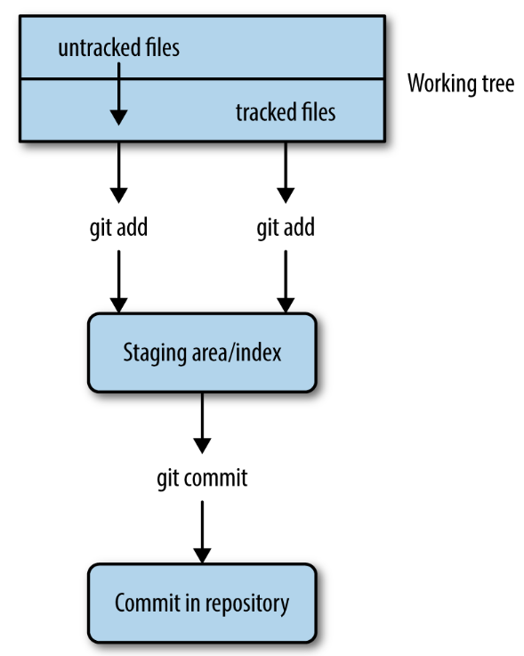
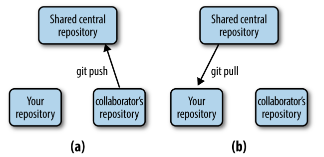

class:inverse middle center

```{r setup, include=FALSE}
options(htmltools.dir.version = FALSE)

knitr::opts_chunk$set(eval = FALSE)
```

## *Week 3: <br> Git and Github*

----

# Part I: Getting started with Git

<br> <br> <br> <br> <br>

### Jelmer Poelstra
### 2021/01/26 (updated: `r Sys.Date()`)

---

## What is version control?

...

<p align="left">

</p>
  

---

## Versioning challenges without formal version control

- What to save?
  
  - Do you only save versions of individual files?  
    --> Space-efficient, but impossible to go back to the state of other files
    at the same point in time.
  
  - Do you save the full project periodically?
    --> Better, but can quickly become prohibitive storage-wise.

- How to manage different variants of files?

- How to know what changes were made between saved versions?

- Collaboration: How to simultaneously work on a project?

---

## Version control enables you to:

- "History of changes"

- Time machine for your project   

- Simultaneous collaborative work

- By using *branches*:
  
  - No worries about breaking things that work.
  
  - Make (experimental) changes without affecting others work,
    but staying up-to-date with the main project.

- Makes sharing your code easy

<br>

> *Version control is a way to keep your scientific projects tidily organized,*
> *collaborate on science, and have the whole history of each project at your*
> *fingertips.*  
> &mdash; CSB

---

## What are Git and GitHub?

<br>

- **Git** is the most widely used software for version control.  
  (Others include *SVN* and *Mercurial*.)

- **GitHub** is the most widely used *website* to host Git repositories.  
   (Others include *GitLab*, *Bitbucket*, and *SourceForge*.)

<br>

Github can be linked up to Git so you can sync your repositories from the
command line.

---

## A few key terms and concepts

- A "**repository**" (or "repo") is the version-control database for a project.  
  It is saved in a hidden folder `.git` in the root dir of your project.
  
  - You can start a repository in any dir on your computer using a single Git
    command.
    
  - You can also download (`git clone`) an online repo,
    whether or not it is your own (but you can only *upload* to repos with
    permission).

- A "**commit**" is a saved *snapshot* of the project.

  It is always possible to go the exact state of a project for any commit.
  When you commit, you also have to include a message describing the changes.

<br>

.content-box-info[
Git saves *differences* between commits,
it does not keep copies of all files for every commit.
This is also true at the within-file level:
only the changes are saved. 
]

---

## What do I put under version control?

- The prime things to version control are:
  - **Scripts** (/ software source)
  - **Documentation**
  - **Manuscripts** (if you write them in plain text)
  
- **Raw data** may or may not be committed (see *Limitations* on next slide).

<br>

- In general: **version-control the source, not the derived files**.

  - For instance, version-control:
      - Your markdown file, not the HTML it produces.
      - Your script, not the figure it produces.

  - Also gets back to one of last weeks points: derived data and other derived
    files are (or should be...) *dispensable*.

---

## What do I put under version control? (cont.)

.content-box-info[
The general model of Git is that *one repository corresponds to everything
inside a single directory structure* (last week's project organization!).

You can instruct Git to ignore certain file(type)s and directories:
we'll learn how to, this week.
]

--

**Limitations:**

- *File type*: Binary files can't be tracked *effectively* &ndash;
  Git will just save a new version of the file whenever there's been a change.

- *Repository size*: Best to keep individual repo's under 1 GB.

- *File size*: Github will not allow files over 100 MB.

--

.content-box-warning[
NGS data is therefore generally too large to be version-controlled.  
You should use dedicated repositories for this like the NCBI's SRA.
]


---

## Using Git

- You can use Git in several different ways:
  
  - Native command-line interface (CLI).
  
  - Third-party GUIs &ndash; *Git Kraken* works for all operating systems.
  
  - Using IDEs with Git integration like RStudio and VS Code.

.content-box-info[
In this course, we will mainly focus on the CLI because it's the most universal
and powerful.
]

---

## Git CLI &ndash; General structure of commands

- Every git command is called using:  
  ```sh
  $ git <(sub)command> [options] [args]
  ```
  
  For instance: 
  ```sh
  $ git status
  
  $ git add file.txt
  
  $ git commit -m "My commit message"
  ```
  
---

## CSB 2.4.1: Basic workflow

Only three commands tend to make up the vast majority of your Git work:

- **`git add`**  
  *Stages* files to be committed (including previously untracked files).

- **`git commit`**  
  Commits all currently staged changes.

- **`git status`**  
  Will report the status of your repository: which files have changed,
  which new files are present, etc.

---

## CSB 2.4.1: Basic workflow

Only three commands tend to make up the vast majority of your Git work:

- **`git add`**  
  *Stages* files to be committed, including previously untracked files.

- **`git commit`**  
  Commits all currently staged changes.

<figure>
<p align="center">

<figcaption>Figure from swcarpentry.github.io</figcaption>
</p>
</figure>

---

## CSB 2.4.1: Basic workflow

Only three commands tend to make up the vast majority of your Git work:

- **`git add`**  
  *Stages* files to be committed, including previously untracked files.

- **`git commit`**  
  Commits all currently staged changes.
  
.content-box-info[
New files are not automatically tracked: you need to add them using `git add`.
```sh
$ git add myfile.txt    # File will now be tracked + staged 

$ git add --all         # All project files are now staged
```
]

---

## CSB 2.4.1: Basic workflow (cont.)

<figure>
<p align="center">

<figcaption>Figure from Buffalo (2015)</figcaption>
</p>
</figure>

---

## CSB 2.4.1: Code-along &ndash; Starting a repo

- Creating a dir for a mock project to version-control:
  ```sh
  $ cd /fs/PAS1855/users/$USER/CSB/git/sandbox
  $ mkdir originspecies
  $ cd originspecies
  ```

- Initializing the repo with `git init`:
  ```sh
  $ git init
  ```

- Check what's going on:
  ```sh
  $ git status
  ```

---

## CSB 2.4.1: Code-along &ndash; Our first commit

- Start writing the book:
  ```sh
  $ touch origin.txt
  $ echo "An Abstract of an Essay on the Origin of Species and \
        Varieties Through Natural Selection" > origin.txt
  $ cat origin.txt
  ```

- Start tracking and stage the file: 
  ```sh
  $ git add origin.txt
  ```

- Check the status of the repo:
  ```sh
  $ git status
  ```

- Looks good? Let's commit:
  ```sh
  $ git commit -m "started the book"
  ```

---

## CSB 2.4.1: Code-along &ndash; Our first commit (cont.)

- Check the status again:
  ```sh
  $ git status
  ```

- Check the history of the repo:
  ```sh
  $ git log
  ```

---

## CSB 2.4.1: Code-along &ndash; Our second commit

- Modify the file:
  ```sh
  $ echo "On the Origin of Species, by Means of Natural Selection, \
        or the Preservation of Favoured Races in the Struggle \
        for Life" > origin.txt
  ```

- Check the status of the repo:
  ```sh
  $ git status
  ```

- We see that Git has noticed the changes, but we need to add them:
  ```sh
  $ git add origin.txt
  ```
  
- Commit and check the history of the repo:
  ```sh
  $ git commit -m "Changed the title as suggested by Murray"
  
  $ git log
  ```
  
---

## CSB 2.4.1: Basic workflow (recap)

Only three commands tend to make up the vast majority of your Git work:

- **`git add`**  
  *Stages* files to be committed (including previously untracked files).

.content-box-info[
**Ways to use `git add` and `git commit`**

You can add individual files, everything, or wildcard selections:  
```sh
$ git add myfile.txt    # File will now be tracked + staged 
$ git add --all         # Or "git add ." or "git add *"
$ git add scripts/*
$ git add /** # TO DO: ADD SHELL FILES ANYWHERE IN REPO
```

You can also use the `-a` option to `git commit` as a shortcut add and commit
all changes with a single command (but note that this will *not add untracked files*):
```sh
git commit -am "My commit message"
```
]

---

## CSB 2.4.1: Basic workflow (recap)

Only three commands tend to make up the vast majority of your Git work:

- **`git add`**  
  *Stages* files to be committed (including previously untracked files).

.content-box-q[
Thinking about the purposes of version control broadly,
what could be a disavantage of committing all changes simultaneously?
]

.content-box-answer[
It's good practice to not simply and only commit at the end of each day,
but to try and create commits for *units of progress worth saving* and to *separate commits for distinct changes*.

An example of the latter:  
You look at the files you've changed using `git status` and find that you have
updated a README to include additional sampling information,
and worked on a script to QC sequence files.
**This does not make sense as a single commit.**
]

---

## `r icon::fa("user-edit")` Intermezzo 2.1

1. Create the file `todo.txt` containing the line:  
   `June 18, 1858: read essay from Wallace`.

2. Add the file to the next snapshot.

3. Commit the snapshot, with message `Added to-do list`.

---

## `r icon::fa("user-edit")` Intermezzo 2.1 &ndash; solutions

1. Create the file `todo.txt`:
   ```sh
   $ echo "June 18, 1858: read essay from Wallace" > todo.txt
   ```

2. Add the file to the next snapshot.
   ```sh
   $ git add todo.txt
   ```
3. Commit the snapshot, with message `Added to-do list`.
   ```sh
   $ git commit -m "Added to-do list"
   ```
   
---

## CSB 2.4.2: Showing changes

- By default, `git diff` will show all changes made since the last commit:
  ```sh
  $ git diff
  ```

## TO DO: EXPAND ON DIFF -- MAKE SOME CHANGES
  
---

## CSB 2.4.3: Ignoring files and directories

Using a `.gitignore` file

## TODO: ADD A COUPLE OF COMMANDS TO ADD UNWANTED FILE, THEN CREATE AND COMMIT .GITIGNORE

```sh
*~
*.tmp
binaries/
largedataset.db
```

---

## CSB 2.4.3: Moving and removing tracked files

To remove or move (including renaming) files tracked by Git, it is best to
preface `rm` and `mv` with `git`:

```sh
$ git rm filetorem.txt
$ git rm *txt
$ git rm myoldname.txt mynewname.csv
```

.content-box-info[
You will inevitably forget about this, and Git will eventually figure out what
happened.
For instance, for a renamed file, Git will first think you removed a file
and also notice a new, untracked file.
Then, when you add this "new" file, Git will realize the file was renamed.

However, it is cleaner to use `git mv` and `git rm`,
so please do so whenever you think of it.
]

.content-box-info[
When you haven't started tracking a file yet, you can use regular `mv` and `rm`
&ndash; in fact, Git will error out if you try to do `git rm` for an untracked file. 
]

---

## CSB 2.4.5: Troubleshooting Git &ndash; Amending commits

- Let's say we forgot to add a file to a commit,
  or see a typo in what we just committed.
  ```sh
  $ git add forgottenfile.txt
  $ git add code.py
  ```
  
- Creating a separate commit for his seems "wasteful" or inappropriate,
  and including these changes along with others in a next commit is likely
  also inappropriate.
  
  In such cases, we can *amend* the commit
  (and here, we also use the  
  `--no-edit` flag to not change the commit message):
  ```sh
  $ git commit --amend --no-edit
  ```

<br>

.content-box-warning[
Do do not amend commits that have been published in (*pushed to*) the online
counterpart of the repo.
]

---

## CSB 2.4.5: Troubleshooting Git &ndash; Concepts

The three states for files correspond to the three "trees" of Git:
 
 - **HEAD**: State of the project in most recent commit (on current branch)
 
 - **Index** (*Stage*): State of the project ready to be committed.
 
 - **Working directory**: State of the project as currently on your computer. 

<figure>
<p align="center">

</p>
</figure>

---

## CSB 2.4.5: Troubleshooting Git &ndash; Concepts

**When a file is:**

| State     | HEAD (Last commit) | Index (Stage) | Working Dir
|-----------|--------------------|---------------|
| **Committed** | version X          | version X     | version X 
| **Staged**    | version X          | **<span style=color:green> version Y</span>**     | **<span style=color:green>version Y</span>**
| **Modified**  | version ?          | version X     | **<span style=color:red>version Y</span>**

<figure>
<p align="center">

</p>
</figure>

---

## CSB 2.4.5: Troubleshooting Git &ndash; Concepts

**When a file is:**

| State     | HEAD (Last commit) | Index (Stage) | Working Dir
|-----------|--------------------|---------------|
| Committed | version X          | version X     | version X 
| Staged    | version X          | **<span style=color:green> version Y</span>**     | **<span style=color:green>version Y</span>**
| Modified  | version ?          | version X     | **<span style=color:red>version Y</span>**
| Untracked | &nbsp; -           | &nbsp; -       | **<span style=color:red>version X</span>**

---

## CSB 2.4.5: Troubleshooting &ndash; Concepts

<br>

<figure>
<p align="center">

</p>
</figure>


---

## CSB 2.4.5: Troubleshooting &ndash; Undoing working dir changes by recovering an old version from the repo

- Let's say we accidentally overwrite instead of append to a file:
  ```sh
  $ echo "todo: ask sequencing center about adapters" > README.md
  ```

- Always start by checking the status:
  ```sh
  $ git status
  ```

- We want to "discard changes in working directory" by recovering the version of
  the file in the index (and HEAD), and Git told us how to do this:
  ```sh
  $ git checkout -- README.md
  ```

.content-box-info[
On recent Git versions (not yet on OSC), it instead recommends:
```sh
git restore README.md
```
]

---

## CSB 2.4.5: Undoing changes that have not been staged <br> by recovering an old version from the repo

- Let's say we accidentally overwrite instead of append to a file:
  ```sh
  $ echo "todo: ask sequencing center about adapters" > README.md
  ```

- Always start by checking the status:
  ```sh
  $ git status
  ```

- Git told us how to do undo the change:
  ```sh
  $ git checkout -- README.md
  ```

.content-box-info[
When mistakes weren't staged or committed, you may, of course,
not need Git to fix it for you: if you made a typo, you can simply change this
in the file.
]

---

## CSB 2.4.5: Troubleshooting &ndash; Unstaging a file

- `git reset` can *unstage* a file, which is most often needed when you
  added a file that was not supposed to be part of the next commit:

  ```sh
  $ echo "The foloqing TruSeq adapters were used:" >> README.md
  $ echo "wc -l *fastq" > count_reads.sh
  $ git add --all
  ```

- Oops, those two file changes should be part of separate commits.  
  Again, we check the status first and find we should use `git reset`:  
  ```sh
  $ git reset HEAD -- README.md
  ```

.content-box-warning[
This will only unstage and **not** revert the file back to its state at the
last commit (cf. CSB &ndash; mistake!).
]

.content-box-info[
If you *staged* a file and realize you made a mistake,
or staged prematurely, you can continue editing the file and re-add it.
]

---

## CSB 2.4.5: Troubleshooting &ndash; Unstaging a file

- `git reset` can *unstage* a file, which is most often needed when you
  added a file that was not supposed to be part of the next commit:

  ```sh
  $ echo "The foloqing TruSeq adapters were used:" >> README.md
  $ echo "wc -l *fastq" > count_reads.sh
  $ git add --all
  ```

- Oops, those two file changes should be part of separate commits.  
  Again, we check the status first and find we should use `git reset`:  
  ```sh
  $ git reset HEAD -- README.md
  ```

.content-box-warning[
This will only unstage and **not** revert the file back to its state at the
last commit (cf. CSB &ndash; mistake!).
]

.content-box-info[
On recent Git versions (not yet on OSC), it instead recommends:
```sh
git restore --staged README.md
```
]

---

## CSB 2.4.5: Troubleshooting &ndash; Undoing staged changes

What if we had even staged our changes,
but we just want to get of all changes in the file since the last commit?

For instance, we overwrote the README.md and staged the misshapen file:
  ```sh
  $ echo "Todo: ask sequencing center about adapters" > README.md
  $ git add README.md
  ```

To get back the version that is stored in the last commit,
and disregard any staged or unstaged changes to the file:
```sh  
$ git checkout HEAD -- README.md
```

.content-box-warning[
Be careful with the `git checkout` command,  
because it irrevocably discards the non-committed changes.
]

---

## CSB 2.4.5: Troubleshooting &ndash; Undoing staged changes

<br>

<figure>
<p align="center">

</p>
</figure>

---

## CSB 2.4.5: Troubleshooting &ndash; Other options

### But what if I want to get back to a previous version, like above, <br> but am not sure I want to permanently delete the recent changes?

1. **Create a new *branch***, commit the changes there, and then move back to
   the main/previous branch. *=> CSB Ch. 2.6*

2. ***Stash* the changes** and possibly retrieve (*apply*) them later.
   This only makes sense if you may or may not want to keep the changes and
   think you will find out soon. *=> Bonus materials*

### But what if I need to get back an old version of the entire project?

...

---

## CSB 2.4.5: Troubleshooting &ndash; Undo summary so far

For a particular file `README.md`:

- I want to unstage a file, but don't need to discard (replace) any changes:
  ```sh
  git reset HEAD -- README.md
  ```
  
- I want to go back to the last commit and have unstaged changes in my working
  dir that should be discarded:
  ```sh
  git checkout -- README.md # Technically: grabs file from *Index*
  ```

- I want to go back to the last commit and have staged changes (and optionally
  unstaged changes, too) that should be discarded:
  ```sh
  git checkout HEAD -- README.md
  ```
--

- **Bonus** &ndash; I need to get an earlier version, e.g. from the one-to-last
  commit, or any arbitrary commit:
  ```sh
  git checkout HEAD^ -- README.md
  git checkout <sha-id> -- README.md
  ```

---

## CSB 2.5: Remote repositories

We have our *Origin* repo that we have been version-controlling,  
but now we also want to have this repo online, on Github:

- To share our work and/or

- To have a online backup and/or

- To collaborate with others

While we can interact with online repos using Git commands,  
we *can't create a new online repo* with the Git CLI.

So, we go to <https://github.com> to create a new repo.

---

## CSB 2.5: Remote repos &ndash; Creating a Github repo

## TO DO: ADD STEPS

---

## CSB 2.5: Remote repos &ndash; I: Single-user workflow

In a single-user workflow, all changes are made in the *local repo*,
and the remote repo is simply periodically updated.

So, the interaction between local and remote is unidirectional:

<figure>
<p align="center">

<figcaption>Figure from Buffalo (2015)</figcaption>
</p>
</figure>

---

## CSB 2.5: Remote repos &ndash; I: Single-user workflow

Our workflow is only modified by occasional *pushing* to remote:

```sh
$ git push
```

<br>

By default, `git push` pushes:
 - The currently active *branch* (which will always be `master` or `main` if we
   haven't created new branches)
 - To the default remote connection, which by convention is name `origin`.

<br>

Therefore, assuming the remote is `origin` and the current branch is `master`,
`git push` is shorthand for:

```sh
$ git push origin master
```

---

## CSB 2.5: Remote repos &ndash; II: Multi-user workflow

With a multi-user workflow, changes made by different users are shared *via*
the online copy.

Like earlier, changes to your local repo remain local-only unless you
actively **push** to remote (i.e., this is not automatic).

Similarly, changes to the remote repo (that someone else has pushed) only
make it into your local repo if you actively **pull** from remote
(also *not automatic*).

---

## CSB 2.5: Remote repos &ndash; II: Multi-user workflow

A multi-user workflow starts with a second user downloading (*cloning*)  
the online repo **(b)**:

<figure>
<p align="center">

</p>
</figure>

---

## CSB 2.5: Remote repos &ndash; II: Multi-user workflow

Then, the second user can push their changes to the shared remote **(a)**:

<figure>
<p align="center">

<figcaption>Figure from Buffalo (2015)</figcaption>
</p>
</figure>

---

## CSB 2.5: Remote repos &ndash; II: Multi-user workflow

Then, the second user can push their changes to the shared remote **(a)**:

<figure>
<p align="center">

<figcaption>Figure from Buffalo (2015)</figcaption>
</p>
</figure>

To go full circle, the first user (you in this case) then *pulls* in
the changes made by the second user **(b)**. 

---

## CSB 2.5: Remote repos &ndash; II: Multi-user workflow

## TODO: ADD MULTI-USER PUSH-PULL PRACTICE

---

## CSB 2.6: Branching and merging &ndash; Code-along

- First, we create a dummy repo with a few commits by running a shell script:
  ```sh
  $ less ../data/create_repository.sh  # press `q` to exit less
  
  $ ./../data/create_repository.sh
  ```

- Let's see what has been done in this repo:
  ```sh
  $ cd branching_example
  
  $ git log --oneline --decorate
  ```

- We want to improve the code, but these changes are experimental, and we want
  to retain our previous version that we know works.
  
  This is where *branching* comes in:
  ```sh
  $ git branch fastercode
  ```
 
---

## CSB 2.6: Branching and merging &ndash; Code-along

- Let's see what our log looks like now, and list the branches:
  ```sh
  $ git log --oneline --decorate
  ```
  
  ```sh
  $ git branch
  ```

- It turns out we created a new branch but we are still on the master branch,
  so we should switch branches:
  ```sh
  $ git checkout fastercode  # Note reuse of `checkout` command!
  ```

- We edit the code, stage and commit the changes:
  ```sh
  $ echo "Yeah, faster code" >> code.txt
  $ git add code.txt
  $ git commit -m "Managed to make code faster"
  ```

- Let's check the log again:
  ```sh
  $ git log --oneline --decorate
  ```

---

## CSB 2.6: Branching and merging &ndash; Code-along

- We need to switch gears completely and add references to the paper draft
  in the same project.
  
  We should do this not in the `fastercode` branch, but on the `master` branch:
  
  ```sh
  $ git checkout master
  
  $ echo "Marra et al. 2014" > references.txt
  $ git add references.txt
  $ git commit -m "Fixed the references"
  ```

- Now we've made changes to each of the two branches independently.
  Let's see the log in "graph" format:  
  ```sh
  git log --oneline --decorate --all --graph
  ```

---

## CSB 2.6: Branching and merging &ndash; Code-along

- We actually finished speeding up the code, but need to document our changes,
  so we go back to the `fastercode` branch:
  ```sh
  $ git checkout fastercode
  
  $ echo "# My documentation" >> code.txt
  $ git add code.txt
  $ git commit -m "Added comments to the code"
  ```

- Again we check the "graph":  
  ```sh
  git log --oneline --decorate --all --graph
  ```

---

## CSB 2.6: Branching and merging &ndash; Code-along

- We are happy with the changes to the code, and want to make the `fastercode`
  version the default version.
  
  This means we should merge the `fastercode` branch back into `master`.
  To do so, we first have to move back to master:
  ```sh
  $ git checkout master
  ```

- Now we are ready to merge, and we use the `git merge` command.
  We also provide a commit message, because a merge is always accompanied
  by a commit:
  ```sh
  $ git merge fastercode -m "Much faster version of code"
  ```

- Again we check the "graph":  
  ```sh
  git log --oneline --decorate --all --graph
  ```

---

## CSB 2.6: Branching and merging &ndash; Code-along

- We no longer need the `fastercode` branch:
  ```sh
  git branch -d fastercode
  ```

- Again we check the "graph":  
  ```sh
  git log --oneline --decorate --all --graph
  ```

---

## CSB 2.6: Branching and merging &ndash; Workflow summary

```sh
# create a new branch
$ git branch mybranch
# see that you are in master
$ git branch

# move to new branch
$ git checkout mybranch
# start working on the branch
...
# add and commit changes
git add --all
git commit -m "my message"
# once you are satisfied, and want to include the changes into the main project,
# move back to main trunk
$ git checkout master
# then merge the branch
$ git merge mybranch -m "message for merge"
# and [optionally] delete the branch
$ git -d mybranch
```


---

## CSB 2.6: Branching and merging &ndash; Code-along

<figure>
<p align="center">

<figcaption>Figure from Allesino & Wilmes (2019)</figcaption>
</p>
</figure>

---

## CSB 2.6: Viewing past revisions

```sh
$ git log --oneline --decorate --all --graph
```

```sh
$ git checkout bc4831a
```

```sh
$ git checkout master
```

## TODO - FINISH

---


## CSB 2.6: Branching and merging (cont.)

### Merge conflicts

```sh
$ code <conflicting-file> # Show features!
```

---

## Intermezzo 2.2

(a) Move to the directory CSB/git/sandbox .

(b) Create a thesis directory and turn it into a Git repository.

(c) Create the file introduction.txt with the line “The best introduction
ever.”

(d) Add the file introduction.txt to the next snapshot and commit with
the message “Started introduction.”

(e) Create the branch newintro and change into it.

(f) Change the contents of introduction.txt , create a new file with the
name methods.txt , and commit.

(g) Look at the commit history of the branches.

(h) Change to the branch master , merge, and confirm that the changes you
performed within the branch newintro are now also part of the branch
master .

(i) Delete the branch newintro .

---

## Intermezzo 2.2: Solutions


---

## CSB 2.7 Contributing to Public Repositories

---

## CSB 2.7: What can you do with someone else's GitHub repository?

If you do not have push rights:
  
  - You can clone the repository and make changes locally,
    but you cannot push your changes
  
  - You can fork their repository and develop it independently
  
  - You can submit a pull request to their repository if you want to contribute
    to the original project

---

## Some Git best practices

- Write informative commit messages -- imagine looking back at your project
  in a few months, after finding an error that you introduced a while ago.

- Commit often, using small commits -- will also help to keep commit messages
  informative.

- Before committing, check what you've changed using `git diff`.

- If you've worked on multiple disparate things before committing,
  create two separate commits: `git add` + `git commit` separately for two
  sets of files.

- When collaborating, pull often.

- Don't commit unnecessary files, which can also lead to conflicts.

---

## More on commit messages

- Bad: "Updated file"
- Good: "Updated x function to include y"


---

## Github

- Note that a `README` file (usually `README.md`) in the top level of the repo
  will always show up, rendered, on the front page of your repo.
  
- Show forking and how this is displayed in the forked repo.
  - Make a change
  - Will say "1 commit ahead" -> Click `Compare`
  - `Create Pull Request`

- Show Issues pointing to Pull Requests and vice versa?

---

## Misc.

- Zenodo for getting a DOI when publishing
  (see <https://github.com/ngs-docs/2020-GGG298/blob/master/Week6-Git_and_GitHub_for_file_tracking_and_sharing/README.md>)

---
class: inverse middle center

# Bonus Materials

----

---

## Bonus: Undoing committed changes

- Create a new commit that will revert all the changes made in a previous commit
  (the last commit in this example):
  ```sh
  $ git revert HEAD
  ```

- This will work and be safe both for commits that were and that were not
  pushed online.
  
---

## Bonus: Checking out previous versions

- Get a version of a file from a past commit:

  ```sh
  git checkout HEAD~2 -- README.md
  git checkout 3ba6674 -- README.md
  
  less README.md  # This will now be "the old version"
  git status   # "The old version" has been staged
  ```

- Nope, please take me back to my current version:

  ```sh
  git checkout HEAD -- README.md
  less README.md  # Phew!
  git status   # Up-to-date
  ```

- Another possibility:
  ```sh
  git show 3ba6674:README.md
  
  git show 3ba6674:README.md > README.md
  ```

---

## Bonus: Checking out previous versions (cont.)

- Look at state of entire project in a previous commit:

  ```sh
  git checkout HEAD~2
  git checkout 3ba6674
  ```
  
- This is best just for looking around, to go back:
  ```sh
  ...
  ```

- Or if you want to permanently move back to that state of the project:
  ```sh
  git revert HEAD~2
  ```

---

## Bonus: Checking out previous versions (cont.)

<figure>
<p align="center">

<figcaption>Figure from swcarpentry.github.io</figcaption>
</p>
</figure>
