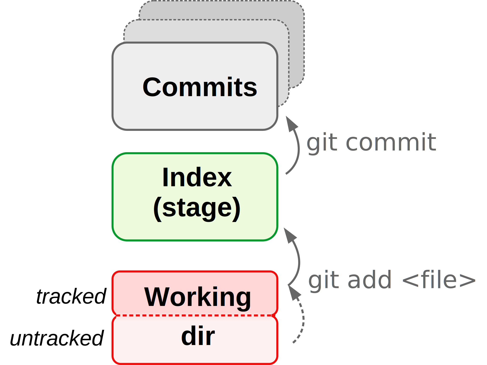
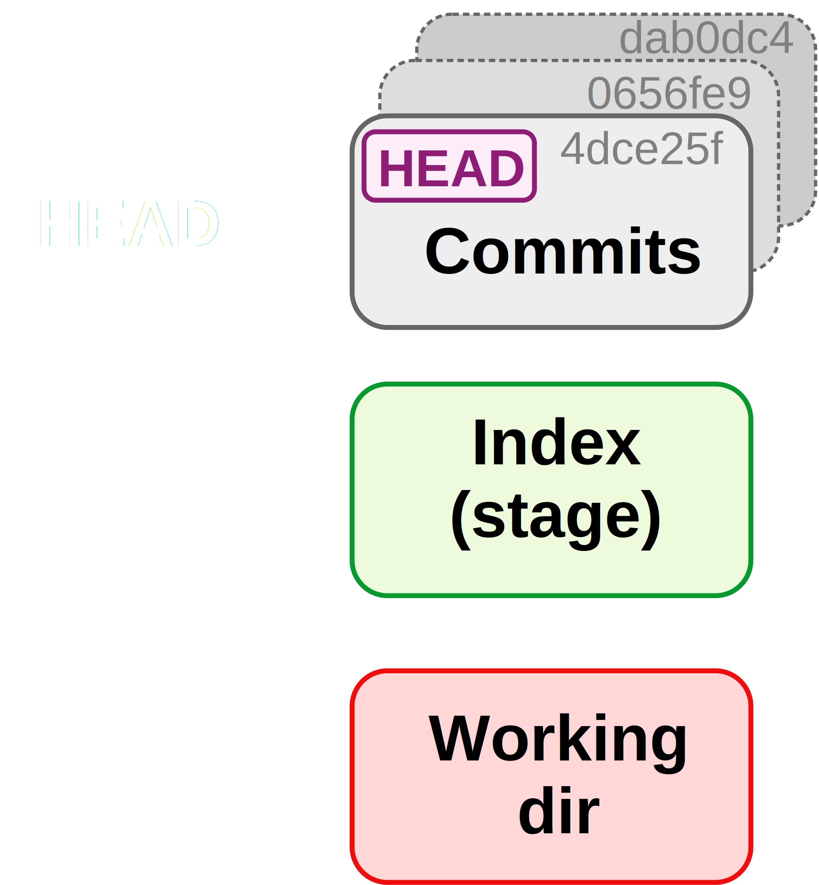
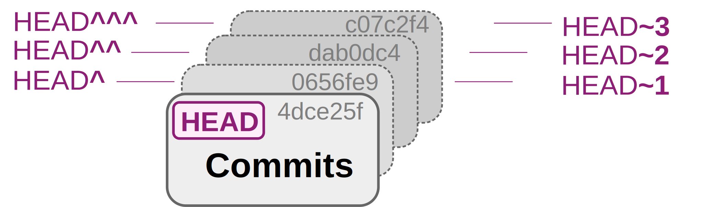

class:inverse middle center

```{r setup, include=FALSE}
options(htmltools.dir.version = FALSE)

knitr::opts_chunk$set(eval = FALSE)
```

## *Week 3: Git and GitHub*

----

# Part I: <br> Getting started with Git

<br> <br> <br> <br> <br>

### Jelmer Poelstra
### 2021/01/26 (updated: `r Sys.Date()`)

---
class:inverse middle center

# Overview of this week

----

<br>

.left[
- ### Part I: Getting started with Git (this slide deck)
- ### Part II: [Branching & merging, and remotes on GitHub](03-2_git.Rmd)
- ### Part III: [Undoing changes and viewing the past](03-3_git.Rmd)
]

<br> <br>

---
class: inverse middle center

# Overview of this slide deck

----

.left[
- ### [An Introduction to version control](#intro)
- ### [The basic Git workflow](#basic-workflow)
- ### [Showing changes and referring to the past](#showing-changes)
- ### [Useful Git tidbits](#tidbits)
]

<br> <br>

---
class: inverse middle center
name: intro

# An introduction to version control

----

<br> <br> <br> <br>

---

## Versioning challenges <br> without a formal Version Control System (VCS)

- **What to save?**
  
  - *Do you only save versions of individual files?*   
    Space-efficient, but not possible to go back to the state of other project
    files at the same point in time.
  
  - *Do you save the full project periodically?*  
    Better, but can quickly become prohibitive in terms of disk storage.

--

- **How to manage simultaneous variants of files**,  
  such as when making experimental changes?

- **How to know what changes were made between saved versions?**  
  Try to summarize this in the file name?

--

- **How to collaborate**, especially when working simultaneously?

---

## Why use a Version Control System (VCS)?

- You can easily **see your history of changes**.

- **Time machine:** You can go back to past states of your project.

- You can do **simultaneous collaborative work**.

  - You can always track down who made which changes.
  
  - Even works when editing the same file.

--

- By using *branches*:
  
  - **Make experimental changes without affecting current functionality**,
    and such experiments can be long-running while staying up-to-date with the
    main project.

  - So: no worries about breaking things that work.
  
- **Sharing your code** and other aspects of your project is easy.

---

## Why use a Version Control System (VCS)?

<br>

.large[
> *Version control is a way to keep your scientific projects tidily organized,*
> *collaborate on science, and have the whole history of each project at your*
> *fingertips.*  
> &mdash; CSB Chapter 2
]

---

## What are Git and GitHub?

<br>

- **Git** is the most widely used Version Control System.  
  (Others include *SVN* and *Mercurial*.)

- **GitHub** is the most widely used *website* to host Git repositories.  
   (Others include *GitLab*, *Bitbucket*, and *SourceForge*.)

---

## How Git roughly works

You save snapshots of your entire project
with every minor piece of progress.

Git manages this cleverly without having to
create full copies of the project for every snapshot.

<figure>
<p align="center">

<figcaption>Figure from https://git-scm.com </figcaption>
</p>
</figure>

---

## How Git roughly works

You save snapshots of your entire project
with every minor piece of progress.

The Version Control System manages this cleverly without having to
create full copies of the project for every snapshot.

<figure>
<p align="center">

<figcaption>Figure from https://git-scm.com </figcaption>
</p>
</figure>

<br>

.content-box-info[
One Git database manages the files inside a single directory structure
(project organization!).
]

---

## Two key Git terms

### Repository

**A "*repository*" (or "*repo*") is the version-control database for a project.**  
It is saved in a hidden folder `.git` in the root dir of your project.
  
  - You can start a repository in any dir on your computer.  
    (But nested repositories are a bad idea.)
    
  - You can also download (`git clone`) *any* public online repository,  
    but you can only *upload* to repos when you have permission to do so.

### Commit

**A "*commit*" is a saved *snapshot* of the project.**  
It is always possible to go the exact state of the entire project or individual
files for *any commit*.  

Whenever you commit, you also include a *message describing the changes*.

---

## What do I put under version control?

- The primary files to put under version control are:
  
  - **Scripts** (and/or source code for software)
  
  - **Documentation for your project**
  
  - **Manuscripts** (if you write them in plain text)
  
- **_Raw data_** may or may not be committed (see *Limitations* on next slide).

<br>

--

- In general, **version-control the source, not derived files**. For instance:
    
    - Version-control your Markdown file, not the HTML it produces.
    
    - Version-control your script, not the figure it produces.

.content-box-info[
Recall last week's point that derived files are (or should be...) *dispensable*,
because they can be regenerated using the raw data + the scripts.
]

---

## What do I put under version control? (cont.)

### Limitations:

- *File type*: Binary (non-text) files can't be tracked effectively &ndash;  
  Git will just save a new version whenever there's been a change.

- *Repository size*: Best to keep individual repo's under 1 GB.

- *File size*: GitHub will not allow files over 100 MB.

--

<br>

.content-box-warning[
NGS data is therefore too large to be version-controlled.  
You should use dedicated repositories for this like the NCBI's SRA.
]

---

## Using Git

<figure>
<p align="center">

<figcaption>Image source: https://xkcd.com/1597/</figcaption>
</p>
</figure>

---

## Using Git

**You can use Git in several different ways:**
  
- Native command-line interface (CLI).
  
- Third-party GUIs &ndash; *Git Kraken* works for all operating systems.
  
- Using IDEs/editors with Git integration like RStudio and VS Code.

<br>

.content-box-info[
**In this course, we will mainly focus on the CLI** because it's the most
universal and powerful interface.

But it's absolutely fine to (partially) switch to GUI/usage later. 
]

--

.content-box-warning[
Git takes some getting used to, regardless of the interface.  
Many people have one or more "false starts" with it.  
I hope that being forced to use it in a course will take you past that!
]

---
class: inverse middle center
name: basic-workflow

# The basic Git workflow

----

<br> <br> <br> <br>

---

## The basic Git workflow &ndash; overview

Only three commands tend to make up the vast majority of your Git work:

- **`git add`**  
  *Stage* files to be committed (including previously untracked files).

- **`git commit`**  
  Commit all currently staged changes (create a snapshot of the project).

- **`git status`**  
  Get the status of your repository: which files have changed,
  which new files are present, tips on next steps, etc.

<br>

.content-box-info[
Every git command is called using (sub)commands (or *verbs*):  
```sh
$ git <(sub)command> [options] [args]
```
]

---

## The basic Git workflow &ndash; overview

Only three commands tend to make up the vast majority of your Git work:

- **`git add`**  
  *Stages* files to be committed, including previously untracked files.

- **`git commit`**  
  Commits all currently staged changes.

<figure>
<p align="center">

<figcaption>Figure from swcarpentry.github.io</figcaption>
</p>
</figure>

---

## The basic Git workflow &ndash; overview

Only three commands tend to make up the vast majority of your Git work:

- **`git add`**  
  *Stages* files to be committed (including previously untracked files).

- **`git commit`**  
  Commits all currently staged changes.
  
<br>

.content-box-info[
Files in your directory structure are not automatically tracked:  
you need to add them using `git add`.
```sh
$ git add file.txt # Starts tracking *and* stages the file 

$ git add --all    # Stages all previously untracked and
                   # tracked-&-changed files in the project
```
]

---

## The basic Git workflow &ndash; overview (cont.)

<figure>
<p align="center">

</p>
</figure>

---

## Start a Git repository

- Create a dir for a mock project to version-control:
  ```sh
  $ cd /fs/PAS1855/users/$USER/
  
  $ mkdir -p week03/originspecies
  
  $ cd week03/originspecies
  ```

--

<br>

- **Initialize a new repo** with `git init`:
  ```sh
  $ git init
  ```

--

- Check the status of the repo:
  ```sh
  $ git status
  ```

---

## Our first commit

- Start writing the book:
  ```sh
  $ touch origin.txt

  $ echo "An Abstract of an Essay on ..." > origin.txt
  ```

--

- Start tracking the file, and stage it:
  ```sh
  $ git add origin.txt   # Tab-completing filenames will work
  ```

--

- Check the status of the repo:
  ```sh
  $ git status
  ```

- Looks good? Let's make our first **commit**:
  ```sh
  $ git commit -m "Started the book"
  ```

---

## Our first commit (cont.)

- Now that we've made a commit, let's check the status of the repo again:
  ```sh
  $ git status
  ```

  .content-box-info[
  Try to get used to using `git status` a lot &ndash; as a sanity check before
  and after other `git` actions.
  ]

--

- We will also **look at the commit history** of the repo with `git log`:
  ```sh
  $ git log
  ```

  .content-box-info[
  Note the hexadecimal codes &ndash; these are unique identifiers for each
  commit, called *SHA-1 checksums*.
    
  You can reference and access each past commit with these checksums.
  ]

---

## Our second commit

- Modify the file:
  ```sh
  $ echo "On the Origin of Species" > origin.txt
  ```

--

- Check the status of the repo:
  ```sh
  $ git status
  ```

- We see that *Git has noticed the changes*, because the file is being tracked,
  but before we can commit it again, we need to use `git add` to **stage** it:
  ```sh
  $ git add origin.txt
  ```

--

- Commit and check the history of the repo:
  ```sh
  $ git commit -m "Changed the title as suggested by Murray"
  
  $ git log
  ```
  
---

## Staging files efficiently

.content-box-info[
**Ways to use `git add` and `git commit`**

You can stage individual files, all files, or wildcard selections:  
```sh
$ git add myfile.txt

# Stage all files in the project:
$ git add --all     # Or "git add ." or "git add *"

# Stage all files in a specific dir in the project:
$ git add scripts/*

# Stage all shell scripts *anywhere* in project:
$ git add *sh   
```

You can also use the `-a` option for `git commit` as a shortcut to stage and
commit all changes with a single command
(but note that this will *not add untracked files*):
```sh
git commit -am "Message" # Stage+commit all tracked files
```
]

---

## What to include in individual commits

.content-box-q[
Thinking about the purposes of version control broadly,
what could be a disadvantage of committing all changes simultaneously?
]

--

<br>

.content-box-answer[
It's good practice to not simply and only commit at the end of each day,
but to try and create commits for ***units of progress worth saving*** and to ***create separate commits for distinct changes***.

For example, say you take look at the files you've changed since the
last commit using `git status`, and you find that you have:

- Updated a README to include more sampling information.

- Worked on a script to do QC of sequence files.

**This is _not_ recommended to constitute a single commit.**
]

---

## `r icon::fa("user-edit")` Intermezzo 2.1

1. Create the file `todo.txt` containing the line:  
   `June 18, 1858: read essay from Wallace`.

2. Stage the file.

3. Create a commit with the message `Added to-do list`.

---

## `r icon::fa("user-edit")` Intermezzo 2.1 &ndash; solutions

1. Create the file `todo.txt`:
   ```sh
   $ echo "June 18, 1858: read essay from Wallace" > todo.txt
   ```

2. Stage the file:
   ```sh
   $ git add todo.txt
   ```
3. Create a commit with the message `Added to-do list`:
   ```sh
   $ git commit -m "Added to-do list"
   ```

---
class: inverse middle center
name: showing-changes

# Showing changes and referring to the past

----

### And an introduction to the three "trees" of Git

<br> <br> <br> <br>

---
name: concepts

## File states and the three "trees"

**Tracked files can be in three states:**
  - Unchanged since the last commit (*committed*)
  
  - Modified and staged since the last commit (*staged*)
  
  - Modified but not staged since the last commit (*modified*)

---

## File states and the three "trees" (cont.)

**These three states correspond to the three "trees" of Git:**
 
 - **HEAD**: State of the project in most recent commit (on current branch).
 
 - **Index** (*Stage*): State of the project ready to be committed.
 
 - **Working directory**: State of the project as currently on your computer. 

--

<figure>
<p align="center">

</p>
</figure>

---

## File states and the three "trees" (cont.)

| File state     | HEAD (Last commit) | Index (Stage) | Working Dir
|----------------|--------------------|---------------|
| **Committed** | version X          | version X     | version X 


---

## File states and the three "trees" (cont.)

| File state     | HEAD (Last commit) | Index (Stage) | Working Dir
|----------------|--------------------|---------------|
| **Committed** | version X          | version X     | version X 
| **Staged**    | version X          | **<span style=color:green> version Y</span>**     | **<span style=color:green>version Y</span>**

---

## File states and the three "trees" (cont.)

| File state     | HEAD (Last commit) | Index (Stage) | Working Dir
|----------------|--------------------|---------------|
| **Committed** | version X          | version X     | version X 
| **Staged**    | version X          | **<span style=color:green> version Y</span>**     | **<span style=color:green>version Y</span>**
| **Modified**  | version ?          | version X     | **<span style=color:red>version Y</span>**

---

## File states and the three "trees" (cont.)

| File state     | HEAD (Last commit) | Index (Stage) | Working Dir
|----------------|--------------------|---------------|
| Committed | version X          | version X     | version X 
| Staged    | version X          | **<span style=color:green> version Y</span>**     | **<span style=color:green>version Y</span>**
| Modified  | version ?          | version X     | **<span style=color:red>version Y</span>**
| Untracked | &nbsp; -           | &nbsp; -       | **<span style=color:red>version X</span>**

---

## Three ways to refer to past commits

- Using the **_SHA-1_ ID** (full ID or 7-character abbreviation)

- Using **_HEAD_** for the most recent commit,  
  and two ways of indicating ancestors of HEAD:

| X-to-last commit |Caret notation| Tilde notation
|------------------|--------------|
| 2nd-to-last      | HEAD^        | HEAD~1
| 3rd-to-last      | HEAD^^       | HEAD~2         
| 4rd-to-last      | HEAD^^^      | HEAD~3         
| and so on...

<figure>
<p align="center">

</p>
</figure>


---

## Showing changes

- By default, `git diff` will show all changes between the **working dir** and:
  - If something has been staged: the **_Index (stage)_**.
  - If nothing has been staged: the **_last commit_**.

- Right now, there are no differences to report, because our working dir,
  the stage, and and the last commit are all the same:
  ```sh
  $ git diff
  ```

---

## Showing changes

- By default, `git diff` will show all changes between the **working dir** and:
  - If something has been staged: the **_Index (stage)_**.
  - If nothing has been staged: the **_last commit_**.

- Right now, there are no differences to report, because our working dir,
  the stage, and the last commit are *all the same*:
  ```sh
  $ git diff
  ```

--

- We make a change to the to-do list and check again:
  ```sh
  $ echo "June 20, 1858: Send first draft to Huxley" >> todo.txt
  $ git diff
  ```

---

## Showing changes (cont.)

.content-box-info[
**VS Code can nicely show differences between files too:**

1. Click on the git symbol in the narrow side bar to open the *Source Control*
   side bar.
   
2. In the source control sidebar, click on the **`M`** next to the file
  `todo.txt`.
]

<br>

--

.content-box-info[
If there are a lot of differences to show,
`git diff` will open the **`less` file pager**, and you no longer have a prompt.  
Don't panic, and press <kbd>q</kbd> to exit `less`.
]

---

## Showing changes (cont.)

.content-box-info[
**Advanced `git diff`**

- To show changes **between the Index (stage) and the last commit**,
  use the `--staged` option to `git diff`.

- If you have changed multiple files,
  but just want to see differences for one of them,
  you can specify the filename:
  ```sh
  $ git diff todo.txt
  ```

- You can also compare your repo or individual files between any two 
  arbitrary commits:
  ```sh
  # Last commit vs second-to-last commit - full repo:
  git diff HEAD HEAD^
  
  # Last commit vs a specified commit - specific file: 
  $ git diff HEAD d715c54 todo.txt 
  ```
]
  
---
class: inverse middle center
name:tidbits

# Useful Git tidbits

----

### Ignoring and (re)moving files, and amending commits

<br> <br> <br> <br>

---

## Ignoring files and directories

It's best not to track some files, such as very bulky data files, temporary
files, and most binary files.

You can add filenames and wildcard selections to a `.gitignore` file,
to tell git that it should not pay attention to those files.

.content-box-info[
This way, these files won't be listed in `untracked files`, and therefore won't be
accidentally added using `git add --all`.
]

--

- Let's add a dir `data`, and a file ending in a `~` (a temporary file type
  that text editors and other programs can produce):
  ```sh
  $ mkdir data
  $ touch data/drawings-1855-{01..12}-{01..30} todo.txt~
  ```

- Check the status:
  ```sh
  $ git status
  ```

---

## Ignoring files and directories (cont.)

- Now, we create a `.gitignore` file that instructs Git to ignore everything
  in the `data` dir, as well as any file that ends in a `~`:
  ```sh
  $ echo "data/" > .gitignore
  $ echo "*~" >> .gitignore
  ```
  
- Check the status:
  ```sh
  $ git status
  ```

--

- Add and commit the `.gitignore` file:
  ```sh
  $ git add .gitignore
  $ git commit -m "Added a gitignore file"
  ```
  
- Check the status again, and the files we want to ignore should no longer
  be listed as untracked files:
  ```sh
  $ git status
  ```
  
---

## CSB 2.4.4: Moving and removing tracked files

To remove or move (including renaming) files **tracked by Git**,  
it is best to preface regular `rm` and `mv` commands with `git`:

```sh
$ git rm file-to-rm.txt

$ git mv myoldname.txt mynewname.csv
```

--

<br>

.content-box-info[
You will inevitably forget about this, and Git will eventually figure out what
happened.

(For example: for a renamed file, Git will first see a removed file and an added file; after you stage the "new" file, Git realizes it was renamed.)

However, it is cleaner to use `git mv` and `git rm`,
so do so when you remember.
]

---

## Amending commits

Let's say we forgot to add a file to a commit,
or we notice a silly typo in something we just committed.
  
Creating a separate commit for this seems "wasteful" or even confusing,  
and including these changes along with others in a next commit is also likely
to be inappropriate. **In such cases, we can _amend_ the commit**.

- First, we stage the forgotten or fixed file: 
  ```sh
  $ git add <file>
  ```

- Then, we amend the commit (also using the `--no-edit` flag
  because we do not want change the commit message):
  ```sh
  $ git commit --amend --no-edit
  ```

--

.content-box-warning[
Because amending commits "changes history", some recommend avoiding this
altogether.
For sure, do **not** amend commits that have been published in (*pushed to*)
the online counterpart of the repo.
]

---
class: inverse middle center

# Questions?

----

<br> <br> <br> <br> <br>
