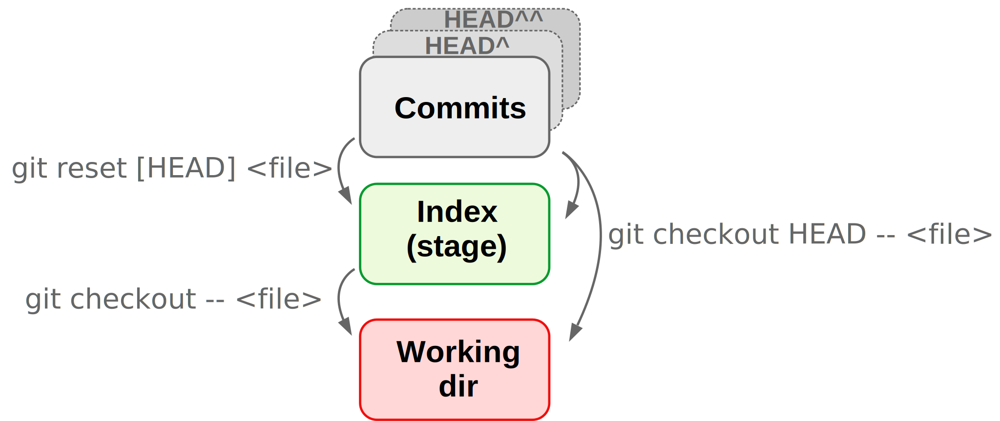

class:inverse middle center

```{r setup, include=FALSE}
options(htmltools.dir.version = FALSE)

knitr::opts_chunk$set(eval = FALSE)
```

## *Week 3: Git and GitHub*

----

# Part III: <br> Undoing changes and viewing the past

<br> <br> <br>

### Jelmer Poelstra
### 2021/01/28 (updated: `r Sys.Date()`)

---
class:inverse middle center

# Overview

----

.left[
- ### [Undoing changes that have not been committed](#undo)
- ### [Viewing and undoing changes that have been committed](#undo-commit)
]

<br> <br> <br>

---
class:inverse middle center
name: undo

# Undoing changes <br> that have not been committed

----

<br> <br> <br> <br> 

---

## Undoing changes that have not been committed: <br> Overview

<figure>
<p align="center">

</p>
</figure>

---

## Undoing changes that have not been committed: <br> Overview

<figure>
<p align="center">

</p>
</figure>

---

## Undoing changes that have not been staged <br> by recovering a version from the repo

- Let's say we accidentally overwrite instead of append to a file:
  ```sh
  $ echo "todo: ask sequencing center about adapters" > README.md
  ```

- Always start by checking the status:
  ```sh
  $ git status
  ```

- We want to "discard changes in working directory" by recovering the version of
  the file in the index (and HEAD), and Git told us how to do this:
  ```sh
  $ git checkout -- README.md
  ```

.content-box-info[
For `git checkout`, the CSB book example omits the dashes `--`.
These indicate that the checkout command should operate on a file,
but since the filename is provided too, this is not strictly necessary.
]

---

## Undoing changes that have not been staged <br> by recovering a version from the repo

### Side notes

.content-box-info[
If you **accidentally deleted a file**,  
you can similarly retrieve it with `git checkout`:

```sh
git checkout -- deleted-file.txt
```

]

<br>

.content-box-info[
For recent Git versions (not yet on OSC), Git will instead of `git checkout`
recommend the following when you do `git status`:
```sh
git restore README.md
```
]

---

## Undoing changes that have not been staged <br> by recovering a version from the repo: <br>visual

<br>

<figure>
<p align="center">

</p>
</figure>

---

## Unstaging a file

- `git reset` can *unstage* a file, which is most often needed when you
  added a file that was not supposed to be part of the next commit:

  ```sh
  $ echo "The following TruSeq adapters were used:" >> README.md
  $ echo "wc -l *fastq" > count_reads.sh
  $ git add --all
  ```

- Oops, those two file changes should be part of separate commits.  
  Again, we check the status first &ndash; and learn we should use `git reset`:  
  ```sh
  $ git reset HEAD README.md
  ```

--

.content-box-warning[
`git reset` will only unstage and **not** revert the file back
to its state at the last commit
(cf. CSB &ndash; mistake in the book!).

(`git reset --hard` *does* revert things back to the state of a desired commit,
but only works on commits and not individual files.)
]

---

## Unstaging a file &ndash; Side notes

.content-box-info[
If you *staged* a file and realize you made a mistake,
or staged prematurely, you can continue editing the file and re-add it.
]

<br>

.content-box-info[
For recent Git versions (not yet on OSC), Git will instead of `git reset`
recommend the following when you do `git status`:
```sh
git restore --staged README.md
```
]

---

## Unstaging a file: visual

<br>

<figure>
<p align="center">

</p>
</figure>

---

## Undoing staged changes

What if we had *staged our mistaken changes*,  
and we need to recover the file from the last commit?

For instance, we overwrote the README.md and staged the misshapen file:
  ```sh
  $ echo "Todo: ask sequencing center about adapters" > README.md
  $ git add README.md
  ```

--

To recover the version stored in the last commit,  
and disregard any staged and unstaged changes to the file:
```sh  
$ git checkout HEAD -- README.md
```

--

.content-box-warning[
Be careful with the `git checkout` command,  
because it irrevocably discards the non-committed changes.

More broadly: your data is only safe with Git once it has been committed.
]

---

## Undoing staged changes: visual

<br>

<figure>
<p align="center">

</p>
</figure>

---

## Summary of undoing non-commited changes

.content-box-info[
For a particular file `README.md`, I want to:

- **Unstage the file**, but don't need to discard (replace) changes:
  ```sh
  $ git reset HEAD -- README.md
  ```
  
- **Go back to the last commit and have unstaged changes** in my
  working dir that should be discarded:
  ```sh
  $ git checkout -- README.md # Technically: grabs file from *Index*
  ```

- **Go back to the last commit and have staged changes**
  (and optionally unstaged changes) that should be discarded:
  ```sh
  $ git checkout HEAD -- README.md
  ```

**Bonus**: undo any and all staged and unstaged changes (unsafe!):

```sh
git reset --hard HEAD
```
]

---
class:inverse middle center
name: undo-commit

# Viewing and undoing changes <br> that have been committed

----

<br> <br> <br> <br> <br>

---

## Viewing past versions of the repository

Say, we want to see what our project looked like at some point in the past.

- First, we print an overview of past commits and their messages:
  ```sh
  $ git log --oneline --all --graph
  ```

- We find a commit we want to go back to, and look around in the past:
  ```sh
  $ git checkout <sha-id> # Replace <sha-id> by an actual hash
  $ less myfile.txt       # Etc. ...
  ```

- To go back to where we were originally:
  ```sh
  $ git checkout master
  ```

.content-box-info[
If you want to **move your repo back** to this earlier state,
there are several strategies (next slides).

For a **single file**, a quick way can be to copy it out of your repo,
move back to the present, and put it in your repo in the present.
]

---

## Viewing past versions of the repository (cont.)

.content-box-warning[
Note the confusing re-use of `git checkout`!  
We have now seen `git checkout` being used to:
  - Move between branches
  - Revert files back to previous states
  - Move to previous commits to explore (**figure below**)
]

<figure>
<p align="center">

<figcaption>Figure from swcarpentry.github.io</figcaption>
</p>
</figure>

---

## Undoing entire commits

- To undo commits, i.e. move the state of your repository back to how it was
  before the commit you want to undo, there are two main commands:
  
  - `git revert`: Undo the changes made by commits by reverting them in a new
     commit.
  
  - `git reset`: Delete commits as if they were never made.

.content-box-info[
Undoing with `git revert` is much safer than with `git reset`,
because `git revert` does not erase any history.

For this reason, some argue you should not use `git reset` on commits altogether.
At any rate, you should **never** use `git reset` for commits that have already 
been pushed online.
]

---

## Undoing commits with `git revert`

- Create a new commit that will revert all changes made in the  
  specified commit:
  
  ```sh
  $ git revert HEAD     # Undo changes by most recent commit
  
  $ git revert HEAD^    # Undo changes by second-to-last commit
  $ git revert e1c5739  # Undo changes by any arbitrary commit
  ```

---

## Undoing commits with `git reset`

.content-box-info[
`git reset` is quite complicated as it has three modes
(`--hard`, `--mixed` (default), and `--soft`)
and can act both on individual files and on entire commits.

We've already used `git reset` on individual files (to unstage).  
To undo a commit and:

- Stage all changes made by that commit:
  ```sh
  $ git reset --soft HEAD^ #Undo LAST=reset to 2nd-to-last
  ```

- Put all changes made by that commit in the working dir:
  ```sh
  $ git reset [--mixed] HEAD^ # --mixed is default
  ```

- Completely **discard** all changes made by that commit:
  ```sh
  $ git reset --hard HEAD^ 
  ```
]

---

## Viewing & reverting to earlier versions of *files*

- Get a specific version of a file from a past commit:

  ```sh
  git checkout HEAD^^ -- README.md   # From second-to-last commit
  git checkout e1c5739 -- README.md  # From arbitrary commit
  ```
  
- Your now have the old version in the working dir & staged:
  ```sh
  cat README.md
  git status
  ```

- You can go on to commit this version from the past,  
  or go back current version as we will do below:

  ```sh
  git checkout HEAD -- README.md
  
  less README.md  # Back to the current version
  git status      # Up-to-date
  ```

.content-box-warning[
Be careful with `git checkout` as any uncommitted changes to the same file
would be overwritten by the past version you are getting!
]

---

## Viewing & reverting to earlier versions of *files* (cont.)

An alternative method to view and revert to older versions of specific files
is to use `git show`.

- We can view a file from any commit as follows:
  ```sh
  git show HEAD:README.md    # Version in the last commit
  
  git show ad4ca74:README.md # An arbitrary version
  ```

- Thanks to our shell skills, it's also easy to revert a file to a previous
  version in this way:
  ```sh
  git show ad4ca74:README.md > README.md
  ```

---
class: inverse middle center

# Questions?

----

<br> <br> <br> <br>
