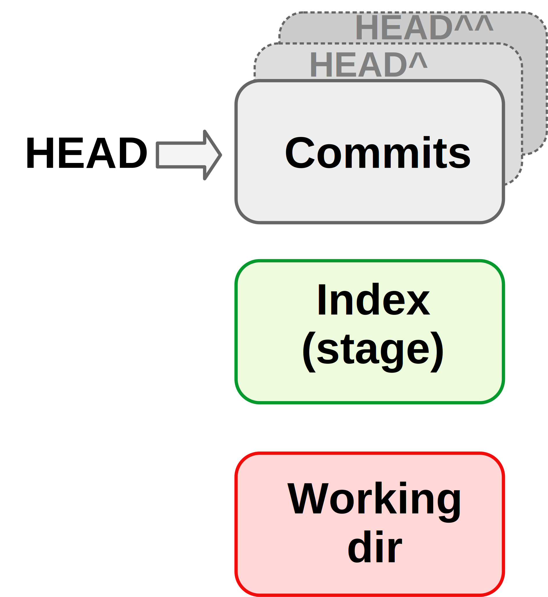
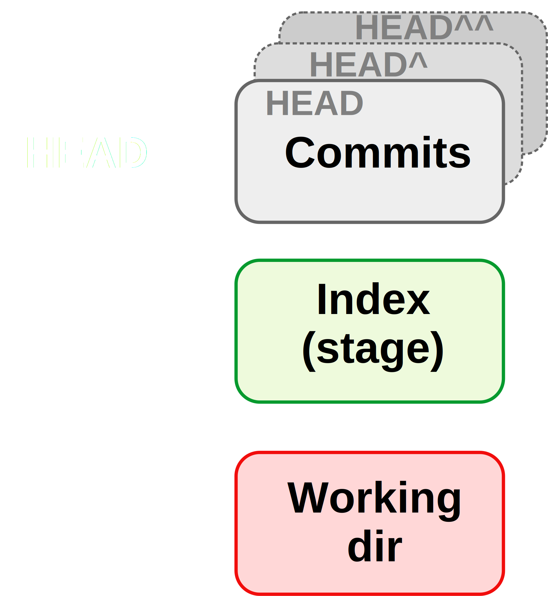
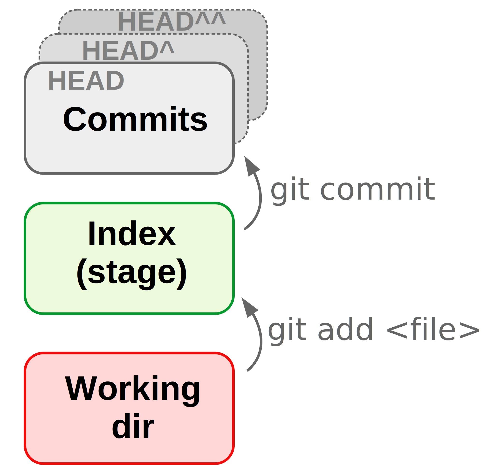
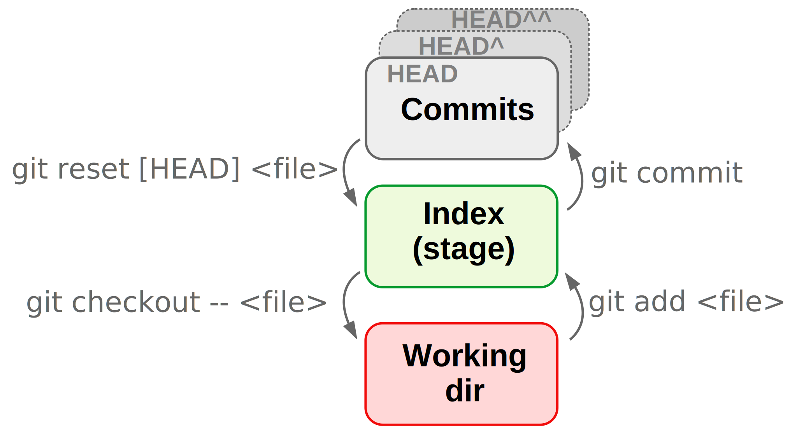
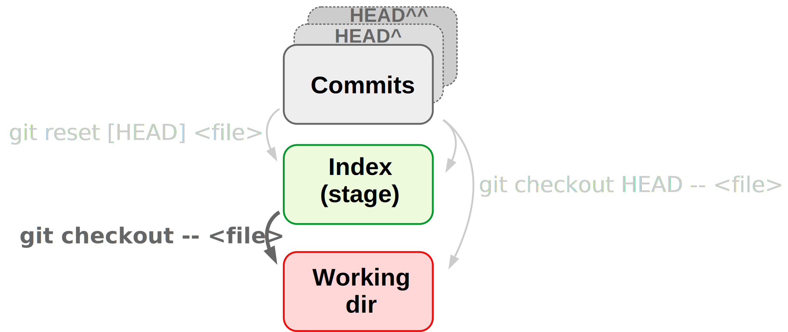

class:inverse middle center

```{r setup, include=FALSE}
options(htmltools.dir.version = FALSE)

knitr::opts_chunk$set(eval = FALSE)
```

## *Week 3: <br> Git and Github*

----

# Part III: Undoing changes and viewing the past
## (CSB 2.5-2.7)

<br> <br> <br> <br> <br>

### Jelmer Poelstra
### 2021/01/28 (updated: `r Sys.Date()`)

---
class:inverse middle center

# Overview

----

.left[
- ### [Key Git concepts and file states](#concepts)
- ### [Undoing *un-committed* changes](#undo)
- ### [Undoing *committed* changes](#undo-commit)
- ### [Viewing past versions of the repo](#past-repo)
- ### [Viewing & reverting to earlier versions of *files*](#past-files)
]

---
name: concepts

## Key Git concepts and file states

The three states for files correspond to the three "trees" of Git:
 
 - **HEAD**: State of the project in most recent commit (on current branch)
 
 - **Index** (*Stage*): State of the project ready to be committed.
 
 - **Working directory**: State of the project as currently on your computer. 

<figure>
<p align="center">

</p>
</figure>

---

## Key Git concepts and file states

The three states for files correspond to the three "trees" of Git:
 
 - **HEAD**: State of the project in most recent commit (on current branch)
 
 - **Index** (*Stage*): State of the project ready to be committed.
 
 - **Working directory**: State of the project as currently on your computer. 

<figure>
<p align="center">

</p>
</figure>

---

## Key Git concepts and file states (cont.)

**When a file is:**

| State     | HEAD (Last commit) | Index (Stage) | Working Dir
|-----------|--------------------|---------------|
| **Committed** | version X          | version X     | version X 
| **Staged**    | version X          | **<span style=color:green> version Y</span>**     | **<span style=color:green>version Y</span>**
| **Modified**  | version ?          | version X     | **<span style=color:red>version Y</span>**

<figure>
<p align="center">

</p>
</figure>

---

## Key Git concepts and file states (cont.)

**When a file is:**

| State     | HEAD (Last commit) | Index (Stage) | Working Dir
|-----------|--------------------|---------------|
| Committed | version X          | version X     | version X 
| Staged    | version X          | **<span style=color:green> version Y</span>**     | **<span style=color:green>version Y</span>**
| Modified  | version ?          | version X     | **<span style=color:red>version Y</span>**
| Untracked | &nbsp; -           | &nbsp; -       | **<span style=color:red>version X</span>**

---

## Key Git concepts and file states(cont.)

<br>

<figure>
<p align="center">

</p>
</figure>

---

## Key Git concepts and file states (cont.)

<br>

<figure>
<p align="center">

</p>
</figure>

---
name: undo

# Undoing

----

<br> <br> <br> <br> 

---

## Undoing working dir changes by recovering an old version from the repo

- Let's say we accidentally overwrite instead of append to a file:
  ```sh
  $ echo "todo: ask sequencing center about adapters" > README.md
  ```

--

- Always start by checking the status:
  ```sh
  $ git status
  ```

- We want to "discard changes in working directory" by recovering the version of
  the file in the index (and HEAD), and Git told us how to do this:
  ```sh
  $ git checkout -- README.md
  ```

--

.content-box-info[
On recent Git versions (not yet on OSC), it instead recommends:
```sh
git restore README.md
```
]

---

## Undoing working dir changes by recovering an old version from the repo

- Let's say we accidentally overwrite instead of append to a file:
  ```sh
  $ echo "todo: ask sequencing center about adapters" > README.md
  ```

- Always start by checking the status:
  ```sh
  $ git status
  ```

- Git told us how to do undo the change:
  ```sh
  $ git checkout -- README.md
  ```

---

## Undoing changes that have not been staged <br> by recovering an old version from the repo

- Let's say we accidentally overwrite instead of append to a file:
  ```sh
  $ echo "todo: ask sequencing center about adapters" > README.md
  ```

- Always start by checking the status:
  ```sh
  $ git status
  ```

- Git told us how to do undo the change:
  ```sh
  $ git checkout -- README.md
  ```

.content-box-info[
For `git checkout`, the CSB book example omits the two dashes `--`.
These dashes indicate that the checkout command should operate on a file,
but since the filename is provided too, this is not strictly necessary.
However, it is what our OSC version of git recommends and is good practice. 
]

---

## Undoing changes that have not been staged <br> by recovering an old version from the repo (cont.)

<br>

<figure>
<p align="center">

</p>
</figure>

---

## Unstaging a file

- `git reset` can *unstage* a file, which is most often needed when you
  added a file that was not supposed to be part of the next commit:

  ```sh
  $ echo "The foloqing TruSeq adapters were used:" >> README.md
  $ echo "wc -l *fastq" > count_reads.sh
  $ git add --all
  ```

- Oops, those two file changes should be part of separate commits.  
  Again, we check the status first and find we should use `git reset`:  
  ```sh
  $ git reset HEAD README.md
  ```

--

.content-box-warning[
This will only unstage and **not** revert the file back to its state at the
last commit (cf. CSB &ndash; mistake!).
]

--

.content-box-info[
If you *staged* a file and realize you made a mistake,
or staged prematurely, you can continue editing the file and re-add it.
]

---

## Unstaging a file

- `git reset` can *unstage* a file, which is most often needed when you
  added a file that was not supposed to be part of the next commit:

  ```sh
  $ echo "The foloqing TruSeq adapters were used:" >> README.md
  $ echo "wc -l *fastq" > count_reads.sh
  $ git add --all
  ```

- Oops, those two file changes should be part of separate commits.  
  Again, we check the status first and find we should use `git reset`:  
  ```sh
  $ git reset HEAD README.md
  ```

.content-box-warning[
This will only unstage and **not** revert the file back to its state at the
last commit (cf. CSB &ndash; mistake!).
]

.content-box-info[
On recent Git versions (not yet on OSC), it instead recommends:
```sh
git restore --staged README.md
```
]

---

## Unstaging a file (cont.)

<br>

<figure>
<p align="center">

</p>
</figure>

---

## Undoing staged changes

What if we had even staged our changes,
but we just want to get of all changes in the file since the last commit?

For instance, we overwrote the README.md and staged the misshapen file:
  ```sh
  $ echo "Todo: ask sequencing center about adapters" > README.md
  $ git add README.md
  ```

--

<br>

To get back the version that is stored in the last commit,
and disregard any staged or unstaged changes to the file:
```sh  
$ git checkout HEAD -- README.md
```

--

.content-box-warning[
Be careful with the `git checkout` command,  
because it irrevocably discards the non-committed changes.
]

---

## Undoing staged changes

<br>

<figure>
<p align="center">

</p>
</figure>

---

## Undo summary so far

.content-box-info[
For a particular file `README.md`, I want to:

- **Unstage the file**, but don't need to discard (replace) changes:
  ```sh
  $ git reset HEAD -- README.md
  ```
  
- **Go back to the last commit and have unstaged changes** in my
  working dir that should be discarded:
  ```sh
  $ git checkout -- README.md # Technically: grabs file from *Index*
  ```

- **Go back to the last commit and have staged changes**
  (and optionally unstaged changes) that should be discarded:
  ```sh
  $ git checkout HEAD -- README.md
  
  # With slight modifications, you can get back *any* version:
  $ git checkout HEAD^ -- README.md  # From second-to-last commit
  $ git checkout <sha-id> -- README.md # From arbitrary commit
  ```
]

---
name: undo-commit

## Undoing *committed* changes

- Create a new commit that will revert all the changes made in a previous commit:
  
  ```sh
  $ git revert HEAD     # Most recent commit
  
  $ git revert HEAD^    # Second-to-last commit
  $ git revert <sha-id> # Any arbitrary commit
  ```

<br>

.content-box-info[
Undoing with `git revert` will work and be safe both for commits that were
and that were not pushed online.

This is because `git revert` does not erase history,
instead it creates a new commit that does exactly the inverse of the changes
made, to get back to the desired past state.
]

---


---
background-color: #f2f5eb
name: past-repo

## Viewing past versions of the repo

Say we want to see what our project looked like at some point in the past.

- First, we get an overview of past commits and their messages:
  ```sh
  $ git log --oneline --all --graph
  ```

- We find a commit we want to go back to, and look around in the past:
  ```sh
  $ git checkout <sha-id> # Replace <sha-id> by an actual hash
  $ less myfile.txt       # Etc. ...
  ```

- To go back to where we were originally:
  ```sh
  $ git checkout master
  ```

.content-box-info[
If you want to revert your repo back to an earlier state,
it's best to move back to the present, as above, and then use `git revert`:
```sh
git revert <sha-id>
```
]

---
background-color: #f2f5eb

## Viewing past versions of the repo (cont.)

.content-box-warning[
Note the confusing re-use of `git checkout`!  
We have now seen `git checkout` being used to:
  - Move between branches
  - Revert files back to previous states
  - Move to previous commits to explore (**figure below**)
]

<figure>
<p align="center">

<figcaption>Figure from swcarpentry.github.io</figcaption>
</p>
</figure>

---
background-color: #f2f5eb
name: past-files

## Viewing & reverting to earlier versions of *files*

- Get a version of a file from a past commit:

  ```sh
  git checkout HEAD^^ -- README.md   # Second-to-last commit
  git checkout ad4ca74 -- README.md  # Arbitrary commit
  
  less README.md  # This will now be "the old version"
  git status      # "The old version" has been staged
  ```

- Nope, please take me back to my current version:

  ```sh
  git checkout HEAD -- README.md
  
  less README.md  # Back to the current version
  git status      # Up-to-date
  ```

.content-box-warning[
Don't do this when you have uncommitted changes to the same file:
those will be lost!
(Recall how we used the same command to undo working dir changes...)
]

---
background-color: #f2f5eb

## Viewing & reverting to earlier versions of *files* (cont.)

- Get a version of a file from a past commit:

  ```sh
  git checkout HEAD^^ -- README.md   # Second-to-last commit
  git checkout ad4ca74 -- README.md  # Arbitrary commit
  
  less README.md  # Reverted to an old version
  git status      # The old version has been staged
  ```

- Nope, please take me back to my current version:

  ```sh
  git checkout HEAD -- README.md
  
  less README.md  # Back to the current version
  git status      # Up-to-date
  ```

.content-box-info[
An alternative method:
```sh
git show ad4ca74:README.md             # View
git show ad4ca74:README.md > README.md # Revert
```
]

---

## Other options

.content-box-info[
**What if I want to get back to a previous version, like above,  
but am not sure I want to permanently delete the recent changes?**

1. **Create a new *branch***, commit the changes there, and then move back to
   the main/previous branch. *=> CSB Ch. 2.6*

2. ***Stash* the changes** and possibly retrieve (*apply*) them later.
   This only makes sense if you may or may not want to keep the changes and
   think you will find out soon. *=> Bonus materials*
]
