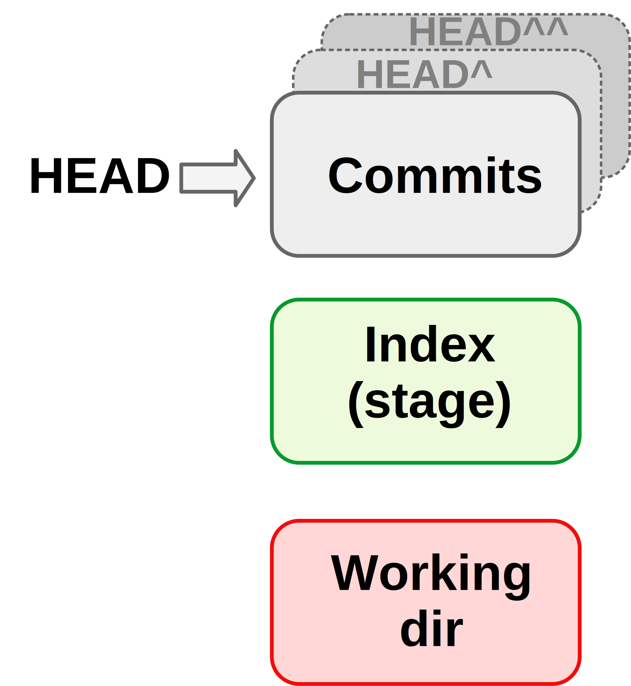
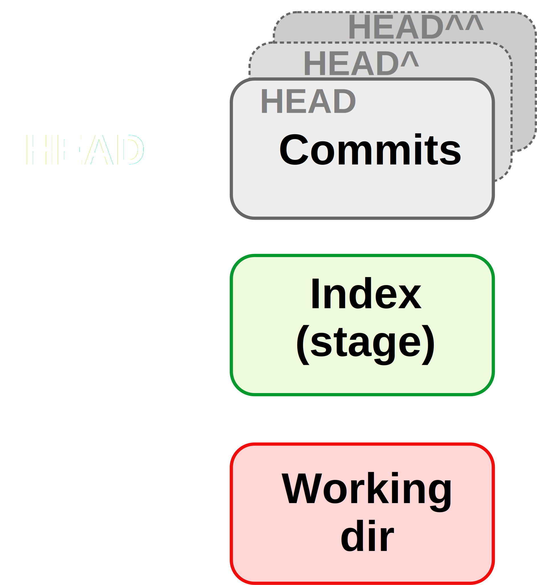
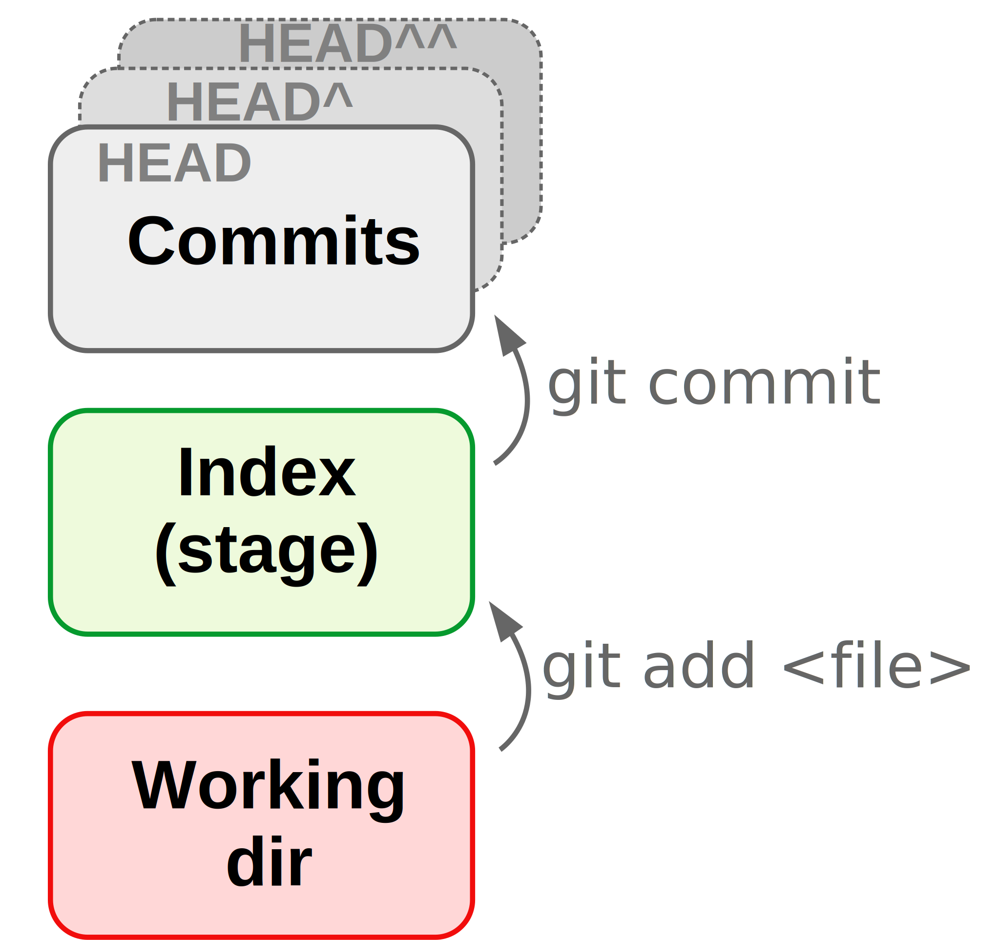
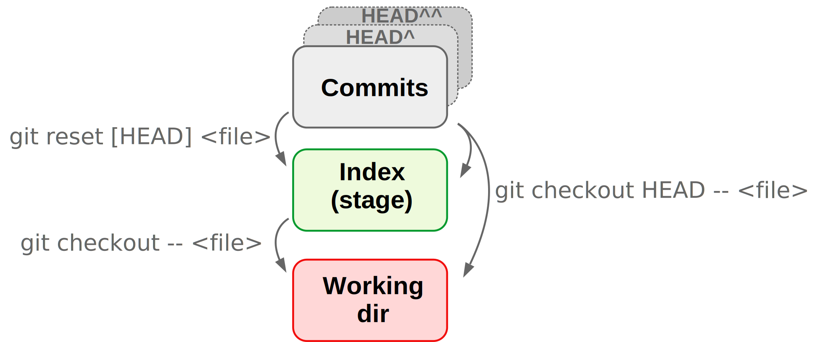
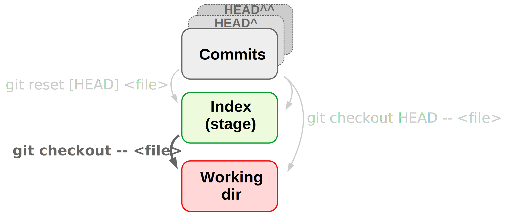

class:inverse middle center

```{r setup, include=FALSE}
options(htmltools.dir.version = FALSE)

knitr::opts_chunk$set(eval = FALSE)
```

## *Week 3: <br> Git and Github*

----

# Part I: Getting started with Git
## (CSB 2.1-2.4)

<br> <br> <br> <br> <br>

### Jelmer Poelstra
### 2021/01/26 (updated: `r Sys.Date()`)

---
class:inverse middle center

# Overview

----

.left[
## [Intro to version control](#remote)
### CSB 2.4.1: [Basic workflow](#branch)
### CSB 2.4.2-2.4.4: [Showing changes, ignoring files, mv and rm](#misc)
### CSB 2.7 : [Public repos](#public)
### [Some best practices](best-prac)
]

<br> <br>

---

## Versioning challenges <br> without a formal Version Control System (VCS)

- What to save?
  
  - **Do you only save versions of individual files?**  
    Space-efficient, but impossible to go back to the state of other files
    at the same point in time.
  
  - **Do you save the full project periodically?**  
    Better, but can quickly become prohibitive in terms of disk storage.

- **How to manage simultaneous variants of files**,  
  e.g. when making experimental changes?

- **How to know what changes were made between saved versions?**  
  Try to summarize this in the file name?
  
- How to collaborate simultaneously work on a project?

---

## With version control:

- You have a time machine for your project.

- You can easily see a "history of changes".

- You can do simultaneous collaborative work.

- By using *branches*:
  
  - No worries about breaking things that work.
  
  - Make (experimental) changes without affecting others work,
    but staying up-to-date with the main project.

- Sharing your code and other aspects of your project is easy

<br>

> *Version control is a way to keep your scientific projects tidily organized,*
> *collaborate on science, and have the whole history of each project at your*
> *fingertips.*  
> &mdash; CSB

---

## How does version control work broadly?

<p align="left">

</p>

.content-box-info[
Git saves *differences* between commits,
it does not keep copies of all files for every commit.
This is also true at the within-file level:
only the changes are saved. 
]

.content-box-info[
The general model of Git is that *one repository corresponds to everything
inside a single directory structure* (project organization!).
]

---

## What are Git and GitHub?

<br>

- **Git** is the most widely used Version Control System,
  i.e. software for version control.  
  (Others include *SVN* and *Mercurial*.)

- **GitHub** is the most widely used *website* to host Git repositories.  
   (Others include *GitLab*, *Bitbucket*, and *SourceForge*.)

<br>

Github can be linked up to Git, so you can sync your repositories from the
command line.

---

## Two key terms

### Repository

A "*repository*" (or "*repo*") is the version-control database for a project.  
It is saved in a hidden folder `.git` in the root dir of your project.
  
  - You can start a repository in any dir on your computer.
    
  - You can also download (`git clone`) an online repo,
    whether or not it is your own (but you can only *upload* to repos with
    permission).

### Commit

A "*commit*" is a saved *snapshot* of the project. It is always possible to go
the exact state of the entire project or individual files for any commit.  
Whenever you commit, you also include a message describing the changes.

---

## What do I put under version control?

- The prime things to put under version control are:
  
  - **Scripts** (and/or source code for software)
  
  - **Documentation**
  
  - **Manuscripts** (if you write them in plain text)
  
- **Raw data** may or may not be committed (see *Limitations* on next slide).

<br>

--

- In general: **version-control the source, not the derived files**.
    
    - Version-control your markdown file, not the HTML it produces.
    
    - Version-control your script, not the figure it produces.

.content-box-info[
Recall last week's point that derived data and other derived files
are (or should be...) *dispensable*, because they can be regenerated
using the raw data + the scripts.
]

---

## What do I put under version control? (cont.)

### Limitations:

- *File type*: Binary files can't be tracked *effectively* &ndash;
  Git will just save a new version of the file whenever there's been a change.

- *Repository size*: Best to keep individual repo's under 1 GB.

- *File size*: Github will not allow files over 100 MB.

--

<br>

.content-box-warning[
NGS data is therefore generally too large to be version-controlled.  
You should use dedicated repositories for this like the NCBI's SRA.
]

---

## Using Git

**You can use Git in several different ways:**
  
- Native command-line interface (CLI).
  
- Third-party GUIs &ndash; *Git Kraken* works for all operating systems.
  
- Using IDEs/editors with Git integration like RStudio and VS Code.

<br>

.content-box-info[
In this course, we will mainly focus on the CLI because it's the most universal
and powerful.
]

<br>

.content-box-info[
Git is pretty hard to get used to, regardless of the interface.
]


---

## Git CLI &ndash; General structure of commands

- Every git command is called using (sub)commands (or *verbs*):  
  ```sh
  $ git <(sub)command> [options] [args]
  ```
  
  <br>
  
  For instance: 
  ```sh
  $ git status
  
  $ git add file.txt
  
  $ git commit -m "My commit message"
  ```
  
---

## CSB 2.4.1: Basic workflow

Only three commands tend to make up the vast majority of your Git work:

- **`git add`**  
  *Stage* files to be committed (including previously untracked files).

- **`git commit`**  
  Commit all currently staged changes.

- **`git status`**  
  Get the status of your repository: which files have changed,
  which new files are present, tips on next steps, etc.

---

## CSB 2.4.1: Basic workflow

Only three commands tend to make up the vast majority of your Git work:

- **`git add`**  
  *Stages* files to be committed, including previously untracked files.

- **`git commit`**  
  Commits all currently staged changes.

<figure>
<p align="center">

<figcaption>Figure from swcarpentry.github.io</figcaption>
</p>
</figure>

---

## CSB 2.4.1: Basic workflow

Only three commands tend to make up the vast majority of your Git work:

- **`git add`**  
  *Stages* files to be committed, including previously untracked files.

- **`git commit`**  
  Commits all currently staged changes.
  
<br>

.content-box-info[
New files are not automatically tracked: you need to add them using `git add`.
```sh
$ git add file.txt # Starts tracking *and* stages file 

$ git add --all    # Stages all project files
```
]

---

## CSB 2.4.1: Basic workflow (cont.)

<figure>
<p align="center">

</p>
</figure>

---

## CSB 2.4.1: Code-along &ndash; Starting a repo

- Creating a dir for a mock project to version-control:
  ```sh
  $ cd /fs/PAS1855/users/$USER/
  
  $ mkdir -p week03/originspecies
  
  $ cd week03/originspecies
  ```

<br>

- **Initializing the repo** with `git init`:
  ```sh
  $ git init
  ```

- Check the status of the repo:
  ```sh
  $ git status
  ```

---

## CSB 2.4.1: Code-along &ndash; Our first commit

- Start writing the book:
  ```sh
  $ touch origin.txt
  $ echo "An Abstract of an Essay on the Origin of Species and \
        Varieties Through Natural Selection" > origin.txt
  $ cat origin.txt
  ```

- **Start tracking the file, and stage it:**
  ```sh
  $ git add origin.txt   # Tab-completing filenames will work
  ```

- Check the status of the repo:
  ```sh
  $ git status
  ```

- Looks good? Let's make our first **commit**:
  ```sh
  $ git commit -m "Started the book"
  ```

---

## CSB 2.4.1: Code-along &ndash; Our first commit (cont.)

- Check the status of the repo again:
  ```sh
  $ git status
  ```

- Check the history of the repo:
  ```sh
  $ git log
  ```

<br>

.content-box-info[
Try to get used to using `git status` a lot &ndash; as a sanity check before
and after other `git` actions.
]

---

## CSB 2.4.1: Code-along &ndash; Our second commit

- Modify the file:
  ```sh
  $ echo "On the Origin of Species, by Means of Natural Selection, \
        or the Preservation of Favoured Races in the Struggle \
        for Life" > origin.txt
  ```

- Check the status of the repo:
  ```sh
  $ git status
  ```

- We see that *Git has noticed the changes*, because the file is being tracked,
  but before we can commit it again, we need to use `git add` to stage it:
  ```sh
  $ git add origin.txt
  ```
  
- Commit and check the history of the repo:
  ```sh
  $ git commit -m "Changed the title as suggested by Murray"
  
  $ git log
  ```
  
---

## CSB 2.4.1: Basic workflow &ndash; Side note

.content-box-info[
**Ways to use `git add` and `git commit`**

You can add individual files, all files, or wildcard selections:  
```sh
$ git add myfile.txt

# Add all files in the project:
$ git add --all     # Or "git add ." or "git add *"

# Add all files in a dir:
$ git add scripts/*

# Add shell scripts *anywhere* in project:
$ git add *sh   
```

You can also use the `-a` option to `git commit` as a shortcut add and commit
all changes with a single command (but note that this will *not add untracked files*):
```sh
git commit -am "Message" # Stage+commit all tracked files
```
]

---

## CSB 2.4.1: Basic workflow &ndash; Side note (cont.)

.content-box-q[
Thinking about the purposes of version control broadly,
what could be a disadvantage of committing all changes simultaneously?
]

--

<br>

.content-box-answer[
It's good practice to not simply and only commit at the end of each day,
but to try and create commits for ***units of progress worth saving*** and to ***create separate commits for distinct changes***.

For example: you look at the files you've changed using `git status`,
and find that you have:

- Updated a README to include additional sampling information,

- Worked on a script to QC sequence files.

**This is not recommended to form a single commit.**
]

---

## `r icon::fa("user-edit")` Intermezzo 2.1

1. Create the file `todo.txt` containing the line:  
   `June 18, 1858: read essay from Wallace`.

2. Stage the file.

3. Create a commit with the message `Added to-do list`.

---

## `r icon::fa("user-edit")` Intermezzo 2.1 &ndash; solutions

1. Create the file `todo.txt`:
   ```sh
   $ echo "June 18, 1858: read essay from Wallace" > todo.txt
   ```

2. Stage the file.:
   ```sh
   $ git add todo.txt
   ```
3. Create a commit with the message `Added to-do list`:
   ```sh
   $ git commit -m "Added to-do list"
   ```
   
---

## CSB 2.4.2: Showing changes

By default, `git diff` will show all changes between the working dir and the
staging area, or, if nothing has been staged, the last commit.

- Right now, there are no differences to report:
  ```sh
  $ git diff
  ```

--

- Let's make a change to the to-do list and check again:
  ```sh
  $ echo "June 20, 1858: Send first draft to Huxley" >> todo.txt
  $ git diff
  ```

- Let's make a change within a line:
  find the file `todo.txt` in the VS Code file *Explorer* and click on it.
  Change "essay" to "essays", save the file, and:
  
  ```sh
  $ git diff
  ```

--

- VS Code has a really nice way of showing differences, too.
  Click on the git symbol in the narrow side bar to open the Source Control
  side bar, then in the sidebar, click on the `M` next to the file `todo.txt`.

---

## CSB 2.4.2: Showing changes (cont.)

.content-box-info[
**Advanced `git diff`**

- Use the `--staged` option to `git diff` to show changes between the stage
  and the last commit.

- If you have changed multiple files but only want to see differences for one,
  you can also specify the filename:
  ```sh
  $ git diff todo.txt
  ```

- Furthermore, you can compare your entire repo or individual files between
  any commit:
  ```sh
  # Last commit vs second-to-last commit - full repo:
  git diff HEAD HEAD^
  
  # Last commit vs a specified commit - specific file: 
  git diff HEAD d715c54 todo.txt 
  ```
]

  
---

## CSB 2.4.3: Ignoring files and directories

Some files are best not tracked. You can add filenames and widcard selections to a `.gitignore` file,
to tell git that it should not pay attention to those files.

That is, they won't be listed in `untracked files`, and therefore won't be
accidentally added using `git add --all`.

--

- Let's add a dir `data`, and a file ending in a `~` (a temporary file type
  that text editors and other programs can produce):
  ```sh
  $ mkdir data
  $ touch data/drawings-1855-{01..12}-{01..30} todo.txt~
  ```

- Check the status:
  ```sh
  $ git status
  ```

---

## CSB 2.4.3: Ignoring files and directories (cont.)

- Now, we create a `.gitignore` file that instructs Git to ignore everything
  in the data dir, and any files ending in `~`:
  ```sh
  echo "data/" > .gitignore
  echo "*~" >> .gitignore
  ```
  
- Check the status:
  ```sh
  $ git status
  ```

--

- Add and commit the `.gitignore` file:
  ```sh
  $ git add .gitignore
  $ git commit -m "Added a gitignore file"
  ```
  
- Check the status again:
  ```sh
  $ git status
  ```
  Voila!
  
---

## CSB 2.4.4: Moving and removing tracked files

To remove or move (including renaming) files **tracked by Git**,
it is best to preface regular `rm` and `mv` commands with `git`:

```sh
$ git rm filetorem.txt
$ git rm *txt
$ git rm myoldname.txt mynewname.csv
```

--

.content-box-info[
You will inevitably forget about this, and Git will eventually figure out what
happened.
(For example: for a renamed file, Git will first see a removed file and an added file; after you stage the "new" file, Git realizes it was renamed.)

However, it is cleaner to use `git mv` and `git rm`,
so do so when you remember.
]

---

## CSB 2.4.5: Troubleshooting Git &ndash; Amending commits

- Let's say we forgot to add a file to a commit,
  or see a typo in what we just committed.
  ```sh
  $ git add forgottenfile.txt
  $ git add code.py
  ```

- Creating a separate commit for his seems "wasteful" or inappropriate,
  and including these changes along with others in a next commit is likely
  also inappropriate.
  
  In such cases, we can *amend* the commit
  (and here, we also use the  
  `--no-edit` flag to not change the commit message):
  ```sh
  $ git commit --amend --no-edit
  ```

<br>

--

.content-box-warning[
Do do not amend commits that have been published in (*pushed to*) the online
counterpart of the repo.
]

---

## CSB 2.4.5: Troubleshooting Git &ndash; Concepts

The three states for files correspond to the three "trees" of Git:
 
 - **HEAD**: State of the project in most recent commit (on current branch)
 
 - **Index** (*Stage*): State of the project ready to be committed.
 
 - **Working directory**: State of the project as currently on your computer. 

<figure>
<p align="center">

</p>
</figure>

---

## CSB 2.4.5: Troubleshooting Git &ndash; Concepts

The three states for files correspond to the three "trees" of Git:
 
 - **HEAD**: State of the project in most recent commit (on current branch)
 
 - **Index** (*Stage*): State of the project ready to be committed.
 
 - **Working directory**: State of the project as currently on your computer. 

<figure>
<p align="center">

</p>
</figure>

---

## CSB 2.4.5: Troubleshooting Git &ndash; Concepts (cont.)

**When a file is:**

| State     | HEAD (Last commit) | Index (Stage) | Working Dir
|-----------|--------------------|---------------|
| **Committed** | version X          | version X     | version X 
| **Staged**    | version X          | **<span style=color:green> version Y</span>**     | **<span style=color:green>version Y</span>**
| **Modified**  | version ?          | version X     | **<span style=color:red>version Y</span>**

<figure>
<p align="center">

</p>
</figure>

---

## CSB 2.4.5: Troubleshooting Git &ndash; Concepts (cont.)

**When a file is:**

| State     | HEAD (Last commit) | Index (Stage) | Working Dir
|-----------|--------------------|---------------|
| Committed | version X          | version X     | version X 
| Staged    | version X          | **<span style=color:green> version Y</span>**     | **<span style=color:green>version Y</span>**
| Modified  | version ?          | version X     | **<span style=color:red>version Y</span>**
| Untracked | &nbsp; -           | &nbsp; -       | **<span style=color:red>version X</span>**

---

## CSB 2.4.5: Troubleshooting &ndash; Concepts (cont.)

<br>

<figure>
<p align="center">

</p>
</figure>

---

## CSB 2.4.5: Troubleshooting &ndash; Concepts (cont.)

<br>

<figure>
<p align="center">

</p>
</figure>

---

## CSB 2.4.5: Troubleshooting &ndash; Undoing working dir changes by recovering an old version from the repo

- Let's say we accidentally overwrite instead of append to a file:
  ```sh
  $ echo "todo: ask sequencing center about adapters" > README.md
  ```

--

- Always start by checking the status:
  ```sh
  $ git status
  ```

- We want to "discard changes in working directory" by recovering the version of
  the file in the index (and HEAD), and Git told us how to do this:
  ```sh
  $ git checkout -- README.md
  ```

--

.content-box-info[
On recent Git versions (not yet on OSC), it instead recommends:
```sh
git restore README.md
```
]

---

## CSB 2.4.5: Undoing changes that have not been staged <br> by recovering an old version from the repo

- Let's say we accidentally overwrite instead of append to a file:
  ```sh
  $ echo "todo: ask sequencing center about adapters" > README.md
  ```

- Always start by checking the status:
  ```sh
  $ git status
  ```

- Git told us how to do undo the change:
  ```sh
  $ git checkout -- README.md
  ```

---

## CSB 2.4.5: Undoing changes that have not been staged <br> by recovering an old version from the repo

- Let's say we accidentally overwrite instead of append to a file:
  ```sh
  $ echo "todo: ask sequencing center about adapters" > README.md
  ```

- Always start by checking the status:
  ```sh
  $ git status
  ```

- Git told us how to do undo the change:
  ```sh
  $ git checkout -- README.md
  ```

.content-box-info[
For `git checkout`, the CSB book example omits the two dashes `--`.
These dashes indicate that the checkout command should operate on a file,
but since the filename is provided too, this is not strictly necessary.
However, it is what our OSC version of git recommends and is good practice. 
]

---

## CSB 2.4.5: Undoing changes that have not been staged <br> by recovering an old version from the repo (cont.)

<br>

<figure>
<p align="center">

</p>
</figure>

---

## CSB 2.4.5: Troubleshooting &ndash; Unstaging a file

- `git reset` can *unstage* a file, which is most often needed when you
  added a file that was not supposed to be part of the next commit:

  ```sh
  $ echo "The foloqing TruSeq adapters were used:" >> README.md
  $ echo "wc -l *fastq" > count_reads.sh
  $ git add --all
  ```

- Oops, those two file changes should be part of separate commits.  
  Again, we check the status first and find we should use `git reset`:  
  ```sh
  $ git reset HEAD README.md
  ```

--

.content-box-warning[
This will only unstage and **not** revert the file back to its state at the
last commit (cf. CSB &ndash; mistake!).
]

--

.content-box-info[
If you *staged* a file and realize you made a mistake,
or staged prematurely, you can continue editing the file and re-add it.
]

---

## CSB 2.4.5: Troubleshooting &ndash; Unstaging a file

- `git reset` can *unstage* a file, which is most often needed when you
  added a file that was not supposed to be part of the next commit:

  ```sh
  $ echo "The foloqing TruSeq adapters were used:" >> README.md
  $ echo "wc -l *fastq" > count_reads.sh
  $ git add --all
  ```

- Oops, those two file changes should be part of separate commits.  
  Again, we check the status first and find we should use `git reset`:  
  ```sh
  $ git reset HEAD README.md
  ```

.content-box-warning[
This will only unstage and **not** revert the file back to its state at the
last commit (cf. CSB &ndash; mistake!).
]

.content-box-info[
On recent Git versions (not yet on OSC), it instead recommends:
```sh
git restore --staged README.md
```
]

---

## CSB 2.4.5: Troubleshooting &ndash; Unstaging a file (cont.)

<br>

<figure>
<p align="center">

</p>
</figure>

---

## CSB 2.4.5: Troubleshooting &ndash; Undoing staged changes

What if we had even staged our changes,
but we just want to get of all changes in the file since the last commit?

For instance, we overwrote the README.md and staged the misshapen file:
  ```sh
  $ echo "Todo: ask sequencing center about adapters" > README.md
  $ git add README.md
  ```

--

<br>

To get back the version that is stored in the last commit,
and disregard any staged or unstaged changes to the file:
```sh  
$ git checkout HEAD -- README.md
```

--

.content-box-warning[
Be careful with the `git checkout` command,  
because it irrevocably discards the non-committed changes.
]

---

## CSB 2.4.5: Troubleshooting &ndash; Undoing staged changes

<br>

<figure>
<p align="center">

</p>
</figure>

---

## CSB 2.4.5: Troubleshooting &ndash; Other options

.content-box-info[
**What if I want to get back to a previous version, like above,  
but am not sure I want to permanently delete the recent changes?**

1. **Create a new *branch***, commit the changes there, and then move back to
   the main/previous branch. *=> CSB Ch. 2.6*

2. ***Stash* the changes** and possibly retrieve (*apply*) them later.
   This only makes sense if you may or may not want to keep the changes and
   think you will find out soon. *=> Bonus materials*
]

.content-box-info[
**What if I need to get back an old version of the entire project?**

...
]

---

## CSB 2.4.5: Troubleshooting &ndash; Undo summary so far

.content-box-info[
For a particular file `README.md`, I want to:

- **Unstage the file**, but don't need to discard (replace) changes:
  ```sh
  $ git reset HEAD -- README.md
  ```
  
- **Go back to the last commit and have unstaged changes** in my
  working dir that should be discarded:
  ```sh
  $ git checkout -- README.md # Technically: grabs file from *Index*
  ```

- **Go back to the last commit and have staged changes**
  (and optionally unstaged changes) that should be discarded:
  ```sh
  $ git checkout HEAD -- README.md
  
  # With slight modifications, you can get back *any* version:
  $ git checkout HEAD^ -- README.md  # From second-to-last commit
  $ git checkout <sha-id> -- README.md # From arbitrary commit
  ```
]


---
class: inverse middle center

# Questions?

----

<br> <br> <br> <br>

---
class: inverse middle center

# Bonus Materials

----

<br>

## [Undoing *committed* changes](#undo-commit)

<br> <br>

---
background-color: #f2f5eb
name: undo-commit

## Undoing *committed* changes

- Create a new commit that will revert all the changes made in a previous commit:
  
  ```sh
  $ git revert HEAD     # Most recent commit
  
  $ git revert HEAD^    # Second-to-last commit
  $ git revert <sha-id> # Any arbitrary commit
  ```

<br>

.content-box-info[
Undoing with `git revert` will work and be safe both for commits that were
and that were not pushed online.

This is because `git revert` does not erase history,
instead it creates a new commit that does exactly the inverse of the changes
made, to get back to the desired past state.
]
