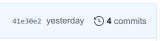
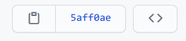
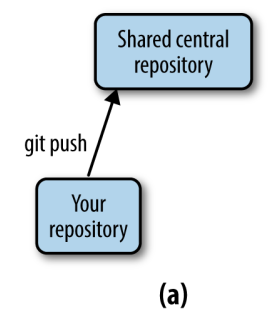
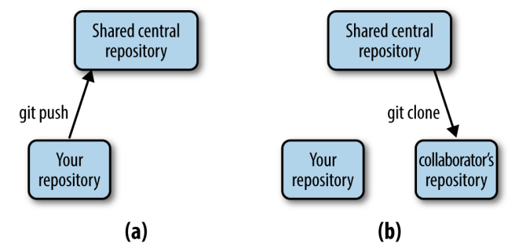
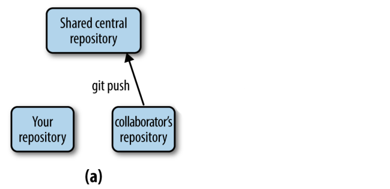
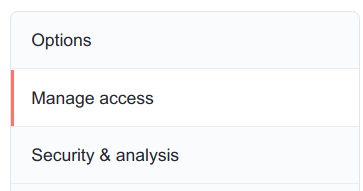

class:inverse middle center

```{r setup, include=FALSE}
options(htmltools.dir.version = FALSE)

knitr::opts_chunk$set(eval = FALSE)
```

## *Week 3: Git and GitHub*

----

# Part II: <br> Branching & merging, <br> and remotes on GitHub

<br> <br> <br>

### Jelmer Poelstra
### 2021/01/28 (updated: `r Sys.Date()`)

---
class:inverse middle center

# Overview

----

.left[
- ### [Branching & merging](#branch)
- ### [Remote repos on GitHub](#remote)
- ### [Some Git best practices](best-prac)
]

<br> <br>

---
class:inverse middle center

# Branching & merging

----

<br> <br> <br> <br> <br>

---

## Starting a repo with some commits

- First, we create a dummy repo with a few commits by running a script:
  ```sh
  $ cd /fs/ess/PAS1855/users/$USER/CSB/git/sandbox
  $ less ../data/create_repository.sh  # press `q` to exit less
  
  $ ../data/create_repository.sh
  ```

- Let's see what has been done in this repo:
  ```sh
  $ cd branching_example
  
  $ git log --oneline
  ```

---

## *Branches* in Git

- *We now want to improve the code, but these changes are experimental,*  
  and we want to retain our previous version that we know works.
  
- This is where ***branching*** comes in.

  With a new branch, we can make changes that don't affect the `master` branch,
  and we can also keep working on the `master` branch:
  
<figure>
<p align="center">

<figcaption>Figure modified after Allesino & Wilmes (2019)</figcaption>
</p>
</figure>

---

## Creating a new branch

- First, we create a new branch as follows:
  ```sh
  $ git branch fastercode   # We name the branch "fastercode"
  ```

--

- Let's see what our log looks like now, and list the branches:
  ```sh
  $ git log --oneline  # --oneline: 1-line summary per commit
  ```
  
  ```sh
  $ git branch  # Without args, git branch will list the branches
  ```

--

- It turns out we created a new branch **but we are still on the master branch**,
  so we should switch branches:
  ```sh
  $ git checkout fastercode  # Note reuse of `checkout` command!
  ```

---

## Making experimental changes on the new branch

- We edit the code, stage and commit the changes:
  ```sh
  $ echo "Yeah, faster code" >> code.txt
  $ git add code.txt
  $ git commit -m "Managed to make code faster"
  ```

- Let's check the log again:
  ```sh
  $ git log --oneline # Last commit: on branch "fastercode"
  ```

---

## Moving back to the `master` branch

- We need to switch gears completely within the project,  
  and add references to the paper draft.
  
  Since this has nothing to do with our attempt at faster code,  
  we should make these changes **back on the `master` branch**:
  
  ```sh
  # Move back to master:
  $ git checkout master
  
  # Add the reference:
  $ echo "Marra et al. 2014" > references.txt
  
  # Stage and commit:
  $ git add references.txt
  $ git commit -m "Fixed the references"
  ```

--

- Now we've made changes to each of the two branches.  
  Let's see the log in "graph" format with `--graph`,
  also listing all branches with `--all`:
  ```sh
  $ git log --oneline --graph --all
  ```

---

## Finishing up on the experimental branch

- At `fastercode`, we finished speeding up the code,
  but still need to document our changes.
  So, we go back to the `fastercode` branch:
  ```sh
  $ git checkout fastercode
  
  # Add the "documentation" to the code:
  $ echo "# My documentation" >> code.txt
  
  # Stage and commit:
  $ git add code.txt
  $ git commit -m "Added comments to the code"
  ```

- Again we check the log graph:  
  ```sh
  $ git log --oneline --all --graph
  ```

---

## Merging the branches

- We are happy with the changes to the code, and want to make the `fastercode`
  version *the default version of the code*.
  
  This means we should merge the `fastercode` branch back into `master`.
  To do so, we first have to move back to `master`:
  ```sh
  $ git checkout master
  ```

--

- Now we are ready to merge, and we use the `git merge` command.  
  We also provide a commit message, *because a merge is always accompanied
  by a commit*:
  ```sh
  $ git merge fastercode -m "Much faster version of code"
  ```

- Once again, we check the log graph:  
  ```sh
  $ git log --oneline --all --graph
  ```

---

## Cleaning up

- We no longer need the `fastercode` branch, so we can delete it:
  ```sh
  $ git branch -d fastercode
  ```

- And again we check the log graph:
  ```sh
  $ git log --oneline --all --graph
  ```

---

## Branching and merging &ndash; Workflow summary

<figure>
<p align="center">

<figcaption>Figure from Allesino & Wilmes (2019)</figcaption>
</p>
</figure>

---

## Branching and merging &ndash; Workflow summary

.content-box-info[
### Overview of the commands used in the branching workflow 

```sh
# Create a new branch:
$ git branch mybranch

# Move to new branch:
$ git checkout mybranch

# Add and commit changes:
$ git add --all
$ git commit -m "my message"

# Done with branch - move back to main trunk and merge
$ git checkout master
$ git merge mybranch -m "Message for merge"

# And [optionally] delete the branch:
$ git -d mybranch
```
]

---

## `r icon::fa("user-edit")` Intermezzo 2.2

**(a)** Move to the directory `CSB/git/sandbox`.

**(b)** Create a directory `thesis` and turn it into a Git repository.

**(c)** Create the file `introduction.txt` with the line *"The best introduction
ever."*

**(d)** Stage `introduction.txt` and commit with the message *"Started introduction."*

**(e)** Create the branch `newintro` and change into it.

**(f)** Change (overwrite) the contents of `introduction.txt`, create a new file  `methods.txt`, and commit.

**(g)** Look at the commit history of the branches.

**(h)** Change to the branch `master`, merge, and confirm that the changes you
performed within the branch `newintro` are now also part of the branch
`master`.

**(i)** *Bonus:* Delete the branch `newintro`.

---

## `r icon::fa("user-edit")` Intermezzo 2.2: Solutions

**(a)** Move to the directory `CSB/git/sandbox`:

```sh
$ cd ∼/CSB/git/sandbox
```

**(b)** Create a directory `thesis` and turn it into a Git repository:

```sh
$ mkdir thesis
$ cd thesis
$ git init
```

**(c)** Create the file `introduction.txt`:
```sh
$ echo "The best introduction ever" > introduction.txt
```

**(d)** Stage and commit `introduction.txt`:
```sh
$ git add introduction.txt
$ git commit -m "Started introduction"
```

---

## `r icon::fa("user-edit")` Intermezzo 2.2: Solutions (cont.)

**(e)** Create the branch `newintro` and change into it:
```sh
$ git branch newintro
$ git checkout newintro
```

**(f)** Change the contents of `introduction.txt`, create a new file  `methods.txt`, and commit:
```sh
$ echo "A much better introduction" > introduction.txt
$ touch methods.txt
$ git add --all
$ git commit -m "A new introduction and methods file"
```

**(g)** Look at the commit history of the branches:
```sh
$ git log --oneline
```

---

## `r icon::fa("user-edit")` Intermezzo 2.2: Solutions (cont.)

**(h)** Change to the branch `master`, merge, and confirm that the `newintro`
changes are in `master`:
```sh
$ git checkout master
$ git merge newintro
$ ls
$ cat introduction.txt
```

**(i)** *Bonus:* Delete the branch `newintro`:
```sh
$ git branch -d newintro
$ git log --oneline
```

---
class:inverse middle center

# Remote repositories on GitHub

----

<br> <br> <br> <br> <br>

---

## Remote repositories

We have been locally version-controlling our `originspecies` repo,  
but now we also want to **put this repo online**, to:

- Share our work and/or

- Have an online backup and/or

- Collaborate with others.

<br>

We will use the **GitHub website** as the place to host our online repositories.

<br>

.content-box-info[
Online counterparts of repositories that we also have locally are usually
referred to as "remote repositories" or "remotes".

To add and manage remotes, we use the `git remote` command.
]

---

## Creating remote repositories

While we can *interact* with online repos using Git commands,  
we **can't _create_ a new online repo with the Git CLI**.

So, we need to go to the GitHub website to create a new online repo.

--

<br> <br> <br> <br>

.content-box-info[
VS Code does provide functionality to create GitHub repos directly.
We may look at this later in the course, but if you're interested,
look for the `GitLens` extension by Eric Amodio.
]

---

## Create a GitHub repo (cont.)

1. Go to <https://github.com> and sign in.

2. In the top-right, click the `+` next to your avatar and then select  
   `New repository`.

<p align="center">

</p>

---

## Create a GitHub repo (cont.)

1. Go to <https://github.com> and sign in.

2. In the top-right, click the `+` next to your avatar and then select  
   `New repository`.
   
3. In the box `Repository name`, we'll use the same name that we gave to our
   local directory: `origin-species`.  
   (*Note:* these names don't need to match up.)

<p align="center">

</p>

---

## Create a GitHub repo (cont.)

1. Go to <https://github.com> and sign in.

2. In the top-right, click the `+` next to your avatar and then select  
   `New repository`.
   
3. In the box `Repository name`, we'll use the same name that we gave to our
   local directory: `origin-species`.  
   (*Note:* these names don't need to match up.)
   
4. Leave other options as they are.  
   (We're not adding a README or other files as we are "importing" an
   existing repository: our local repo.)

<p align="center">

</p>

---

## Create a GitHub repo (cont.)

1. Go to <https://github.com> and sign in.

2. In the top-right, click the `+` next to your avatar and then select  
   `New repository`.
   
3. In the box `Repository name`, we'll use the same name that we gave to our
   local directory: `origin-species`.  
   (*Note:* these names don't need to match up.)
   
4. Leave other options as they are.  
   (We're not adding a README or other files as we are "importing" an
   existing repository: our local repo.)

5. Click `Create repository`.

<p align="center">

</p>

---

## Link up the local and remote repositories

<p align="center">

</p>

.content-box-info[
You can click on the `HTTPS`/`SSH` button to change the URL type.
]

---

## Link up the local and remote repositories (cont.)

We go back to the shell, where we'll enter the commands that GitHub provided
to us under "*...or push an existing repository from the command line*".

- First, we tell Git to add a "remote" connection with `git remote`.  
  We provide three arguments to this command:
  
  - `add` &ndash; because we're adding a remote.
  
  - `origin` &ndash; the nickname we're giving the connection.  
    This is an arbitrary name but is usually *origin* by convention.   
  
  - The SSH URL to the GitHub repo.

  ```sh
  # git remote add <remote-nickname> <URL>
  $ git remote add origin git@github.com:<user>/originspecies.git
  ```

---

## Link up the local and remote repositories (cont.)

- Second, we rename the default branch, from `master` to `main`
  (GitHub since recently uses `main` as the default branch):
  ```sh
  $ git branch -M main
  ```

- Third, we push our local repo to remote using `git push`.  
  Whenever we push a branch for the first time,  
  we need to use the `-u` option to set up an "**u**pstream" counterpart:
  ```sh
  $ git push -u origin main
  ```

--

.content-box-info[
When not given any arguments, `git push` pushes:
 - To & from the **currently active *branch*** (default: `master`/`main`)
 - To the **default remote connection**.

Therefore, from now on, we can mostly just use:

```sh
$ git push
```
]

---

## Explore the repository on GitHub

- Back at GitHub, click on `Code` in the lower of the top bars.  
  Now, we can see the files that we just uploaded from our local repo.

<p align="center">

</p>

- Next, click where it says `x commits` (should be 4) with a clock icon,  
  and you'll get an overview of commits somewhat like with `git log`.

<p align="center">

</p>

--

- On the right hand side, there are three buttons for each commit:

  - Click the hash (hexadecimal ID) to see changes made by that commit.
  
  - Click the <kbd>< ></kbd> to see the state of the repo at the time
    of that commit.
  
<p align="center">

</p>

---

## Remote repos &ndash; Single-user workflow

In a single-user workflow, all changes are made in the *local repo*,  
and the remote repo is simply periodically updated (*pushed to*).

So, the interaction between local and remote is unidirectional:

<figure>
<p align="center">

<figcaption>Figure from Buffalo (2015)</figcaption>
</p>
</figure>

---

## Remote repos &ndash; Single-user workflow (cont.)

In our day-to-day work, we now commit as usual, and in addition,  
*push* to remote occasionally:

- Let's add a README.md file, and commit:
  ```sh
  $ echo "# Origin" > README.md
  $ echo "Repo for book draft on my new **theory**" >> README.md
  $ git add README.md
  $ git commit -m "Added a README"
  ```

- Now, we push to the remote repository:
  ```sh
  $ git push
  ```

--

.content-box-info[
If we go back to GitHub, we show that the contents of the README.md
automatically shows up as a rendered Markdown file!
]

--

.content-box-info[
Visualization with <http://git-school.github.io/visualizing-git>.
]

---

## Remote repos &ndash; Multi-user workflow

A multi-user workflow starts when a second user downloads (*clones*)  
the online repo, as in **(b)** below:

<figure>
<p align="center">

<figcaption>Figure from Buffalo (2015)</figcaption>
</p>
</figure>

---

## Remote repos &ndash; Multi-user workflow

- Then, the second user can push their changes to the shared remote **(a)**:

<figure>
<p align="center">

<figcaption>Figure from Buffalo (2015)</figcaption>
</p>
</figure>

---

## Remote repos &ndash; Multi-user workflow

- Then, the second user can push their changes to the shared remote **(a)**:

<figure>
<p align="center">

<figcaption>Figure from Buffalo (2015)</figcaption>
</p>
</figure>

- To go full circle, you *pull* in
  the changes made by the second user **(b)**. 

.content-box-info[
`git pull` is two commands in one: `git fetch` to download the updates
from remote and store them in a branch,
and `git merge` to merge the newly fetched branch into you current branch.
]

---

## Remote repos &ndash; Multi-user workflow

.content-box-info[
**Recap:**  

With a multi-user workflow, changes made by different users are *shared via
the online copy of the repo.*

*Syncing is not automatic*:

- Changes to your local repo remain local-only until you **push** to remote.

- Someone else's changes to the remote repo do not make it into your
  local repo until you **pull** from remote.

But Git will tell you about "divergence" between local remote,
when you check `git status`:
<figure>
<p align="center">

</p>
</figure>
]

---

## What can you do with <br> someone else's GitHub repository?

If you do not have rights to *push*, you can:
  
  - **Clone** the repo and make changes locally (as we do with `CSB`).
  
  - **Fork** the repository and develop it independently (!)
  
  - Submit a **pull request** [**(bonus slides)**](#pull-request)
    with proposed changes to the repo,  
    if you want to contribute to the original project.

--

<br>
.content-box-info[
If you're collaborating on a project,
you should ask your collaborator to give you admin rights for the repo.
]

---

## GitHub Issues

- Each GitHub repository has "Issues" tab &ndash; issues are mainly used to
  track bugs and other (potential) problems with a repository.

- In an issue, you can reference specific commits and people,
  and use Markdown formatting.
  
- In your Graded Assignment for this week, you will create an issue simply
  to notify me about your repository.

.content-box-info[
**Forking**, **Pull Requests**, and **Issues** are Git*Hub* functionality,  
and not part of Git.
]

---
class:inverse middle center

# In closing: <br> Some Git best practices

----

<br> <br> <br> <br> <br>

---

## Some Git best practices

- **Write informative commit messages.**  
  Imagine looking back at your project
  in a few months, after finding an error that you introduced a while ago.

  - **Bad:** "Updated file"
  - **Good:** "Updated x function to include y"

--

<figure>
<p align="center">

<figcaption>Image source: https://xkcd.com/1296/</figcaption>
</p>
</figure>

---

## Some Git best practices

- **Write informative commit messages.**  
  Imagine looking back at your project
  in a few months, after finding an error that you introduced a while ago.

  - **Bad:** "*Updated file*"
  - **Good:** "*Updated x function to include y*"

<br>

.content-box-info[
It is often argued that commit messages should preferably be in the form of
completing the sentence "*This commit will...*":

When adhering to this, the above commit message would instead say
"*Update x function to include y*".
]

---

## Some Git best practices (cont.)

- **Commit often, using small commits.**  
  This will also help to keep commit messages informative!

- **Before committing, check what you've changed.**  
  Use `git diff [--staged]` or VS Code functionality.

.content-box-info[
**Avoid including unrelated changes in commits**  
Separate commits if your working dir contains work from disparate edits:
use `git add` + `git commit` separately for two sets of files.
]

--

- **When collaborating: pull often.**  
  This will reduce the chances of *[merge conflicts](#merge-conflict)*.

- **Don't commit unnecessary files.**  
  These can also lead to conflicts &ndash; especially automatically generated,
  temporary files.

---

## Some Git best practices (cont.)

- If you have a repo with general scripts,
  which you continue to develop and use in multiple projects,
  and you publish a paper in which you use these scripts:
  
  Add a "**_tag_**" to a commit to mark the version of the scripts
  used in your analysis.
 
  ```sh
  $ git tag -a v1.2.0 -m "Clever release title"
  $ git push --follow-tags # To push all annotated tags to the remote
  ```

---
class: inverse middle center

# Questions?

----

<br> <br> <br> <br>

---
class: inverse middle center

# Bonus materials

----

<br>

.left[
- ### [Resolving merge conflicts](#merge-conflict)
- ### [Forking and creating a Pull Request](#pr)
- ### [git stash](#stash)
- ### [Amending commits](#amend)
- ### [More Git tidbits](#misc)
- ### [Add a collaborator in GitHub](#add-collab)
]

---
background-color: #f2f5eb
name: merge-conflict

## *Merge conflicts* and resolving them

A *merge conflict* can occur when:

- You try to merge two branches, or pull from remote
  (recall that a pull includes a merge), and
  
- One or more files have been changed (via commits) on **_both_** of these
  branches since their divergence, and
  
- These changes were made in similar parts of the file, usually the same line(s).

In such a case, Git has no way of knowing which changes to keep,  
and it will report a merge conflict as follows:

<p align="center">

</p>


---
background-color: #f2f5eb

## *Merge conflicts* and resolving them (cont.)

When you get a merge conflict, follow the following steps:

1. Use `git status` to find the conflicting file(s).

<p align="center">

</p>

---
background-color: #f2f5eb

## *Merge conflicts* and resolving them (cont.)

When you get a merge conflict, follow the following steps:

1. Use `git status` to find the conflicting file(s).

2. Open and edit those files manually to a version that fixes the conflict.

.content-box-info[
Git has changed this file to add the conflicting lines from both versions
of the file, and to add marks indicating these conflicting lines:

```sh
On the Origin of Species # Line preceding conflicting line
<<<<<<< HEAD # GIT MARK 1: Next line = current branch
Second line of the book - from main # Conflict line: current branch
======= # GIT MARK 2: Dividing line
Second line of the book - from conflict-branch # Conflict line: incoming branch
>>>>>>> conflict-branch # GIT MARK 3: Prev line = incoming branch
```

You have to manually change the contents in your text editor to keep the
conflicting content that you want, and to remove the indicator marks that
Git made.
]

---
background-color: #f2f5eb

## *Merge conflicts* and resolving them (cont.)

When you get a merge conflict, follow the following steps:

1. Use `git status` to find the conflicting file(s).

2. Open and edit those files manually to a version that fixes the conflict.

.content-box-info[
VS Code has some nice functionality to make this easier:

```sh
$ code <conflicting-file>  # Open the file in VS Code
```

<p align="center">

</p>

If you click on "*Accept Current Change*" or "*Accept Incoming Change*", etc.,
it will keep the desired lines and remove the Git indicator marks.
Then, save and exit.
]

---
background-color: #f2f5eb

## *Merge conflicts* and resolving them (cont.)

When you get a merge conflict, follow the following steps:

1. Use `git status` to find the conflicting file(s).

2. Open and edit those files manually to a version that fixes the conflict.

3. Use `git add` to tell Git you've resolved the conflict in a particular file.
  
  ```sh
  $ git add origin.txt
  ```
  <p align="center">
  
  </p>

---
background-color: #f2f5eb

## *Merge conflicts* and resolving them (cont.)

When you get a merge conflict, follow the following steps:

1. Use `git status` to find the conflicting file(s).

2. Open and edit those files manually to a version that fixes the conflict.

3. Use `git add` to tell Git you've resolved the conflict in a particular file.

4. Once all conflicts are resolved, use `git status` to check that all changes
   are staged. Then, use `git commit` to finish the merge commit.

  ```sh
  $ git commit
  ```
  
  .content-box-info[
  Even if you provided a commit message for the merge at the outset,
  Git will now launch your text editor if you don't again do do.
  ]
  
---
class: inverse middle center

# CSB 2.7: Forking and creating a Pull Request

----

<br> <br> <br> <br>

---
background-color: #f2f5eb
name: pr

## *Forking* a GitHub repository

- Go to a GitHub repository, and click the "**_Fork_**" button in the top-right:
  
  <p align="center">
  
  </p>
  
  You'll be asked which account or organization to fork to &ndash;
  you likely just have your personal account, which you should pick at any rate.

--

.content-box-info[
**Now, you have your own version of the repository**.

<p align="center">

</p>

You can't directly modify the *original repository*, but you can:
- First, *modify your fork*.
- Then, submit a so-called *Pull Request* to the owner of the original repo
  to pull in your changes.
  
You can also easily keep your fork up-to-date with changes to the original
repository.
]

---
background-color: #f2f5eb

## Editing the forked repository

- Clone your forked GitHub repository to your computer.

  Find the URL for the GitHub repository by clicking the green `Code` button.
  
  Make sure you get the SSH URL, and then click the clipboard button
  next to the URL to copy it.
  
  <p align="center">
  
  </p>
  
  
  ```sh
  $ git clone git@github.com:jelmerp/originspecies.git
  ```

---
background-color: #f2f5eb

## Editing the forked repository (cont.)

Now, we can make changes to the repository in the familiar way:

  ```sh
  $ echo "# Chapter 1. Variation under domestication" > origin.txt
  
  $ git add origin.txt
  $ git commit -m "Suggested title for first chapter."
  
  $ git push origin
  ```

---
background-color: #f2f5eb

## Creating a Pull Request

- If we then go back to GitHub,
  we see that our forked repo is "*x commit(s) ahead*" of the original repo:
  
  <p align="center">
  
  </p>
  
- Click `Pull Request`, and check whether the right repositories and branches
  are being compared:

  <p align="center">
  
  </p>

  You can also see the changes that were made in this window.

- If it looks good, click the green `Create Pull Request` button:
  <p align="center">
  
  </p>

---
background-color: #f2f5eb

## Creating a Pull Request (cont.)

- Give your pull request a title,
  and write a brief description of your changes:

  <p align="center">
  
  </p>

---
background-color: #f2f5eb

## Keeping your fork up-to-date

- As we saw, you can't directly *push* to original repo but instead have to submit
  a Pull Request (yes, confusing terminology!).
  
  But, you *can* create an ongoing connection to the original repo,
  which you can use to periodically *pull* to keep your fork up-to-date.
  
  This works similarly to connecting your own GitHub repo:
  
```sh
$ git remote add upstream git@github.com:jelmerp/originspecies.git

# List the remotes:
$ git remote -v
origin   git@github.com:pallass-boszanger/originspecies.git  (fetch)
origin   git@github.com:pallass-boszanger/originspecies.git  (push)
upstream   git@github.com:jelmerp/originspecies.git  (fetch)
upstream   git@github.com:jelmerp/originspecies.git  (push)

# Pull from the upstream repository:
$ git pull upstream main
```
  
.content-box-info[
"*upstream*" is an arbitrary name often used by convention,  
as opposed to "origin" for your *own* version of the online repo. 
]

---
background-color: #f2f5eb
name: stash

## `git stash`

Git stash can be useful when you need to pull from remote,
but have changes in your working dir that:
  
  - Are not appropriate for a separate commit
  
  - Are not worth starting a new branch for,
    because you want to get these
    changes back on the current branch immediately.

```sh
# Stash changes to tracked files:
$ git stash    # Note: add option -u to include untracked files

# Pull from the remote repository:
$ git pull

# Apply stashed changes:
$ git stash apply
```

---
background-color: #f2f5eb
name: amend

---

## Amending commits

Let's say we forgot to add a file to a commit,
or we notice a silly typo in something we just committed.
  
Creating a separate commit for this seems "wasteful" or even confusing,  
and including these changes along with others in a next commit is also likely
to be inappropriate. **In such cases, we can _amend_ the commit**.

- First, we stage the forgotten or fixed file: 
  ```sh
  $ git add <file>
  ```

- Then, we amend the commit (also using the `--no-edit` flag
  because we do not want change the commit message):
  ```sh
  $ git commit --amend --no-edit
  ```

.content-box-warning[
Because amending commits "changes history", some recommend avoiding this
altogether.
For sure, do **not** amend commits that have been published in (*pushed to*)
the online counterpart of the repo.
]

---
background-color: #f2f5eb
name: misc

## More Git tidbits

- Git will not pay attention to *empty* directories.

- You can create a new branch and move to it in one go using:
  ```sh
  $ git checkout -b <new-branch-name>
  ```

- To show commits in which a specific file was changed, you can simply use:
  ```sh
  $ git log <filename>
  ```

- "*Aliases*" (command shortcuts) can be useful with Git,
  and can be added to the `~/.gitconfig` file or set with `git config`:
  ```sh
  [alias]
    hist = log --graph --pretty=format:'%h %ad | %s%d [%an]' --date=short
    last = log -1 HEAD  # Just show the last commit
  ```
  
  ```sh
  $ git config --global alias.last "log -1 HEAD"
  ```

---
background-color: #f2f5eb
name: add-collab

## Add a collaborator in GitHub

- You can add a collaborator to a repository by going to the repository's
  settings:
  
<p align="center">

</p>

----

<p align="center">

</p>

----

<p align="center">

</p>

