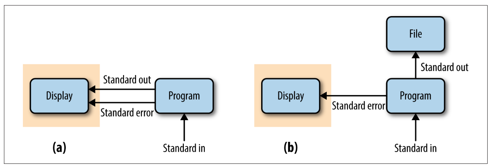

class:inverse middle center

```{r setup, include=FALSE}
options(htmltools.dir.version = FALSE)
knitr::opts_chunk$set(eval = FALSE)

icon::fa("user-edit")
```

## *Week 5: Shell scripting*

----

# Part II: <br> Shell scripting

<br> <br> <br> <br> <br>

### Jelmer Poelstra
### 2021/02/11

---
class: inverse middle center

# Overview

----

.left[
- ### Introduction
- ### [Script header lines and zombie scripts](#header)
- ### [Command-line arguments for scripts](#args)
- ### [Putting it all together](#scripts)
- ### [Touching up your script](#touch-up)
- ### [Conducting tests, exit status, and standard error](#test)
]

<br>

---

## Why scripts?

- Scripts enable us to **run sets of commands non-interactively**,  
  which is beneficial or even necessary when this set of commands:
  
  - Takes a long time to run and/or
  
  - Should be run many times, e.g. for different samples.

<br>

--

- Scripts form the basis for *analysis pipelines* and if we code things cleverly,
  it should be straightforward to rerun much of our project workflow:
  
  - After removing or adding a sample.
  
  - For different parameter settings.
  
  - And possibly even for an entirely different dataset. 

---

## Bash scripts

> *"Most Bash scripts in bioinformatics are simply commands organized into a
> rerunnable script with some added bells and whistles to check that files exist
> and ensuring any error causes the script to abort."* &mdash; Buffalo Ch. 12

<br>

Therefore, relatively straightforward to write with what you already know!

---
class: inverse middle center
name: header


# Script header lines and zombie scripts

----

<br> <br> <br> <br> <br>

---

## First line of the script: *shebang* line

- Use a so-called **"*shebang*" line** as the first line of a script.
  
  This line tells the computer which program to use to run the script:  
  in our case Bash, whose binary is located at `/bin/bash`.
  
  ```sh
  #!/bin/bash
  ```

- *Without this line*, we would have to call a script as follows:

  ```sh
  $ bash script.sh   # "bash" needed to indicate the interpreter
  ```

--

- *With this line*, we can submit the script to a job scheduler (next week),
  and also call the script as follows:

  ```sh
  $ ./script.sh      # Indicating the dir is needed; here the wd
  ```

--

- But, for this to work, we also need to make the script executable:

  ```sh
  $ chmod u+x script.sh   # Executable for user/owner of file only (u=user)
  $ chmod a+x script.sh   # Alt: executable for everyone (a=all)
  ```

---

## Bash zombie scripts &ndash; and worse!

By default, Bash will just keep running a script after it has encountered errors.

And if you reference a variable that hasn't been assigned, it won't complain:

```sh
$ echo $non_existent_variable
```

--

<br>

.content-box-q[
Why is such behavior a bad idea in scripts?
]

--

- Let's accidentally delete the entire filesystem...!
  
  ```sh
  TMPDIR=output/tmp/$sample/
  # rest of script...
  rm -rf $TMPPDIR/*   ## DONT TRY THIS!
  ```

- And as for why we want a script to stop after errors:
  these may otherwise go unnoticed but could well render the output
  of the script worthless!

---

## Three necessary options for robust scripts

With these settings, the script terminates, with appropriate error message, if:

- `set -u` &mdash; An unset variable is referenced.

- `set -e` &mdash; Almost any errors occurs.

- `set -o pipefail` &mdash; An error occurs in a shell "pipeline"
  (`sort | uniq`).

<br>

```sh
set -u
set -e
set -o pipefail
```

Or, in one line:

```sh
set -u -e -o pipefail
```

---

## Our script template so far 

```sh
#!/bin/bash

set -u -e -o pipefail
```

<br>

.content-box-info[
Another useful setting, especially for debugging, is `set -x`,  
which will print every line of the script as it is executed.
]

---
class: inverse middle center
name: arrays

# Command-line arguments for scripts

----

<br> <br> <br> <br> <br>

---

## Command-line arguments for scripts

- When you call a script, you can give it command-line arguments,  
  much like when you provide commands like `ls` with arguments:

  ```sh
  $ bash printname.sh John Doe
  ```

- Inside the script, these arguments are *automatically* assigned to the
  placeholder variables `$1` ("John" above), `$2` ("Doe" above), and so on:

  ```sh
  #!/bin/bash
  
  echo "First argument: $1"   # John
  echo "Second argument: $2"  # Doe
  echo "Full name: $1 $2"
  ```

  ```sh
  $ bash printname.sh John Doe
  #> First argument: John
  #> Second argument: Doe
  #> Full name: John Doe
  ```

---

## Command-line arguments for scripts (cont.)

- It is good practice to reassign the `$1`-style placeholders to more
  descriptively named variables:

  ```sh
  #!/bin/bash
  
  first_name=$1
  last_name=$2
  
  echo "First argument: $first_name"
  echo "Second argument: $last_name"
  echo "Full name: $first_name $last_name"
  ```

<br>

.content-box-info[
**Other variables that are automatically available inside scripts:**
- `$0` contains the filename of the script.

- `$#` contains the number of command-line arguments provided.
]

---

## Another simple shell script example

- Contents of the script, saved as `headtail.sh`:

  ```sh
  #!/bin/bash
  
  head -n 2 "$1"
  echo "---"
  tail -n 2 "$1"
  ```

- Running the script:

  ```sh
  $ bash headtail.sh samples.txt
  #> zmaysA  R1      seq/zmaysA_R1.fastq
  #> zmaysA  R2      seq/zmaysA_R2.fastq
  #> ---
  #> zmaysC  R1      seq/zmaysC_R1.fastq
  #> zmaysC  R2      seq/zmaysC_R2.fastq

  $ bash headtail.sh egfr_flank.fasta
  #> >ENSMUSG00000020122|ENSMUST00000138518
  #> CCCTCCTATCATGCTGTCAGTGTATCTCTAAATAGCACTCTCAACCCCCGTGAACTTGGT
  #> ---
  #> TTCGCTCCTCTGGATCCCTCCTCCTTCTTTAGTCCCTCCTCCTCCCGCCCAGCCTCCCCC
  #> AGTCCCGACCCGAGCTAACT
  ```

---

## Another simple shell script example (cont.)

- Good scripting citizens that we are,
  we will also add the `set` header, and make the script executable:

  ```sh
  #!/bin/bash
  set -u -e -o pipefail
  
  head -n 2 "$1"
  echo "---"
  tail -n 2 "$1"
  ```

  ```sh
  $ chmod u+x headtail.sh
  ```

- Now we can run it as follows:

  ```sh
  $ ./headtail.sh samples.txt
  ```

---

## <i class="fa fa-user-edit"></i> Your turn: A simple script

Write a script that prints a specific line (identified by line number)
from a file.

Make the line number argument 1 (`$1`), and the filename argument 2 (`$2`). 

Test the script by printing line 4 from `samples.txt`.

<br>

*If you don't remember how to print a specific line, click on the hint below.*

<details>
<summary><strong>Hint!</strong></summary>
<br>
To print a specific line number, say line 37 from <code>file.txt</code>,
you can use: <br>

<ul>
<li> <code>head -n 37 file.txt | tail -n 1</code> or </li>

<li> <code>sed -n '37p' file.txt</code> </li>
</ul>

<br>
</details>

---

## <i class="fa fa-user-edit"></i> Solution: A simple script

- Script `line.sh`:

  ```sh
  #!/bin/bash
  set -u -e -o pipefail
  
  head -n "$1" "$2" | tail -n 1
  ```
  
  Or with named variables:
  
  ```sh
  #!/bin/bash
  set -u -e -o pipefail
  
  line="$1"
  file="$2"
  
  head -n "$line" "$file" | tail -n 1
  ```

- To execute:

  ```sh
  $ chmod u+x line.sh
  $ ./line.sh 4 samples.txt
  ```

---
class: inverse middle center
name: scripts

# Putting it all together: <br> Functional, nontrivial scripts

----

<br> <br> <br> <br> <br>

---

## Buffalo's first script

```sh
#!/bin/bash
set -e -u -o pipefail

# Specify the input samples file (3rd column = path to FASTQ file):
sample_info=samples.txt

# Create a Bash array from the third column of "$sample_info":
sample_files=($(cut -f 3 "$sample_info"))

# Loop through the array:
for fastq_file in ${sample_files[@]}; do
    
    # Strip .fastq from each FASTQ file, and add suffix:
    results_file="$(basename $fastq_file .fastq)-stats.txt"
    
    # Run "fastq_stat" on a file:
    fastq_stat "$fastq_file" > stats/$results_file

done
```

---

## Buffalo's second script

```sh
#!/bin/bash
set -e -u -o pipefail

# Specify the input samples file (3rd column = path to FASTQ file):
sample_info=samples.txt

# Our reference genome:
ref=zmays_AGPv3.20.fa

# Create a Bash array from the first column (sample names).
# Because there are duplicate sample names, we call uniq
sample_names=($(cut -f 1 "$sample_info" | uniq))

# Loop through the array:
for sample in ${sample_names[@]}; do
    
    # Create an output file from the sample name:
    results_file="${sample}.sam"
    
    # Run the sequence alignment with "bwa mem":
    bwa mem $ref ${sample}_R1.fastq ${sample}_R2.fastq \
        > $results_file

done
```

---
class: inverse middle center
name: touch-up

# Touching up your scripts to <br> increase robustness and user-friendliness

----

<br> <br> <br> <br> <br>

---

## Touching up your scripts to <br> increase robustness and user-friendliness

- Let's go back to our smaller `line.sh` script to keep things manageable.
  That script also has some arguments we can work with:

```sh
  #!/bin/bash
  set -u -e -o pipefail
  
  head -n "$1" "$2" | tail -n 1
```

<br>

.content-box-q[
What could we do to be make this script more robust / foolproof?
]

---

## Assigning the arguments to named variables

- Using named variables will make the rest of the script more readable:
  
  ```sh
  line="$1"
  file="$2"
  ```

- Instead of:

  ```sh
  head -n "$1" "$2" | tail -n 1
  ```

- We can now say:

  ```sh
  head -n "$line" "$file" | tail -n 1
  ```

---

## Reporting what's going on

- While you probably don't want a small utility script like `line.sh` to be
  "chatty",
  this behavior *is* often useful for longer-running or more complex scripts:
  
  ```sh
  echo "Starting script $0"
  date # Print date & time to log & time running duration
  
  line="$1"
  file="$2"
  
  echo "Input file: $file"
  echo "Requested line number: $line"
  
  head -n "$line" "$file" | tail -n 1
  
  echo "Done with script $0"
  date
  ```

---

## Reporting what's going on

- Now our script would return the following:

  ```sh
  $ ./line.sh 2 samples.txt
  #> Starting script ./line.sh
  #> Tue 09 Feb 2021 09:35:08 AM EST
  #> Input file: metadata.txt
  #> Requested line number: 2
  #> sample_B        2021-01-16      high
  #> Done with script ./line.sh
  #> Tue 09 Feb 2021 09:35:08 AM EST
  ```

<br>

- This type of behavior is useful when *the actual data is written to file*,
  and the standard out functions as a log.

---
class: inverse middle center
name: tests

# Conducting tests, <br> exit status, and standard error

----

<br> <br> <br> <br> <br>


---

## Conducting tests

- Before we start running the meat of the script,
  we may want to conduct some basic tests / sanity checks.
  
  Rather than letting subsequent programs fail with possibly cryptic error messages,
  have puzzling behavior or output, or submit jobs for nothing, we can stop
  the script at an earlier stage.

--

<br>

-  For example, we can test whether the right number of arguments
   were provided when the script was called:

  ```sh
  $ if [ ! "$#" -eq 2 ]; then
          echo "Error: wrong number of arguments"
          echo "You provided $# arguments, while 2 are required."
          echo "Usage: line.sh <line-number> <file>"
          exit 1
      fi
  ```

---

## Side note: Exit status

With `exit 1`, the *exit status* of our script is 1.
In bash, an exit status of **0 means success** &mdash; 
any other integer, including 1, means failure.  

Commands also return an exit status, and you can see the exit status of the
last command with `$?`:

```sh
$ ls dfkjslkjg
#> ls: cannot access 'dfkjslkjg': No such file or directory
$ echo $?
#> 2
```

---

## Side note: Exit status (cont.)

`grep`'s exit status depends on whether it found a match:
```sh
$ echo "sampleA.fastq.gz" | grep "fastq"; echo $?
#> sampleA.fastq.gz
#> 0
$ echo "sampleA.fastq.gz" | grep "fastx"; echo $?
#> 1
```

This underlies why we can use `grep` in `if` statements:

```sh
$ if ! echo "$file_name" | grep "fastq" > /dev/null; then
     echo "File is not a FASTQ file!"
  fi
```  

---

## Conducting tests (cont.)

- We may also want to test whether the input file is a regular file (`-f`)
  and can be read (`-r`):

  ```sh
  $ if [ ! -f $file ] || [ ! -r $file ]; then
        
        echo "Error: can't open file"
        echo "Second argument should be a readable file"
        echo "You provided: $file"
        exit 1
      
      fi
  ```

---

## Conducting tests (cont.)

- Similarly, we can test whether the requested line number is valid  
  (which will also implicitly test whether it's a number at all):
  
  ```sh
  $ if [ $line -gt $(wc -l < $file) ] || [ ! $line -gt 0 ]; then
        
        echo "Error: Invalid line number"
        echo "Number should be >0 and <= the file's nr. of lines"
        echo "File contains $(wc -l < $2) lines; you provided $1."
        exit 1
      
      fi
  ```

--

<br>

- You could even decide to implement some useful default behavior
  for some erroneous input, like a requested line number that is too high:

  ```sh
  $ if [ $line -gt $(wc -l < $file) ]; then
        
        line=$(wc -l < $file)
        echo "Requested line exceeds line count; printing last line"
      
      fi
  ```

---

## Standard output and standard error

- When commands run into errors, they will print error messages.  
  
  Error messages are **not** part of standard out,   
  and instead represent a separate output stream: **"standard error"**.

--

- We can see this when we try to list a non-existing directory:
  ```sh
  ls -lhr solutions/ > solution_files.txt 
  # ls: cannot access solutions.txt: No such file or directory
  ```

- The error was printed to screen. What was printed to the file?

--

  ```sh
  $ ls
  # solution_files.txt
  $ cat solution_files.txt
  $                # We just get our prompt back - file is empty
  ```

---

## Standard output and standard error (cont.)

- So, without redirection **(a)** versus with **`>`** redirection **(b)**:

<p align="center">

</p>


---

## Standard output and standard error (cont.)

- To *redirect* the standard error, we use `2>`:  
  (`1>` is standard out and `>` is a shortcut for that.)
  
  ```sh
  ls -lhr solutions/ > solution_files.txt 2> errors.txt
  ```

--

- To *combine* standard out and standard error, we use `&>`:

  ```sh
  ls -lhr solutions/ &> out.txt # &> is a bash shortcut for 2>&1
  ```

--

- Finally, if you want to "manually" designate an `echo` statement to represent
  standard error instead of standard out in a script, use `>&2`:
  
  ```sh
  echo "Error: Invalid line number" >&2
  echo "Number should be >0 and <= the file's nr. of lines" >&2
  echo "File contains $(wc -l < $2) lines; you provided $1." >&2
  exit 1
  ```

---

## In closing

The reporting (`echo`-ing) and testing may have started to seem silly for our
litle script, but fairly extensive reporting and
testing can be very useful &mdash; and will be eventually a time-saver.
  
This is especially true for long-running scripts,
or scripts that you often reuse and perhaps share with others.

---

## In closing (cont.)

While different strategies are certainly possible, as a general rule of thumb:

.content-box-green[
**Bash scripts are best kept relatively simple.**
]

<br>

**If you find yourself writing very long and complicated shell scripts:**

- Break up your scripts into smaller units!

- If you're connecting many scripts in an intricate pipeline =>  
  switch this part to a workflow management system (Week 13!)

- If neither of the above two options applies: switch to Python (or R).
  
---
class: inverse middle center

# Questions?

----

<br> <br> <br> <br>

---
class: inverse middle center

# Bonus Materials

----

<br>

.left[
- ### [More on quoting in shell commands](#quote)
- ### [Parameter expansion to provide default options](#par-exp)
]

<br> <br> <br> <br>

---
background-color: #f2f5eb

## Some quick information about your Final Project

Requirements for your project focus on **appropriate usage of many of the
tools we covered during the course** &mdash; the project should:

- Be well-organized, and well-documented using Markdown READMEs.

- Be version-controlled throughout, and repeatedly "pushed" to Github.

--

- Should have (most) analysis or data processing done using scripts  
  in bash and/or Python.

- Run one or more of the scripts as SLURM jobs at OSC.

- Be re-runnable using a single Snakemake control script ("Snakefile").


---
background-color: #f2f5eb

## Some quick information about your Final Project

- So, lots of "infrastructure" requirements &mdash;
  therefore, no need to devise a complicated project with many scripts.

<br>

--

- We encourage you to *use your own data or find a dataset yourself*,  
  but Zach will also provide a dataset with accompanying project ideas if
  you prefer to do that. (And we can dig up other datasets if needed.)

<br>

--

- Otherwise, you are quite free regarding the **topic** of the project:
  
  - From answering an actual or contrived research question...
  
  - ...to automating something "boring" that you so far did manually. 


--

<br>

- Your project proposal is not due until the week of March 23rd,
  but you may want to slowly start thinking about this.

---
background-color: #f2f5eb
name: quote

## More on quoting in shell commands

Recall that we can use quoting to escape special characters:

```sh
$ cd XXX

$ echo *
# Should show a list of files

$ echo "*"
# *
```

But what about this?

```sh
$ echo "* and this is my shell: $SHELL"
# * and this is my shell: /bin/bash
```

We can use *single quotes* to also escape the "**`$`**":
```sh
$ echo '* and this is my shell: $SHELL'
# * and this is my shell: $SHELL
```

---
background-color: #f2f5eb
name: par-exp

## Parameter expansion to provide default values

- Finally, it may be useful to have *optional arguments* that have a default
  value if they are not specified on the command line.
  
  With `set -u` set, this becomes a little more tricky, because the script
  will fail if you reference an unset variable &ndash; but you can use the
  following syntax:
  
  ```sh
  line=${1:-10}             # Set 10 as the default value for $1
  
  rm_unpaired=${3:-true}    # Set true as the default value for $3
  ```

---
background-color: #f2f5eb

## Parameter expansion to provide default values

- For example, say that your script takes an input dir and an output dir
  as arguments, but if the output dir is not specified,
  you want it to be the same as the input dir:
  
  ```sh
  input_dir=$1
  output_dir=${2:-$input_dir}
  ```

- Now you can call the script with or without the output dir:

  ```sh
  $ sort_bam.sh results/bam results/bam
  
  $ sort_bam.sh results/bam
  ```
