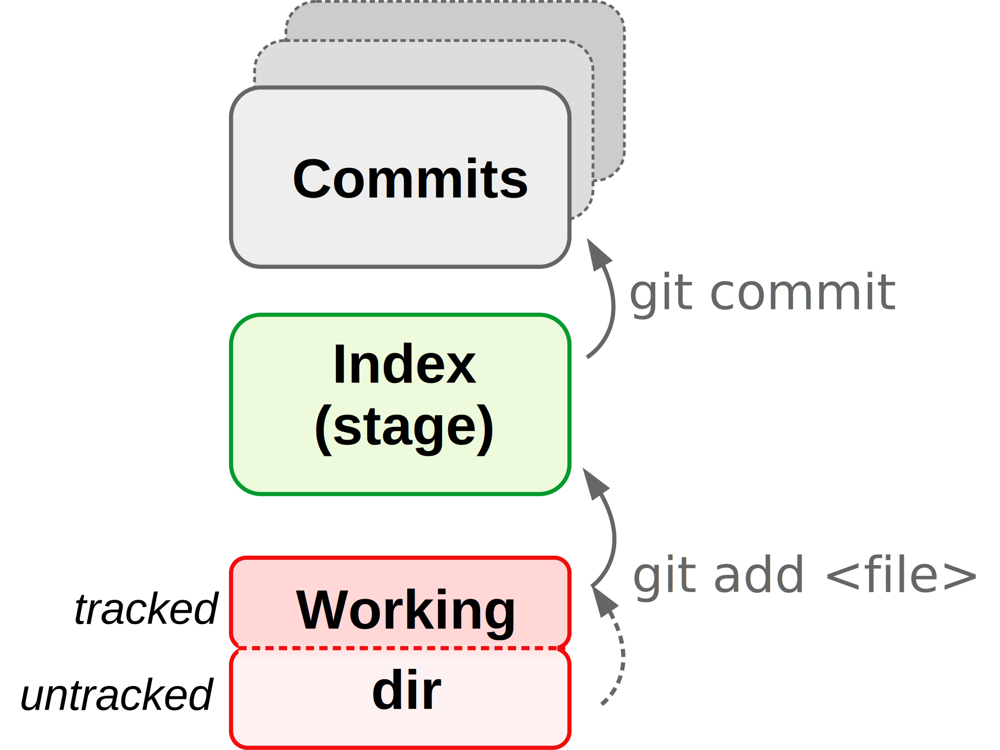
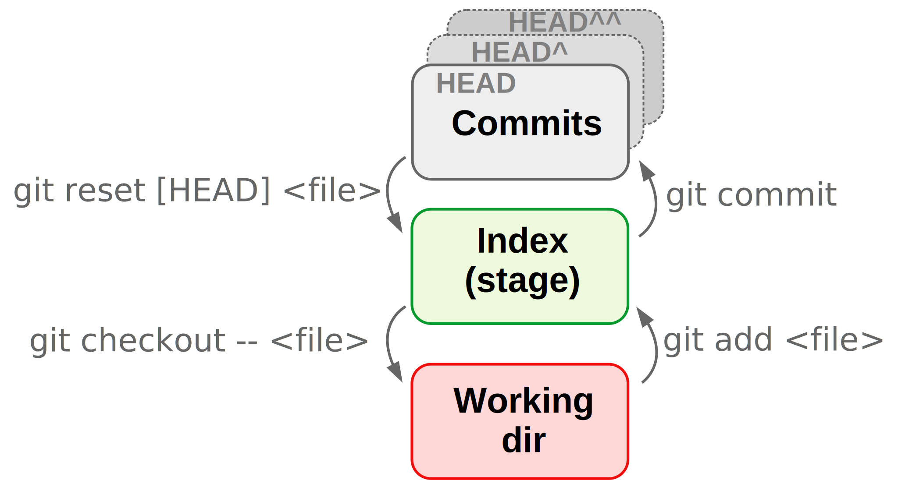

## Key commands

+----------------+---------------------------------------------------------------------------------------------------------------------------------------------------------------------------------------------------------------+--------------------------------------------------------------------------------------------------------------------------------------------------------------------------------------------------------------------------------------------------------------------------------------+
| Command        | Explanation                                                                                                                                                                                                   | Examples                                                                                                                                                                                                                                                                             |
+================+===============================================================================================================================================================================================================+======================================================================================================================================================================================================================================================================================+
| **`add`**      | **Stage files to be committed**, including previously untracked files.                                                                                                                                        | *Stage a single file:*   `git add file.txt`   *Stages all eligible files, tracked and untracked:*   `git add --all`   *Stage shell scripts anywhere in project:*   `git add *.sh`                                                                                     |
|                |                                                                                                                                                                                                               |                                                                                                                                                                                                                                                                                      |
|                | Therefore, `git add` does *two things at once for untracked files*: start tracking them *and* stage them. Files that were already being tracked are merely staged by `git add`.                               |                                                                                                                                                                                                                                                                                      |
+----------------+---------------------------------------------------------------------------------------------------------------------------------------------------------------------------------------------------------------+--------------------------------------------------------------------------------------------------------------------------------------------------------------------------------------------------------------------------------------------------------------------------------------+
| **`commit`**   | **Commit all currently staged changes** to create a snapshot for the repository to which you can always return later on.                                                                                      | `git commit -m "Started the book"`   `git commit -am "Fix infinite loop bug"`       `-m` *specify commit message as above*       `-a` *Also stage all changes (but won't add untracked files)*                                                                              |
+----------------+---------------------------------------------------------------------------------------------------------------------------------------------------------------------------------------------------------------+--------------------------------------------------------------------------------------------------------------------------------------------------------------------------------------------------------------------------------------------------------------------------------------+
| **`status`**   | **Get the status of your repository**: which files have changed since the last commit, which untracked files are present, etc.                                                                                |                                                                                                                                                                                                                                                                                      |
+----------------+---------------------------------------------------------------------------------------------------------------------------------------------------------------------------------------------------------------+--------------------------------------------------------------------------------------------------------------------------------------------------------------------------------------------------------------------------------------------------------------------------------------+
| **`log`**      | See the repository's **commit history**.                                                                                                                                                                      | `git log`   *One-line summary for each commit:*   `git log --oneline`   *Show all branches in "graph" form (useful with \>1 branch):*   `git log --oneline --graph --all`                                                                                                |
+----------------+---------------------------------------------------------------------------------------------------------------------------------------------------------------------------------------------------------------+--------------------------------------------------------------------------------------------------------------------------------------------------------------------------------------------------------------------------------------------------------------------------------------+
| **`diff`**     | By default, **show changes between the working dir and**:                                                                                                                                                     | *Last commit vs second-to-last commit - full repo:*   `git diff HEAD HEAD^`   *Last commit vs a specified commit - specific file:*   `git diff HEAD d715c54 todo.txt`   *Show changed between stage and last commit:*   `git diff --staged`                           |
|                |                                                                                                                                                                                                               |                                                                                                                                                                                                                                                                                      |
|                | -   The **stage (index)** if something has been staged.                                                                                                                                                       |                                                                                                                                                                                                                                                                                      |
|                | -   The **last commit** if nothing has been staged.                                                                                                                                                           |                                                                                                                                                                                                                                                                                      |
+----------------+---------------------------------------------------------------------------------------------------------------------------------------------------------------------------------------------------------------+--------------------------------------------------------------------------------------------------------------------------------------------------------------------------------------------------------------------------------------------------------------------------------------+
| **`mv`**       | **Move files** that are tracked by Git: better to use `git mv` than regular `mv` so Git will immediately register what happened properly.                                                                     | `git mv old.txt new.txt`                                                                                                                                                                                                                                                             |
+----------------+---------------------------------------------------------------------------------------------------------------------------------------------------------------------------------------------------------------+--------------------------------------------------------------------------------------------------------------------------------------------------------------------------------------------------------------------------------------------------------------------------------------+
| **`rm`**       | **Delete files** that are tracked by Git: better to use `git rm` than regular `rm` so Git will properly register what happened at once.                                                                       | `git rm tmp.txt`                                                                                                                                                                                                                                                                     |
+----------------+---------------------------------------------------------------------------------------------------------------------------------------------------------------------------------------------------------------+--------------------------------------------------------------------------------------------------------------------------------------------------------------------------------------------------------------------------------------------------------------------------------------+
| **`branch`**   | Various **functionality for Git branches**, such as creating, removing, and listing branches. (To switch between branches, use `git checkout`.)                                                               | *List existing branches:*   `git branch`   *Create a new branch named "my-new-branch":*   `git branch my-new-branch`   *Rename the current branch to "main":*   `git branch -M main`   *Remove a branch that is no longer needed:*   `git branch -d fastercode` |
+----------------+---------------------------------------------------------------------------------------------------------------------------------------------------------------------------------------------------------------+--------------------------------------------------------------------------------------------------------------------------------------------------------------------------------------------------------------------------------------------------------------------------------------+
| **`checkout`** | `git checkout` has multiple functions:                                                                                                                                                                        | *Move to the master branch:*   `git checkout master`                                                                                                                                                                                                                              |
|                |                                                                                                                                                                                                               |                                                                                                                                                                                                                                                                                      |
|                | -   `git checkout <branch-name>` will **switch to the specified branch**.                                                                                                                                     |                                                                                                                                                                                                                                                                                      |
|                | -   `git checkout -- <file>` will **revert the specified file** back to its last committed state.                                                                                                             |                                                                                                                                                                                                                                                                                      |
|                | -   `git checkout <commit-id>` will **move you to the specified commit** for looking around.                                                                                                                  |                                                                                                                                                                                                                                                                                      |
+----------------+---------------------------------------------------------------------------------------------------------------------------------------------------------------------------------------------------------------+--------------------------------------------------------------------------------------------------------------------------------------------------------------------------------------------------------------------------------------------------------------------------------------+
| **`merge`**    | **Merge a specified branch into the current branch**. When doing a merge, make sure that you are on the branch that you want to keep, and from there, merge the branch whose changes you want to incorporate. | *Merge branch `fastercode` into the current branch:*   `git merge fastercode -m "my msg"`                                                                                                                                                                                         |
+----------------+---------------------------------------------------------------------------------------------------------------------------------------------------------------------------------------------------------------+--------------------------------------------------------------------------------------------------------------------------------------------------------------------------------------------------------------------------------------------------------------------------------------+
| **`remote`**   | **Interact with "remote" counterparts of repositories**: in our case, GitHub repositories.                                                                                                                    | *List the repo's remote connections:*   `git remote -v`   Add a remote *(syntax: git remote add \<nickname\> \<URL\>):*   `git remote add origin git@github.com:me/my.git`                                                                                                  |
+----------------+---------------------------------------------------------------------------------------------------------------------------------------------------------------------------------------------------------------+--------------------------------------------------------------------------------------------------------------------------------------------------------------------------------------------------------------------------------------------------------------------------------------+
| **`push`**     | **Upload** (changes to) your local repository to an online counterpart, in our case a GitHub repository.                                                                                                      | *Push currently active branch to default remote connection:*   `git push`   *When pushing a branch for the first time, use the -u option to set up an "upstream" counterpart:*   `git push -u origin main`                                                                  |
+----------------+---------------------------------------------------------------------------------------------------------------------------------------------------------------------------------------------------------------+--------------------------------------------------------------------------------------------------------------------------------------------------------------------------------------------------------------------------------------------------------------------------------------+
| **`pull`**     | **Download** (changes from) an online counterpart to your local repository (in our case a GitHub repository) **and** **merge** (as in `git merge`) the changes into your local repo.                          | *Pull from currently active branch in remote repo:*   `git pull`                                                                                                                                                                                                                  |
|                |                                                                                                                                                                                                               |                                                                                                                                                                                                                                                                                      |
|                | May result in a [merge conflict](#merge-conflicts) if you are collaborating with others on the remote repo.                                                                                                   |                                                                                                                                                                                                                                                                                      |
+----------------+---------------------------------------------------------------------------------------------------------------------------------------------------------------------------------------------------------------+--------------------------------------------------------------------------------------------------------------------------------------------------------------------------------------------------------------------------------------------------------------------------------------+
| **`clone`**    | Download an online repository.                                                                                                                                                                                | *After this `git clone`, you will have a dir `CSB` in your current working dir with the full repo (incl. history)*:   `git clone https://github.com/CSB-book/CSB.git`                                                                                                             |
+----------------+---------------------------------------------------------------------------------------------------------------------------------------------------------------------------------------------------------------+--------------------------------------------------------------------------------------------------------------------------------------------------------------------------------------------------------------------------------------------------------------------------------------+
| **`tag`**      | **Add a "tag" to a commit**, for instance to mark the version of the scripts used in the analysis for your paper.   [ddddddddddddddddddddddddddddddddddddd]{style="color:white"}                           | `git tag -a v1.2.0 -m "Publish version"`   *Tags need to be explicitly pushed like so:*   `git push --follow-tags`                                                                                                                                                             |
+----------------+---------------------------------------------------------------------------------------------------------------------------------------------------------------------------------------------------------------+--------------------------------------------------------------------------------------------------------------------------------------------------------------------------------------------------------------------------------------------------------------------------------------+

 

## Miscellaneous

+------------------------+-----------------------------------------------------------------------------------------------------------------------------------------------------------------------------------------------------------------------------------------------------------+----------------------------------------------------------------------------------------------------------------------------------------------------------------------------------------------------------------------------------+
| Code / concept         | Explanation                                                                                                                                                                                                                                               | Examples                                                                                                                                                                                                                         |
+========================+===========================================================================================================================================================================================================================================================+==================================================================================================================================================================================================================================+
| **`module load git`**  | **Load the OSC Git module**. If you forget to do this, Git will still work but you'll be using a *very* old version.                                                                                                                                      |                                                                                                                                                                                                                                  |
+------------------------+-----------------------------------------------------------------------------------------------------------------------------------------------------------------------------------------------------------------------------------------------------------+----------------------------------------------------------------------------------------------------------------------------------------------------------------------------------------------------------------------------------+
| **`.gitignore`**       | A file that tells Git **what (kinds of) files to ignore**, i.e. files that are not to be listed among "Untracked files" and will not be added with `git add --all`.                                                                                       | *Example entries:*     *Ignore everything in the dir "data":*   `data/`   *Ignore files ending in `~` in the **entire** repo*:   `*~`   *Ignore gzipped FASTQ files in the **entire** repo:*   `*.fastq.gz` |
|                        |                                                                                                                                                                                                                                                           |                                                                                                                                                                                                                                  |
|                        | -   `.gitignore` is usually in the top-level repo dir (recommended!).                                                                                                                                                                                     |                                                                                                                                                                                                                                  |
|                        | -   Don't forget to add and commit the `.gitignore` file.                                                                                                                                                                                                 |                                                                                                                                                                                                                                  |
|                        | -   Note that files won't be "retroactively ignored": files that are already in the repo would need to be explicitly removed.                                                                                                                             |                                                                                                                                                                                                                                  |
+------------------------+-----------------------------------------------------------------------------------------------------------------------------------------------------------------------------------------------------------------------------------------------------------+----------------------------------------------------------------------------------------------------------------------------------------------------------------------------------------------------------------------------------+
| **`HEAD`**             | **A pointer to the most recent (last) commit on the current branch**. Note that as a *pointer*, `HEAD` can *move* and will do so e.g. if you switch between branches.                                                                                     |                                                                                                                                                                                                                                  |
+------------------------+-----------------------------------------------------------------------------------------------------------------------------------------------------------------------------------------------------------------------------------------------------------+----------------------------------------------------------------------------------------------------------------------------------------------------------------------------------------------------------------------------------+
| **`HEAD^`, `HEAD^^`**  | **A Pointer to the second-to-last and third-to-last (and so on) commit**. See [figure below](#explanatory-figures) for details.                                                                                                                           |                                                                                                                                                                                                                                  |
+------------------------+-----------------------------------------------------------------------------------------------------------------------------------------------------------------------------------------------------------------------------------------------------------+----------------------------------------------------------------------------------------------------------------------------------------------------------------------------------------------------------------------------------+
| **`HEAD~1`, `HEAD~2`** | **A pointer to the second-to-last and third-to-last (and so on) commit**: easier than `^` as you get further back, e.g. `HEAD~8`. See [figure below](#explanatory-figures) for details.   [ddddddddddddddddddddddddddddddddddddd]{style="color:white"} |   [ddddddddddddddddddddddddddddddddddddd]{style="color:white"}                                                                                                                                                                |
+------------------------+-----------------------------------------------------------------------------------------------------------------------------------------------------------------------------------------------------------------------------------------------------------+----------------------------------------------------------------------------------------------------------------------------------------------------------------------------------------------------------------------------------+

 

## Tips and tricks

-   **Use informative commit messages!** Imagine yourself looking for some specific changes that you made in the repository a year ago: what would help you to find them?

-   **Commit often, using small commits.** This will also help to keep commit messages informative.

-   **Don't include unrelated sets of edits in a single commit.** If you have worked on two disparate things in your project since the last commit, `git add` + `git commit` them separately.

-   **When collaborating: pull often**. This will reduce the chances of *merge conflicts*.

-   **Don't commit unnecessary files**: include a `.gitignore` file to ignore these.

-   **Don't have nested repositories.** (If, for example, in the dir structure `work/projects/gwas/` you have a Git repository in the `work` dir and in the `gwas` dir, they would be nested.)

-   **Be *very* careful with destructive commands** like `git reset` at the commit level, or simply deleting your `.git` directory. As you get started with Git, it is best to make backup copies before you try these types of commands.

-   **File and repository size limitations:**

    -   *Binary files* cannot be tracked as effectively as plain text files: Git will just save a new version whenever there has been a change.

    -   *Repository size*: Best to keep individual repositories under a total size of 1 GB.

    -   *File size*: GitHub will not allow files over 100 MB.

## Explanatory figures

-   Referring to past commits:

    

    

    <figcaption>

-   Git's three areas ("trees"), staging, and committing:

    

    

    

-   Overview of ways to undo changes that have not been committed:

    

    

    

 

## Advanced (bonus)

### Undoing changes and viewing the past

+-----------------------------------------------------------------------------------------------------+----------------------------------------------------------------------------------------------------------------------------------------------------------------+---------------------------------------------------------------------------------------------------------------------------------------------------------------------------------------------------------------------------------------------------------------------------------------------------------------------------------------------------------------------------------------------------------------------------------------------------------------------------------------------------------------------------------------+
| **I need to**                                                                                       | Use this                                                                                                                                                       | Examples                                                                                                                                                                                                                                                                                                                                                                                                                                                                                                                              |
+=====================================================================================================+================================================================================================================================================================+=======================================================================================================================================================================================================================================================================================================================================================================================================================================================================================================================================+
| **Undo unstaged changes to a file**                                                                 | `git checkout -- <file>`                                                                                                                                       | *After accidentally deleting `README.md` or overwriting it instead of appending to it:*   `git checkout -- README.md`                                                                                                                                                                                                                                                                                                                                                                                                              |
|                                                                                                     |                                                                                                                                                                |                                                                                                                                                                                                                                                                                                                                                                                                                                                                                                                                       |
|                                                                                                     | Note: for the most recent Git versions (not yet on OSC), the recommended method is the new command `git restore`.                                              |                                                                                                                                                                                                                                                                                                                                                                                                                                                                                                                                       |
+-----------------------------------------------------------------------------------------------------+----------------------------------------------------------------------------------------------------------------------------------------------------------------+---------------------------------------------------------------------------------------------------------------------------------------------------------------------------------------------------------------------------------------------------------------------------------------------------------------------------------------------------------------------------------------------------------------------------------------------------------------------------------------------------------------------------------------+
| **Unstage a file**                                                                                  | `git reset HEAD <filename>`                                                                                                                                    | *After accidentally staging `README.md` which was not supposed to be part of the next commit:*   `git reset HEAD README.md`                                                                                                                                                                                                                                                                                                                                                                                                        |
|                                                                                                     |                                                                                                                                                                |                                                                                                                                                                                                                                                                                                                                                                                                                                                                                                                                       |
|                                                                                                     | Note: for the most recent Git versions (not yet on OSC), the recommended method is the new command `git restore --staged`.                                     |                                                                                                                                                                                                                                                                                                                                                                                                                                                                                                                                       |
+-----------------------------------------------------------------------------------------------------+----------------------------------------------------------------------------------------------------------------------------------------------------------------+---------------------------------------------------------------------------------------------------------------------------------------------------------------------------------------------------------------------------------------------------------------------------------------------------------------------------------------------------------------------------------------------------------------------------------------------------------------------------------------------------------------------------------------+
| **Undo staged changes to a file**                                                                   | `git checkout HEAD -- <filename>`                                                                                                                              | *After accidentally deleting `README.md` or overwriting it instead of appending to it, AND staging these changes:*   `git checkout HEAD -- README.md`                                                                                                                                                                                                                                                                                                                                                                              |
|                                                                                                     |                                                                                                                                                                |                                                                                                                                                                                                                                                                                                                                                                                                                                                                                                                                       |
|                                                                                                     | Note: this irrevocably discards the non-committed changes (your data is only safe with Git once it has been committed!).                                       |                                                                                                                                                                                                                                                                                                                                                                                                                                                                                                                                       |
+-----------------------------------------------------------------------------------------------------+----------------------------------------------------------------------------------------------------------------------------------------------------------------+---------------------------------------------------------------------------------------------------------------------------------------------------------------------------------------------------------------------------------------------------------------------------------------------------------------------------------------------------------------------------------------------------------------------------------------------------------------------------------------------------------------------------------------+
| **Undo ALL unstaged changes (all files)**                                                           | `git checkout -- .`                                                                                                                                            | *After making edits to several files that you all want to get rid of, to revert back to the last commit:*   `git checkout -- .`                                                                                                                                                                                                                                                                                                                                                                                                    |
+-----------------------------------------------------------------------------------------------------+----------------------------------------------------------------------------------------------------------------------------------------------------------------+---------------------------------------------------------------------------------------------------------------------------------------------------------------------------------------------------------------------------------------------------------------------------------------------------------------------------------------------------------------------------------------------------------------------------------------------------------------------------------------------------------------------------------------+
| **Undo ALL staged and unstaged changes (all files)**                                                | `git reset --hard HEAD`                                                                                                                                        |                                                                                                                                                                                                                                                                                                                                                                                                                                                                                                                                       |
|                                                                                                     |                                                                                                                                                                |                                                                                                                                                                                                                                                                                                                                                                                                                                                                                                                                       |
|                                                                                                     | This will take you back to the state of your repository right after the last commit.                                                                           |                                                                                                                                                                                                                                                                                                                                                                                                                                                                                                                                       |
+-----------------------------------------------------------------------------------------------------+----------------------------------------------------------------------------------------------------------------------------------------------------------------+---------------------------------------------------------------------------------------------------------------------------------------------------------------------------------------------------------------------------------------------------------------------------------------------------------------------------------------------------------------------------------------------------------------------------------------------------------------------------------------------------------------------------------------+
| **View the state of my repo for a past commit**                                                     | `git checkout <commit-id>`                                                                                                                                     | `git checkout 4dce25f`   `git checkout HEAD^^`   *To go back, assuming you're on branch `master`:*   `git checkout master`                                                                                                                                                                                                                                                                                                                                                                                                   |
|                                                                                                     |                                                                                                                                                                |                                                                                                                                                                                                                                                                                                                                                                                                                                                                                                                                       |
|                                                                                                     | This is only for "looking around". If you decide you want to go back to your repo as it was in an earlier commit, use `git revert` or `git reset` (see below). |                                                                                                                                                                                                                                                                                                                                                                                                                                                                                                                                       |
+-----------------------------------------------------------------------------------------------------+----------------------------------------------------------------------------------------------------------------------------------------------------------------+---------------------------------------------------------------------------------------------------------------------------------------------------------------------------------------------------------------------------------------------------------------------------------------------------------------------------------------------------------------------------------------------------------------------------------------------------------------------------------------------------------------------------------------+
| **Undo one or more commits**                                                                        | To undo one or more commits, i.e. to roll the state of your repository back to how it was before the commit you want to undo, there are two main commands:     | *Undo changes by most recent commit:*   `git revert HEAD`   *Undo changed by second-to-last commit:*   `git revert HEAD^`   *Undo changes by any arbitrary commit:* `git revert e1c5739`     *Undo last commit and completely discard all changes made by it:*  `git reset --hard HEAD^`   *Undo last commit and put all changes made by that commit in the working dir:*  `git reset HEAD^`   *Undo last commit and stage all changes made by it ("peel off commit"):*  `git reset --soft HEAD^`    |
|                                                                                                     |                                                                                                                                                                |                                                                                                                                                                                                                                                                                                                                                                                                                                                                                                                                       |
|                                                                                                     | -   `git revert`: Undo the changes made by commits by reverting them in a new commit. (**Safe** -- does not change history.)                                   |                                                                                                                                                                                                                                                                                                                                                                                                                                                                                                                                       |
|                                                                                                     | -   `git reset`: Delete commits as if they were never made. (**Unsafe** -- changes history.)                                                                   |                                                                                                                                                                                                                                                                                                                                                                                                                                                                                                                                       |
|                                                                                                     |                                                                                                                                                                |                                                                                                                                                                                                                                                                                                                                                                                                                                                                                                                                       |
|                                                                                                     | (`git reset HEAD^` undoes changes made by the last commit as it resets to the second-to-last commit.)                                                          |                                                                                                                                                                                                                                                                                                                                                                                                                                                                                                                                       |
+-----------------------------------------------------------------------------------------------------+----------------------------------------------------------------------------------------------------------------------------------------------------------------+---------------------------------------------------------------------------------------------------------------------------------------------------------------------------------------------------------------------------------------------------------------------------------------------------------------------------------------------------------------------------------------------------------------------------------------------------------------------------------------------------------------------------------------+
| **Retrieve a file version from a past commit**   **[dddddddddddddddddddd]{style="color:white"}** | `git checkout --`   or   `git show`   [ddddddddddddddddddddddddddddddddddddd]{style="color:white"}                                                    | *Retrieve from second-to-last commit:*   `git checkout HEAD^^ -- README.md`   *Retrieve from arbitrary commit:*   `git checkout e1c5739 -- README.md`   *To not change after all and go back to the current version:*   `git checkout HEAD -- README.md`     *Look at the version from the last commit:* `git show HEAD:README.md`   *Revert to arbitrary earlier version using redirection:*   `git show ad4ca74:README.md > README.md`   [ddddddddddddddddddddddddddddddddddddd]{style="color:white"} |
+-----------------------------------------------------------------------------------------------------+----------------------------------------------------------------------------------------------------------------------------------------------------------------+---------------------------------------------------------------------------------------------------------------------------------------------------------------------------------------------------------------------------------------------------------------------------------------------------------------------------------------------------------------------------------------------------------------------------------------------------------------------------------------------------------------------------------------+

 

### Merge conflicts {#merge-conflicts}

A merge conflict can occur when all three of the following conditions are met:

-   You are trying to merge two branches (this includes pulling from remote: recall that a *pull* includes a *merge*).
-   One or more files have committed changes on both of these branches since their divergence.
-   Some of these changes were made in the same part(s) of file(s).

When this occurs, Git has no way of knowing which changes to keep, and will report a ***merge conflict***. When it does so, your merge process has basically been *paused*, and Git wants you to make changes to resolve the conflict, after which a `git commit` will complete the merge. To resolve a merge conflict:

1.  Use `git status` to find the conflicting files.
2.  Open and edit those files manually to a version that fixes the conflict. Note that Git has added `<<<<<<<`, `=======`, and `>>>>>>>` markers to help you see the conflict -- but you will want to remove those.
3.  Use `git add` to tell Git you have resolved the conflict in a particular file.
4.  Use `git status` to check that all changes are staged, at which point Git should tell you "*All conflicts fixed but you are still merging. (use "git commit" to conclude merge)*".
5.  Use `git commit -m "My merge message"` to conclude the merge.

 

### Forking and Pull Requests

***Forking*** is a GitHub concept that will create a personal GitHub repo that remains linked to the source repository. For instance, you could keep your fork up-to-date with the source, and you could issue a ***Pull Request*** from your fork. See [these slides](posts/week-03/slides/03-2_git.html#pr) for details and screenshots.

 

### Miscellaneous

+--------------------------+---------------------------------------------------------------------------------------------------------------------------------------------------------------------------------------------------------------------------------------------------------------------------------------------------------+----------------------------------------------------------------------------------------------------------------------------------------------------------------+
| Code / concept           | Explanation                                                                                                                                                                                                                                                                                             | Examples                                                                                                                                                       |
+==========================+=========================================================================================================================================================================================================================================================================================================+================================================================================================================================================================+
| **`stash`**              | `git stash` **temporarily saves files**.                                                                                                                                                                                                                                                                | *Stash changes to tracked files:*\                                                                                                                             |
|                          |                                                                                                                                                                                                                                                                                                         | `git stash` (Add `-u` to include untracked files)   *Pull from the remote repository:*   `git pull`   *Apply stashed changes:*   `git stash apply` |
|                          | It can be useful when you need to pull from remote, but are prevented from doing so because you have changes in your working dir (and those are not appropriate for a separate commit / new branch). In such a case, stash the changes, pull, and get your stashed changes back (see example on right). |                                                                                                                                                                |
+--------------------------+---------------------------------------------------------------------------------------------------------------------------------------------------------------------------------------------------------------------------------------------------------------------------------------------------------+----------------------------------------------------------------------------------------------------------------------------------------------------------------+
| **`commit --amend`**     | **Add something to a commit that has already been made**, for instance if you notice a type or forgot a file.                                                                                                                                                                                           | `git commit --amend --no-edit` (*No edit will keep the same commit message)*                                                                                   |
|                          |                                                                                                                                                                                                                                                                                                         |                                                                                                                                                                |
|                          | Note: amending commits "changes history" and as such is not recommended by everyone -- but at any rate, do not amend commits that have been pushed online!                                                                                                                                              |                                                                                                                                                                |
+--------------------------+---------------------------------------------------------------------------------------------------------------------------------------------------------------------------------------------------------------------------------------------------------------------------------------------------------+----------------------------------------------------------------------------------------------------------------------------------------------------------------+
| **`checkout -b`**        | Create a new branch and move to it immediately.                                                                                                                                                                                                                                                         | `git checkout -b my-new-branch`                                                                                                                                |
+--------------------------+---------------------------------------------------------------------------------------------------------------------------------------------------------------------------------------------------------------------------------------------------------------------------------------------------------+----------------------------------------------------------------------------------------------------------------------------------------------------------------+
| **`git log <filename>`** | Show commits in which a specific file was changed (!).   [ddddddddddddddddddddddddddddddddddddd]{style="color:white"}                                                                                                                                                                                | *Say you have a script that no longer works and you need to see the changes that were made to it:*   `git log my-failing-script.sh`                         |
+--------------------------+---------------------------------------------------------------------------------------------------------------------------------------------------------------------------------------------------------------------------------------------------------------------------------------------------------+----------------------------------------------------------------------------------------------------------------------------------------------------------------+

 
