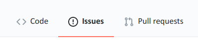

 

## Introduction

In this assignment, you will primarily be practicing your Git skills.
You will also show that you can write in Markdown
and can write a `for` loop to rename files.

The instructions below will take you through it step-by-step.
All of the the steps involve things that we have gone through in class and/or
that you have practiced with in last week's exercises.

Grading information:

- The number of points (if any) that you can earn for each step are
  denoted in cursive between square brackets (e.g. *[0.5]*).
  In total, you can earn 10 points with this assignment,
  which is 10% of your grade for the class.

- If you make a mistake like an unnecessary commit, or something that requires
  you to subsequently make an extra commit: this is no problem.
  Points will not be subtracted for extra commits as long as you indicate what
  each commit is for & I'm still able to figure out which commits are
  the ones that I requested.

- Points are not subtracted for minor things like typos in commit messages, either.

- Basically, you should not feel like you have to *restart* the assignment unless
  things have become a total mess...

Some general hints:

- Don't forget to constantly check the status of your repository (repo)
  with `git status`:
  before and after nearly all other Git commands that you issue.
  This will help prevent mistakes, and will also help you understand what's
  going on as you get up and running with Git.

- It's also a good idea to regularly check the log with `git log`;
  recall that `git log --oneline` will provide a quick overview with one line
  per commit.

 

## Part 1 -- Create a new Git repo

1. **Create a new directory at OSC.**
  - A good place for this directory is in `/fs/ess/PAS1855/users/$USER/week03/`,
    but you are free to create it elsewhere
    (I will only be checking the online version of your repo).
  - I suggest the name `pracs-sp21-GA1` for the dir,
    ("GA1" for "Graded Assignment 1"),
    but you are free to pick a name that makes sense to you. 

2. **Load the OSC git module.**

2. **Initialize a local Git repository** inside your new directory.

3. **Create a README file in Markdown format.** *[0.5]*  
   The file should be named `README.md`,
   and for now, just contain a *header* saying that this is a repository
   for your assignment.
   
4. ***Stage* and then *commit* the README file.** *[0.5]*  
   Include an appropriate commit message.

## Part 2 -- Add some Markdown content

5. **Create a second Markdown file with some more contents.** *[1.5]*  
   
   This file can have any name you want,
   and you can also choose what you want to write about.
   
   Just make sure to use of a good variety of Markdown syntax,
   as discussed and practiced in week 2: headers, lists, hyperlinks, and so on.
   (You'll have to include some inline code and a code block later on,
   so you may or may not choose to use those now.)
   Also, make sure to read the next step before you finish writing.
   
   As long as you are not writing minimalistic dummy text without any meaning
   (like "*Item 1, Item 2*"), you will not be graded for what you are writing
   about, so feel free to pick something you like -- and don't worry about
   the details.
   
   (If you're not feeling inspired, here are some suggestions:
   lecture and reading notes for this week;
   a table of Unix and/or Git commands that we've covered;
   things that you so far find challenging or interesting about Git;
   how computational skills may help you with your research.)
   
   

   
Hints

   Open the Markdown preview on the side, so you can experiment and see whether
   your formatting is working the way you intend.
   

   
6. **Create at least two commits while you work on the Markdown file.** *[0.5]*  
   Try to break your progress up into logical units that can be
   summarized with a descriptive commit message.
   
   

   
Hints

   
   

   - **Bad** commits/commit messages:  
     "*First part of the file*" along with "*Second part of the file*".
   - **Good** commits and commit messages:  
     "*Summarized key concepts in the Git workflow*" along with
     "*Made a table of common Git commands*".
   

   
   

7. **Update the `README.md` file**. *[0.5]*  
   Briefly describe the current contents of your repo now that you actually
   have some contents.

8. **Stage and commit the updated README file.** *[0.5]*  

## Part III -- Add some "data" files

9. **Create a directory with dummy data files.**  *[0.5]*  
   Create a directory called `data` and inside this directory,
   create 100 empty files with a single `touch` command and at least one
   brace expansion
   (e.g. for samples numbered 1-100, or 20 samples for 5 treatments).
   Give the files the extension `.txt`.
   
10. **Stage and commit the `data` directory and its contents.** *[0.5]*  
    As always, include a descriptive message with your commit.

## Part IV -- Renaming files on a new branch

As it turns out, there was a miscommunication,
and and all the "data" files will have to be renamed.
You realize that this is risky business,
and you don't want to lose any data.

It occurs to you that one good way of going about this
is creating a new Git *branch* and performing the renaming task on that branch.
Then, if anything goes wrong, it will be easy to go back:
you can just switch back to the master branch.  
(*Note that there are many other ways of undoing and going back in Git,
but this one is perhaps conceptually the easiest, and safe.*)
    
11. **Go to a new branch.** *[0.5]*  
    Create a new branch called `rename-data-files` or something similar,
    and move to the new branch. (Also, check whether this worked.)

12. **Write a `for` loop to rename the files.**   *[1.5]*  
    You can keep it as simple as switching the file extension to `.csv`,
    or do something more elaborate if you want.
    
    Because these files are being tracked by Git,
    recall that there is a Git-friendly modification to the command to rename
    files: use that in the loop.

   

   
Hints

   

   
- To replace the last part of the filename, like the extension,
  recall that you can strip suffices using the `basename` command.
- Before you go ahead and actually rename the files,
  use `echo` in your loop to print the (old and) new filenames:
  if it looks good, *then* add the renaming command to the loop.
  
   

   

   
13. **Commit the changes made by the renaming operation.**

13. **Merge into the `master` branch.**  *[0.5]*  
    With the files successfully renamed, go back to the `master` branch.  
    Then, merge the `rename-data-files` branch into the `master` branch.  
    (Optionally, remove the `rename-data-files` branch, since you will no
    longer need it.)

14. **Update the README file.**  
    In the README file, describe what you did, including some inline code
    formatting, and put the code for the `for` loop in a code block.  
    (*No, the repo doesn't really make sense as a cohesive unit anymore,
     but that's okay while we're practicing. :) *)

15. **Stage and commit the updated README file.** *[0.5]*  

## Part V -- Create and sync an online version of the repo

Phew, those were a lot of commits! Let's share all of this work with the world.

16. **Create a Github repository.** *[0.5]*  
    Go to <https://github.com>, sign in, and create a new repository.
    
    - You can give it the same name as your local repo,
      but these names don't have to match.
    - You will want to start a completely empty repository, because you will uploead
      all the contents from your local repo:
      therefore, don't check any of the boxes to create files like a README.
    
17. **Push your local repo online.** *[0.5]*  
    With your repo created, follow the instructions that Github now gives you,
    under the heading "*...or push an existing repository from the command line*".
    
    (Assuming that you're using SSH authentication, which you should have set up
    in this week's ungraded assignment, make sure you use the SSH link type:
    starting with `git@github.com` rather than `HTTPS`.)
    
    These instructions will comprise of three commands:
    `git remote add` to add the "remote" (online) connection,
    `git branch` to rename the default branch from `master` to `main`,
    and `git push` to actually "push" (upload) your local repo.

    When you're done, click the `Code` button, and
    admire the rendered README on the front page of your Github repo.

18. **Push a final local edit.** *[1]*  
    To see how it will now be easy to keep your remote repo in sync,
    and to practice with `.gitignore` files, you will do final commit and push:
    
    - Create a file `my.tmp~` (so, ending in a tilde `~`).
    - Check your repo's status.
    - Create a file `.gitignore` in which you use a shell wildcard to match any
      file ending in `~`.
    - Add the `.gitignore` file.
    - Check your status and make sure the `my.tmp~` file is not listed as
      an untracked file (or worse, as a staged file).
    - Commit the `.gitignore` file.
    - Push the changes to remote.
    - Check your repo to see the update.

19. **Create an issue to mark that you're done!**  
    Find the "Issues" tab for your repo on Github.
    (This is the button in the lower bar next to Code and with an exclamation
    mark icon, not the Issues button in the black uppermost bar: see image
    below.)
    
    

    
    

    
    In the Issues tab, click the green button `New Issue` to open a new issue
    for you repo.
    Give it a title like "I finished my assignment",
    and in the issue text, tag `@jelmerp`.
    You can say, for instance,
    "*Hey @jelmerp, can you please take a look at my repo?*".
