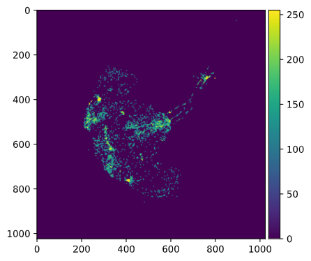

<br>

The first and last of these exercises are more short tutorials working through
two of the examples in the book.

The first two exercises use *BioPython*, the third uses *Pandas*,
and the last uses *NumPy*.
As we're getting into more advanced and specialized material,
you may be much more interested in some approaches/packages than others,
and it is fine if you direct your attention accordingly.

For example, if you are interested in one of these three but not so much the
other two, feel free to skip the other exercises.
And if you have time to spare,
I would rather recommend digging a bit deeper into your topic of interest:

-   For more BioPython, see this [BioPython
    workshop](https://github.com/peterjc/biopython_workshop) (and for much
    more, [the BioPython
    tutorial](http://biopython.org/DIST/docs/tutorial/Tutorial.html)).

-   For more NumPy, see the official [NumPy
    tutorial](https://numpy.org/doc/stable/user/absolute_beginners.html).

-   For more Pandas, see [this overview of
    tutorials](https://pandas.pydata.org/docs/getting_started/intro_tutorials/).

<br>

## 1: Tutorial exercise <br> Querying PubMed (CSB 6.4.4)

Using the `Entrez.esearch()` function we used in class, we can search any NCBI
database, including **PubMed**,
which is a comprehensive scientific literature database.

By way of example, we will search for any papers on *Drosophila* that mention
the gene "*spaetzle*" anywhere in the title or abstract.[^1]

- As always,
  we start by importing the `Entrez` module and providing our email address:

  ```python
  from Bio import Entrez
  Entrez.email = "me.999@osu.edu"  # Replace with your actual email address!
  ```

- Now, we can run the search.
  We will match "*spaetzle*" only in the title or abstract,
  and we will match *Drosophila* anywhere (`[ALL]`):
  
  ```python
  handle = Entrez.esearch(db = "pubmed",
                          term = ("spaetzle[Title/Abstract] AND Drosophila[ALL]"),
                          usehistory = "y")
  record = Entrez.read(handle)
  handle.close()                        
  ```

  Note that these search keywords are NCBI's.
  For a list of all of them go [NCBI's PubMed help page](https://pubmed.ncbi.nlm.nih.gov/help/)
  and search for "Search Field descriptions and tags".
  
-   We used `usehistory = "y"`, which will allows us to refer back to our
    search to fetch the titles and abstracts by saving `WebEnv` and
    `QueryKey`:

    ``` {.python}
    webenv = record["WebEnv"]
    query_key = record["QueryKey"]
    ```

-   How many hits did we get?

    ``` {.python}
    record["Count"]
    #> '15'
    ```

    We found 15 records (up from 13 in the book) that contained the words
    "*spaetzle*" and "*Drosophila*".

-   We can now fetch the titles and abstracts:

    ``` {.python}
    handle = Entrez.efetch(db = "pubmed",
                             rettype = "medline", retmode = "text",
                             webenv = webenv, query_key = query_key)
    data = handle.read()
    handle.close() 
    ```

-   Finally, we write the results to file:

    ``` {.python}
    out_handle = open("Spaetzle_abstracts.txt", "w")
    out_handle.write(data)
    out_handle.close()
    ```

-   Let's have a look at the results -- here, I am using `!` to execite shell
    commands from within Python (alternatively, you can open a shell):

    ``` {.python}
    !cat Spaetzle_abstracts.txt
    
    #> [Output not shown.]
    ```

-   With a simple `grep` command,
    we can select just those lines that contain the word "*Spaetzle*".
    We'll use `-C 1` to also see 1 line before and 1 lines after each match,
    to get a bit more context:

    ``` {.python}
    !grep -i "spaetzle" -C 1 Spaetzle_abstracts.txt

    #>     leading to ventrally-restricted expression of the sulfotransferase Pipe. These
    #>    events promote the ventral processing of Spaetzle, a ligand for Toll, which
    #>    ultimately sets up the embryonic dorsal-ventral axis. We then describe the
    #> --
    #> DP  - 2019 Nov 12
    #> TI  - Dynamics of Spaetzle morphogen shuttling in the Drosophila embryo shapes
    #>    gastrulation patterning.
    #> --
    #>    The dynamics indicate that a sharp extracellular gradient is formed through
    #>    diffusion-based shuttling of the Spaetzle (Spz) morphogen that progresses through
    #>    several nuclear divisions. Perturbed shuttling in wntD mutant embryos results in
    
    #> [And so on, first three matches shown.]
    ```

<details>
<summary>Bonus using regular expressions in Python</summary>

Alternatively, we could use regular expressions in Python to nicely retrieve
each *sentence* (rather than each line) that contains "*Spaetzle*",
and also print the PubMedID ("PMID") for the publication.
You will learn how to use regular expressions like this in Python next week!

``` {.python}
import re   # re is Python'r regular expression module

with open("Spaetzle_abstracts.txt") as datafile:

pubmed_input = datafile.read()

# To get titles and abstracts on one line: delete newlines + 6 spaces:
pubmed_input = re.sub(r"\n\s{6}", " ", pubmed_input)

for line in pubmed_input.split("\n"):

    # re.match()'s output will be interpreted as True only if a match is found:
    # (Here we just use a literal search from "PMID")
    if re.match("PMID", line):

         # We find and extract the PubMed ID by matching one or more digits;
         # group() will return the match:
         PMID = re.search(r"\d+", line).group()

         if re.match("AB", line):

              # We look for *all* sententces that contain "Spaetzle" using findall():
              if re.findall(r"([^.]*?Spaetzle[^.]*\.)", line):
                    print("PubMedID: ", PMID, " ", spaetzle)

#> PubMedID:  32591083   [' These events promote the ventral processing of Spaetzle, a ligand for Toll,   which ultimately sets up the embryonic dorsal-ventral axis.']
#> PubMedID:  31719046   ['  The dynamics indicate that a sharp extracellular gradient is formed through   diffusion-based shuttling of the Spaetzle (Spz) morphogen that progresses through several nuclear   divisions.']
#> PubMedID:  27314646   [' While cytokines activating immune responses,  such as Spaetzle or Unpaired-3,   have been identified and
```

</details>

<br>

-   While this PubMed search was relatively trivial, you may need to do this
    kind of search for a dozen or more genes, and possibly repeat the search
    periodically.
    In that case, using Python to do the searches and parse the results can be
    a huge time-saver!

[^1]: See [here](https://pubmed.ncbi.nlm.nih.gov/help/#author-search) for
    PubMed search options.

## 2: Exercise CSB-1: <br> Lord of the fruit flies

*(You will need to have run through the previous tutorial exercise to be able
to do this one.)*

Suppose you need information on how to breed *Drosophila virilis* in your
laboratory and you would like to contact an expert. Conduct a PubMed query on
who has published most contributions on *D. virilis*. This person might be a
good researcher to contact.

1.  Identify how many papers in the PubMed database have the words *Drosophila
    virilis* in their title or abstract.

<details><summary>Hints</summary>
<p>

-   Use the `Entrez.esearch()` function and search the "pubmed" database,
    and then save the results from the search handle in an object called
    `record`.

-   Include `usehistory=y` in your `Entrez.esearch()` call, and then
    assign the "WebEnv" and "QueryKey" to variables. If you saved you
    results in the variable `record`, you could get these using
    `record["WebEnv"]` and `record["QueryKey"]`, respectively. Then, you
    can refer to this search in the next step.

-   Use `[Title/Abstract]` after the search term to search only in the
    title and abstract.

Pseudocode:

```
import the Entrez module
Entrez.email = "your email here"

# Create a handle:
handle = Entrez.esearch(your code here)

# Retrieve the records
record = Entrez.read(handle)
close the handle

save WebEnv from your record
save QueryKey from your records
```

</p>
</details>

<details><summary>Solutions</summary>
<p>

``` {.python}
# Import the Entrez module:
from Bio import Entrez

# Tell NCBI who you are:
Entrez.email = "me.1@osu.edu" # EDIT TO YOUR ADDRESS

# Perform the search:
handle = Entrez.esearch(db = "pubmed",
                        term = "Drosophila virilis[Title/Abstract]",
                        usehistory = "y")
# Save the results from the search handle in "record" and close the handle:                 
record = Entrez.read(handle)
handle.close()

# Print the number of matching papers:
print(record["Count"])

# Save the WebEnv and QueryKey for later use:
webenv = record["WebEnv"]
query_key = record["QueryKey"]
```

For the similar CSB solutions to all steps in this exercise, see
[here](https://github.com/CSB-book/CSB/blob/master/scientific/solutions/Lord_of_the_flies_solution.ipynb).

</p>
</details>

<br>

2.  Retrieve the PubMed entries that were identified in step 1, and write them
    to a new file called `D_virilis_pubs.txt`.

<details><summary>Hints</summary>
<p>

-   Use the `Entrez.efetch()` function to retrieve the records. Use
    similar options to those we used in class, but set `retmax` to be at
    least as high as the number of papers that you found in the previous
    step, or you will not get all papers.

-   Read the results from your search handle to an object, and then write
    your object to the file `D_virilis_pubs.txt`.

Pseudocode:

```
handle = fetch records from "pubmed" db with "medline" rettype, "text" retmode,
              600 retmax, and the saved webenv and query_key
data = read from handle
close the handle

with open output file as handle
    write the data
```

</p>
</details>

<details><summary>Solutions</summary>
<p>

``` {.python}
# Perform the search:
shandle = Entrez.efetch(db = "pubmed",
                        rettype = "medline",
                        retmode = "text",
                        retstart = 0, retmax = 600,
                        webenv = webenv, query_key = query_key)

# Save results from the search handle in "data" and close the handle:
data = shandle.read()
shandle.close(
with open("D_virilis_pubs.txt", "w") as fhandle:
    fhandle.write(data)
```

</p>
</details>

<br>

3.  Count the number of contributions per author.

    Start by taking a look at your `D_virilis_pubs.txt` file to see how you
    can match lines that contain author names.

<details>
<summary>Hints</summary>
<p>

-   Create an empty dictionary for authors and their publication counts,
    and then loop through each line in `D_virilis_pubs.txt` to fill in the
    dictionary.

-   To find lines with authors, use the `find()` methods and search for
    `AU` or even better `AU  -`, since these are the lines with authors.

-   You'll want to only process lines for which you found `AU  -` as
    above. Because `find()` returns `-1` when nothing if found, use an
    `if` statement to test what the output of `find()` is.

Pseudocode:

```
with open D_virilis_pubs.txt
     initialize empty dict
     for line in fhandle
          if line contains "AU -"
              split the line by "-" and take the 2nd element
              strip whitespace
              initialize author if not in dict and add 1 to keep count
```

</p>
</details>

<details><summary>Solutions</summary>
<p>

``` {.python}
with open("D_virilis_pubs.txt") as fhandle:

# Initialize an empty dictionary:
author_dict = {}

# Loop through each line:
      for line in fhandle:

      # Search for lines with "AU  -", which contain authors:
      if line.find("AU  -") != -1:

      # The author name is after the "-",
      # so we split by "-" and take the 2nd element:
      author = line.split("-", 1)[1]

      # Then, we remove any leading and trailing whitespace:
      author = author.strip()

      # If key (=author) is present, add 1, otherwise, initialize at 1:
      author_dict[author] = author_dict.get(author, 0) + 1
```

</p>
</details>

<br>

4.  For the the five authors with the most papers on *D. virilis*, print each
    name and the corresponding number of papers.

    You'll have to use the `sorted()` in a way we have not seen yet, see the
    Hints below for more details.

<details><summary>Hints</summary>
<p>

To get the top authors, you can use the `sorted()` function on your dictionary.
You'll have two provide two additional arguments:

-   `key = author_dict.get`, which will sort by the values of the dictionary.

-   `reverse = TRUE`, so you get the highest number of papers first.

Then, take the first 5 items in the resulting list, which will be the top
5 authors.

Finally, loop through your list of top authors and print their names
(keys) and number of papers (values).

Pseudocode:

```
sorted_authors = sort dict by value in reverse order
top_authors = take top 5 from sorted_authors
for author in top authors
    print the name and the number of papers
```

</p>
</details>

<details><summary>Solutions</summary>
<p>

``` {.python}
sorted_authors = sorted(author_dict, key = author_dict.get, reverse = True)
top_authors = sorted_authors[:5]

for author in top_authors:
    print(author, ":", author_dict[author])

#> Gruntenko NE : 36
#> Evgen'ev MB : 31
#> Hoikkala A : 24
#> Raushenbakh IIu : 24
#> Korochkin LI : 22
```

</p>
</details>

<br>

## 3: Exercise CSB-2: Rejection rates

[Fox et al.
(2016)](https://besjournals.onlinelibrary.wiley.com/doi/full/10.1111/1365-2435.12587)
studied the effects on the outcome of papers of the genders of the handling
editors and reviewers. For the study, they compiled a database including all
the submissions to the journal Functional Ecology from 2004 to 2014. Their
data are reported in `CSB/scientific/data/Fox2015_data.csv`.[^2]

Besides the effects of gender and bias in journals, the data can be used to
investigate whether manuscripts having more reviewers are more likely to be
rejected. Note that this hypothesis should be tested for reviewed manuscripts,
that is, excluding "desk rejections" without review.

1.  Import the data using *Pandas*, and count the number of reviewers (by
    summing `ReviewerAgreed`) for each manuscript (i.e., unique `MsID`). The
    column `FinalDecision` contains `1` for rejection, and `0` for acceptance.

    Compile a table measuring the probability of rejection given the number of
    reviewers. Does the probability of being rejected seem to increase with
    the number of reviewers?

<details><summary>Hints</summary>
<p>

With an eye on the next step, where you have to do the same thing for each
year, it is convenient to write a function that takes the data and a
calendar year as input, and prints the probability of rejection given the
number of reviewers for that given year.

We can set the function to return the general rejection rate if "all"
instead of a year is specified as an argument.

Pseudocode:

```
import pandas
import numpy as np

# read the data using pandas
# (assuming you are in 'CSB/scientific/sandbox')
fox = pandas.read_csv("../data/Fox2015_data.csv")

use a combination of list and set() to extract the unique `MsID`

now go through each manuscript and store:
i) the final decision (reject/accept) in the np.array final_decision
ii) the number of reviewers in the np.array num_reviewers
iii) the submission year in the np.array year

def get_prob_rejection(my_year = "all"):
    if my_year == "all":
        do not subset the data
    else:
        subset the data to use only the specified year
    for each number of reviewers:
        compute probability of rejection and produce output
```

</p>
</details>

<br>

2.  Write a function to repeat the analysis above for each year represented in
    the database.

    For example, for the year 2009, your function should return:

        Year: 2009
        Submissions: 626
        Overall rejection rate: 0.827
        NumRev    NumMs   rejection rate
        0   306   0.977
        1   2     0.5
        2   228   0.68
        3   86    0.698
        4   4     0.75

<details><summary>Hints</summary>
<p>

If your function doesn't already take a calendar
year as as an argument, modify your function to do so.

Then loop through the years of 2004-2014 (inclusive) and run your function
for each year.

</details>

<br>

<details><summary>Solutions for both steps</summary>
<p>

See the [CSB notebook with the
solutions](https://github.com/CSB-book/CSB/blob/master/scientific/solutions/Fox2016_solution.ipynb).

The notebooks sometimes don't manage to load on GitHub; if not, try refreshing
and otherwise go
[here](https://github.com/CSB-book/CSB/tree/master/scientific/solutions) and
look at the PDF version instead.

***Note:** The solution uses some "plain Python" approaches where specialized
Pandas functions are also available to do the same thing more succinctly. That
is fine, and makes sense given that we have only had a quick introduction to
Pandas and did not learn about these more advanced functions --- but it may be
good to be aware of this.*

*If you want to try out specialized Pandas approaches for this exercise, look
into the `groupby` method in particular.*

</p>
</details>

<br>

[^2]: If necessary, download the CSB repository again using
    `git clone https://github.com/CSB-book/CSB.git`

## 4: Tutorial exercise <br> Image processing with NumPy

-   To get started, you will need to install `scikit-image` into your
    interactive Python Conda environment, which you can do as follows:

    ``` {.sh}
    sinteractive -A PAS1855 -t 60      # Start an interactive job
    module load python/3.6-conda5.2    # Load the OSC Conda module
    source activate ipy-env            # Activate your existing Conda environment
    conda install -y scikit-image      # Install scikit-image
    ```

-   We start by loading NumPy and Scikit-image:

    ``` {.python}
    import numpy as np
    import skimage.io as io
    ```

-   Next, let's save the path to the image we want to read in as a variable:

    ``` {.python}
    import os

    # Change "<user>" by your username:
    # (and adjust the path otherwise if necessary)
    CSB_dir = '/fs/ess/PAS1855/users/<user>/CSB/scientific/data'

    image_file = 'Kacsoh2013_Drosobrain.png'
    image_path = os.path.join(CSB_dir, image_file)
    ```

::: {.content-box-info}
Plotting works out of the Box in the VS Code interactive window.\
If you're using a Jupyter Notebook, you would also need to make Matplotlib
image plotting available using the following IPython "magic function":

``` {.python}
%matplotlib inline
```
:::

-   Let's view the image:

    ``` {.python}
    image = io.imread(image_path)
    io.imshow(image)
    ```

    <p align="right">
    
    </p>

-   In what format is our image stored?

    ``` {.python}
    type(image)
    #> numpy.ndarray
    ```

    As a NumPy array!

-   Therefore, we can use the NumPy methods we have learned about. Let's check
    the dimensions:

    ``` {.python}
    image.shape
    #> (1024, 1024, 4)
    ```

    The image is 1024 x 1024 pixels, with 4 the four RGBA channels along the
    3rd dimension:

    -   Red (index 0)
    -   Green (index 1)
    -   Blue (index 2)
    -   Alpha (opaqueness; index 3).

-   The first channel is the red channel, which should be the one of interest,
    given what our image looks like... Let's extract it and explore a bit:

    ``` {.python}
    red = image[:, :, 0]          # All rows, all columns, red channel

    print(red.mean())
    #> 23.181024551391602
    print(red.std())
    #> 30.446740821993011
    print(red.min(), red.max())
    #> 0 255
    ```

-   It looks like we indeed *only* have variation in the red channel:

    ``` {.python}
    # Loop over the channel indices in the 3rd dimension: image.shape[3]
    for channel_index in range(0, image.shape[2]):

          # Compute the standard deviation in the 3rd dimension:
          print(image[:, :, channel_index].std())

    #> 30.44674082199301
    #> 0.0
    #> 0.0
    #> 0.0
    ```

-   Say that we are interested in examining what area in the image express the
    *NPF* and *NPFR1* genes that were targeted by this assay.

    We'll here take an overly simple approach, by **setting a threshold of
    100** and determining which pixels have a higher value than that.

    Let's check what a value of 100 looks like by modifying a copy of the
    image:

    ``` {.python}
    img_copy = image.copy()
    img_copy[:, 480:500, 0] = 100  # This should create a thick vertical red line
    io.imshow(img_copy)
    ```

    <p align="center">

    

    </p>

-   Next, we'll "mask" our array: with a conditional expression, we produce a
    Boolean (`False`/`True`) array and then multiply that by 1 to get `0` (for
    `False`) for pixels that do not pass the threshold and `1` (for `True`)
    for pixels that do pass the threshold.

    ``` {.python}
    threshold = 100
    mask = (red > threshold) * 1 # Recall: "red" is the 2d-array for the red channel
    ```

-   How many pixels passed this mask (filter)?

    ``` {.python}
    mask.sum()
    #> 37037
    ```

-   Plot the mask:

    ``` {.python}
    io.imshow(mask)
    ```

    <p align="left">
    
    </p>

-   Finally, we'll use a little trick to get the actual pixel values back for
    those pixels that passed the threshold -- we multiply the original array
    by the 0/1 mask:

    ``` {.python}
    mask2 = red * mask
    io.imshow(mask2)
    ```

    <p align="center">
    
    </p>
